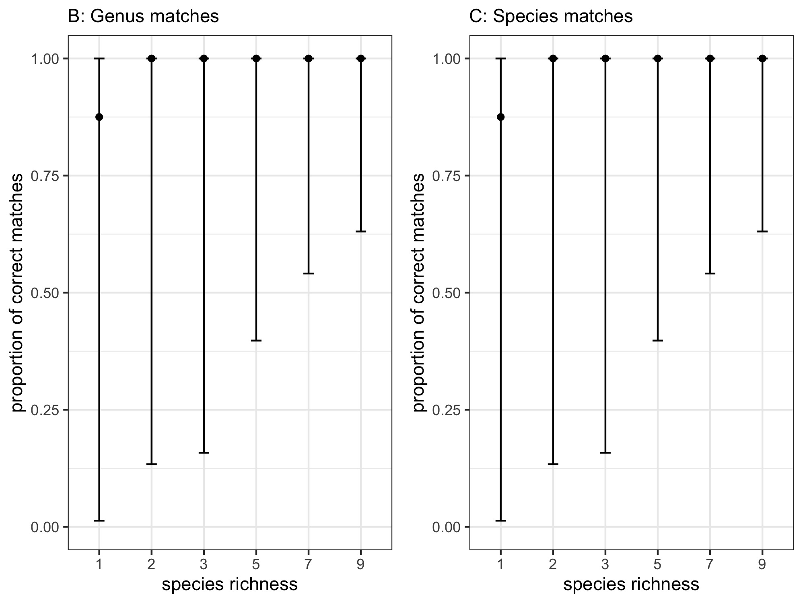
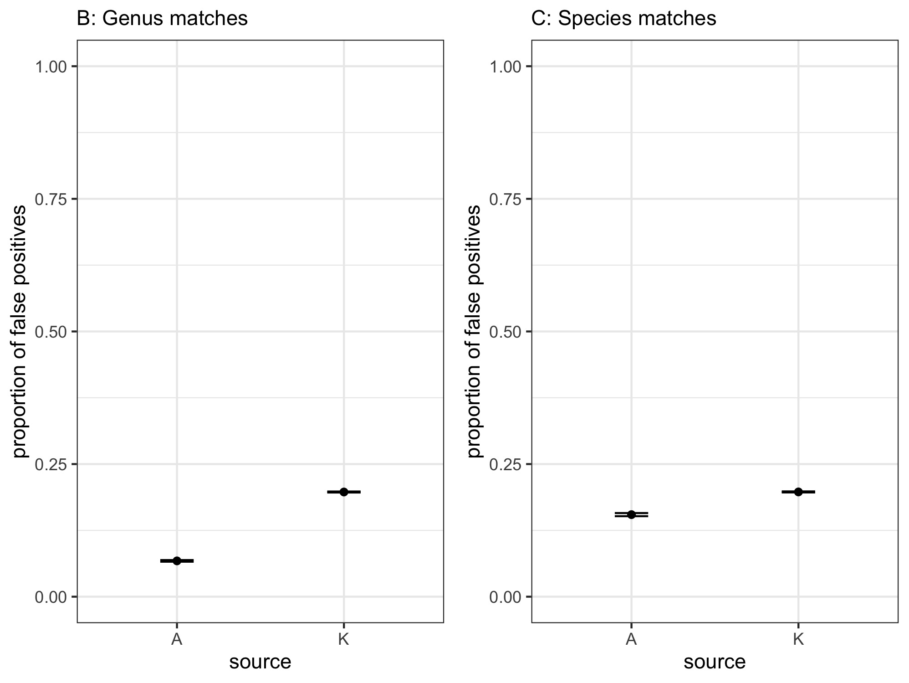

```{r setup, include=FALSE}
knitr::opts_chunk$set(echo = TRUE, error = TRUE)

suppressPackageStartupMessages(require(kableExtra))
suppressPackageStartupMessages(require(dplyr))
suppressPackageStartupMessages(require(stringr))
suppressPackageStartupMessages(require(reshape2))
suppressPackageStartupMessages(require(lme4))
suppressPackageStartupMessages(require(lmerTest))
suppressPackageStartupMessages(require(r2glmm))
suppressPackageStartupMessages(require(knitr))
suppressPackageStartupMessages(require(stringr))
suppressPackageStartupMessages(require(tidyr))
suppressPackageStartupMessages(require(tibble))
suppressPackageStartupMessages(require(data.table))
suppressPackageStartupMessages(require(binom))
suppressPackageStartupMessages(require(ggplot2))
suppressPackageStartupMessages(require(gridExtra))
```

# Overview

This analysis is set up to assess how whole-genome shotgun (WGS) sequencing of known pollen samples performs, both on its own and relative to amplicon-based metabarcoding (with ITS2 and *rbcL*) in terms of:

1. **False negatives** (i.e. true positives)---if a species is present in a sample, is that species detected? 
1. **False positives**---how many species that are *not* present in a sample are detected?
1. **Quantitative matching**---what is the quantitative correspondence between the number of pollen grains going in to a sample and the number of sequence reads coming out?

These three questions form the basic structure of the analysis, which is paralleled by the structure of this file.

The samples that were sequenced with WGS were from constructed "mock community" pollen samples of known composition. We used the exact same DNA isolations as in Bell et al. 2019 *Molecular Ecology*. This analysis is largely (though not entirely) based on the analyses in that paper. 

The sequenced pollen samples were constructed to vary in complexity in three dimensions; we assessed how sample complexity affected the qualitative outcomes (false positive and false negative reads):

1. Question 1: **species richness** (1-9 species)
2. Question 2: **rarity** (actual proportion of grains this taxon has in a sample; from roughly half & half to < 1% of the rarer type)
3. Question 3: **taxonomic relatedness** (within genus to across broad clades in the seed plants)

## version notes

This analysis file was modified from the previous file version to:

* remove the Kraken simulations, as they were not providing any major insights in the manuscript
* describe better and provide more context for the analysis, in tighter parallel to the manuscript
* streamline the analyses and remove several unused analyses from the file
* ensure that the false negative and false positive analyses were directly parallel to one another
* update the approach used for quantitative matching (no longer using AIC as it was not statistically correct)

# Analysis approach

## non-independence of data
Because all analyses included non-independent data (multiple replicates of the same pollen mixtures; pollen from the same plant species occurring in multiple mixtures), all of our analyses were conducted with mixed-effects modeling, using mixture identity and species identity as crossed random effects (modeled as random intercepts). 

## comparing WGS to amplicon data
Across our outcomes, in comparing WGS and amplicon performance, we pooled WGS and amplicon results together into a single data table and conducted analyses with method (WGS vs. amplicon) as a fixed effect.

## structure of analyses: false negatives and false positives

The response variables for our first two outcomes are binomial (yes / no) in structure. We use binomial-errors mixed-effects models for these analyses.

For our first outcome of false negatives, we thus need to record---for each species present in a pollen mixture---whether or not that species was detected in that sample. To do this, we set up a datafile with each species truly present within each sample as its own row, which we subsequently scored as 0 / 1, with a zero for species that were present in the sample but *not* present in sequencing reads (above the contamination threshold), and a one for species that *were* present in the sequencing reads above the threshold. 

For our second outcome of false positives, we wished to assess the proportion of true vs. false positives. To do this, we aggregated the data to one row per sample replicate, and summed the read counts of true positives (combining all species truly present in a particular mix) and false positives in two separate columns.

## structure of analyses: quantitative matching

To assess the quantitative accuracy of WGS sequencing for our constructed mixtures, we tested the correlation between the known proportion of pollen grains in a sample (explanatory variable) and the proportion of WGS sequencing reads (response variable).

Ideally, we would like for there to be a perfect 1:1 fit between pollen grains going in and sequence reads coming out. This means a linear response between the two, with an intercept of 0 and a slope of 1.

There are two potential ways to structure an analysis:

* one is to use a *linear* mixed-effects model, since we have proportions going in and proportions going out and in theory their relationship should be linear. This was the first approach we used, and may still be the right way to go. 
* alternatively, we could use a *binomial* errors model, since the response variable is indeed proportional counts (of sequence reads). Even with a binomial-errors model, it is possible to get the equivalent of a line with slope = 1 and intercept = 0.

For both of these approaches, one possibility would be to specify the intercept (0) and slope (1) and see how well the input data do at fitting that line. This could potentially work particularly well when comparing the amplicon and the WGS data.

# Data import

Three groups of data sets to import: 

1. sample metadata 
1. WGS Kraken empirical data 
1. amplicon data 

The metadata are the same for the WGS and amplicon data, as both were run from the exact same DNA extractions.

The amplicon data are represented by 7 data files: The first (`amp_all`) is already merged with the sample metadata and already formatted for false-negative analyses (with a separate row for each species within each sample). There are separate columns for the presence or absence of that taxon at three different taxonomic levels (species, genus, and family) and for each marker (ITS2 and *rbcL*).

This `amp_all` dataset, however, does not include data on false positives. Thus, the remaining six datafiles are there to provide data on how many of the hits were to true positives (known to be present in the sample) vs. false positives (not included in the sample). In contrast to `amp_all`, these are formatted as six separate files, one each for 
the two markers (ITS2 and *rbcL*) and three levels of taxonomic matching (species, genus, and family). The format of these files matches basically what comes from QIIME: taxa are the rows, and samples are the columns. We re-format these to the tidy format of having samples as rows later. 

Across both the amplicon and the kraken data, one issue is that for different samples, matching the taxonomy at different levels leads to different numbers of rows. For example, we have two *Populus* species in some of the samples. For matching at the species level, that is two different rows. But for genus and family, it is just one row. There are some other samples that have two different genera in the same family (e.g., *Poa* and *Zea*, both in the Poaceae). Thus, these have to be either 1) stored as completely separate datafiles; or 2) stored in a single datafile (as in `amp_all`) but properly subset to not include duplicate rows for the same genus or family within samples. In this analysis we have split these out into separate files, which is probably not the best way to go; for the future, try to keep data together in a single data file and then subset that file for analyses.

For the Kraken data, Jamieson Botsch formatted these (25-Apr-2018) from the raw Kraken output to combine the two data sources (we sequenced WGS data both at Emory and at UGA), and to have the family / genus / species separated out into columns; see `Shotgun_data_prep.Rmd`. Unlike the QIIME Illumina data, we do not need to do any aggregation of read counts as this was done automatically by Kraken (nice touch); i.e. all read counts at the species level are also included in genus-level matches and so on.

We do just a couple of steps of very basic / simple formatting with the data import here (removal of superfluous numeric column a the beginning of the data; removal of duplicate rows).

```{r data import}
krak.raw = read.csv("kraken.csv") # create 'krak.raw' that we can refer back to later
krak = krak.raw # create working copy of kraken data
mixes = read.csv("pollen-mixes-proportions.csv")
amp_its_family = read.csv("Amplicon_ITS_Family.csv")
amp_its_genus = read.csv("Amplicon_ITS_Genus.csv")
amp_its_species = read.csv("Amplicon_ITS_Species.csv")
amp_rbc_family = read.csv("Amplicon_rbcL_Family.csv")
amp_rbc_genus = read.csv("Amplicon_rbcL_Genus.csv")
amp_rbc_species = read.csv("Amplicon_rbcL_Species.csv")
amp_all = read.csv("Amplicon_all.csv")

# 'mixes' comes in with some rows duplicated (because in the spreadsheet, each was assessed with both ITS2 and with rbcL); fix this here:
mixes = unique(mixes)

# 'krak' comes with an extra numeric column at the beginning ('X'); delete
krak = krak[,-1]

# change name of 'krak' identifier columns
# identifier column is called 'mix.id' but it is very different from the 'mix.ID' column in the 'mixes' data; we will ultimately want to join by 'mix.ID'
names(krak)[1] = "sample.id"

# check them out to make sure we're all good:
# View(krak)
# View(mixes)
```

# data formatting / setup

1. Kraken data prep
    + filter to include only matches at family / genus / species taxonomic resolutions (not anything coarser, and no intermediate clades)
    + create new columns for `mix.ID` that matches the column in the sample (`pollen-mixes-proportions.csv`) data, and also `replicate.ID` for replicates within each mix
    + a couple of minor tweaks to make sure data are consistent etc.
1. Combine Kraken and sample metadata
1. Remove reads below contamination thresshold
1. Match Kraken and sample data, qualitatively and quantitatively
1. Format Kraken data for false positive analysis
1. Combine amplicon and empirical Kraken data: false positives
1. Combine amplicon and empirical Kraken data: false negatives

## Kraken data prep:

1. filter by `tax.cat` column, including only species / genus / family levels
1. create new column for `mix.ID` that matches the column in the sample metadata (`pollen-mixes-proportions.csv`)
1. also create a new `replicate.ID` column (replicate samples of each `mix.ID`)
    + both of the above are challenging because the Emory and UGA data are formatted slightly differently from each other, and also those formats are different than the metadata; this involves parsing regular expressions from the single column of sample names
1. finally, do some relatively minor tweaks for formatting etc.; e.g. capitalization of *"C. illinoisensis"*; formatting of sample numbers, etc.

```{r Kraken data prep}

# 1. filter out the reads to only include those at the family / genus / species levels
krak = filter(krak, tax == "F" | tax == "G" | tax == "S")

# 2. create new column for `mix.ID` that matches the column in the sample (`pollen-mixes-proportions.csv`) data
# this is a bit more involved... a primary issue is that Emory and UGA used different naming conventions for the samples

## MIX.ID
## FIRST ONLY FOR 'KRAK'

# first, create the column; fill in temporarily the first 6 characters in the 'sample.id' column
krak$mix.ID = substr(krak$sample.id, 1, 6)

# move the new column to be second in order (not at the end where it's hard to see)
krak = krak[, c(1, ncol(krak), 3:ncol(krak)-1)]

# Want to remove the 6th character if mix.id does not contain the word "mix" or contains 2 dashes. Only want six characters if the mix number is double digits.

krak$mix.ID = ifelse(!grepl("mix", krak$mix.ID) | str_count(krak$mix.ID, pattern="-")==2, substr(krak$mix.ID, 1, 5), krak$mix.ID)

# second, replace underscores and dashes in the temp 'mix.ID' with periods so that they match the 'mixes' data
krak$mix.ID = gsub("-", ".", krak$mix.ID)
krak$mix.ID = gsub("_", ".", krak$mix.ID)

  # fix capitalization for pecan ("c.ill"" should be "C.ill")
  krak$mix.ID = gsub("c.i", "C.i", krak$mix.ID)

# third, for the Emory mixes (different label), extract the mix from the text in the 'sample.id' column
# use 'str_extract' from the 'stringr' library (thank you tidyverse!) plus 'replace'
# (... took a while to figure this out, dang regular expressions...)
# then do some cleanup

  # extract strings and subset to only the relevant values  
  new.vals = str_extract(krak$sample.id, "mix_.*/")
  new.vals = new.vals[is.na(new.vals) == F]
  
  # replace old vals with new.vals
  krak$mix.ID = replace(krak$mix.ID, krak$mix.ID=="repla", new.vals)
  
  # cleanup
  krak$mix.ID = gsub("_", ".", krak$mix.ID)
  krak$mix.ID = gsub("/", "", krak$mix.ID)

# fourth, remove periods in between the text "mix" and the number 
krak$mix.ID = gsub("mix.", "mix", krak$mix.ID)

# 3. also create a new 'replicate.ID'; we will use this later to back-fill in the 'mixes' dataframe
  
## 'REP.ID'
# noticed a weird quirk of the data: in the "B.pap" samples, the "1" at the end of the 'sample.id' is cut off. It may not really matter, but by making it consistent it will help make there be fewer levels / potential complications when appending onto the 'mixes' data
krak$sample.id = as.character(krak$sample.id)
indexy = str_sub(krak$sample.id, -1, -1)==0 # identifies which are missing the '1' at the end
krak$sample.id = replace(krak$sample.id, indexy, paste(krak$sample.id[indexy],"1", sep = ""))

# first, create the column; fill in the relevant characters from the 'sample.id' column
krak$rep.ID = substr(krak$sample.id, nchar(as.character(krak$sample.id))-7, nchar(as.character(krak$sample.id))-4) # 
# switch underscore to period
krak$rep.ID = gsub("_", ".", krak$rep.ID)

# move the new column to be second in order (not at the end where it's hard to see)
krak = krak[, c(1:2, ncol(krak), 4:ncol(krak)-1)]

## Sample number
sample_sep <- colsplit(krak$sample.id, "_", c("ID", "sample", "L", "R", "Num"))
krak$sample <- ifelse(startsWith(sample_sep$L,"S"), sample_sep$L, ifelse(startsWith(sample_sep$L,"1") | startsWith(sample_sep$L,"2"), sample_sep$R, sample_sep$sample))

##Create list of unique combinations of mix ID, sample number, and rep ID to properly merge kraken with mixes data at later point
krak_uniqueid <- data.frame(krak$mix.ID, krak$rep.ID, krak$sample)
krak_uniqueid <- unique.data.frame(krak_uniqueid)

# clean up
rm(sample_sep, new.vals, indexy)

```

## combine Kraken & sample / mix data:

new aggregated datasheeet, based on sample metadata, but which matches sample data back to the Kraken data so we can run analyses about probability of matching (both qualitative and quantitative). In particular this is taking account of sample "replicates" (including some that are not true replicates, but rather forward vs. reverse reads); also different Illumina lanes in the Emory Genome Center data.

1. Merge the unique krak IDs with mixes to subset the sample data to only the samples in the kraken dataset 
1. Create a dataset for analysis of false negatives by only including taxa that are present in sample data
    + for this one, do it separately at each taxonomic level that we are assessing, i.e. species, genus, family
1. Create a dataset for analysis of false positives by including all taxa in kraken data

use 'mix.ID' as the variable to combine by...

```{r merge kraken data and sample metadata}

## Merge sample and replicate IDs with mixes data
krak_mixes <- merge(mixes,krak_uniqueid, by.x="mix.ID", by.y="krak.mix.ID")

# create separate datasets for family, genus, and species level, both including and excluding false positives
# excluding false positives (focus on true positives / false negatives):
truepos.krak.family =  merge(krak_mixes, filter(krak, tax == "F"), by = c("mix.ID", "family"), all.x=T)
truepos.krak.genus =  merge(krak_mixes, filter(krak, tax == "G"), by = c("mix.ID", "genus"), all.x=T)
truepos.krak.species =  merge(krak_mixes, filter(krak, tax == "S"), by = c("mix.ID", "species"), all.x=T)

# including false positives:
all.krak.family =  merge(krak_mixes, filter(krak, tax == "F"), by = c("mix.ID", "family"), all.x = T, all.y = T)
all.krak.genus =  merge(krak_mixes, filter(krak, tax == "G"), by = c("mix.ID", "genus"), all.x = T, all.y = T)
all.krak.species =  merge(krak_mixes, filter(krak, tax == "S"), by = c("mix.ID", "species"), all.x = T, all.y = T)

# clean up:
rm(krak_uniqueid)

```

## remove reads below the isolation/PCR negative control

1. remove reads below the isolation / PCR negative control thresholds
      a) ideally, would base these on negative controls **for a given Illumina run** (two separate runs here, at UGA and Emory Genome center; we will need to keep those separate); but **unfortunately** there are not negative controls for the Emory Genome Center data; use the UGA thresholds for all the data (definitely not ideal)
      a) this entails removing rows with $k$-mer counts below the threshold
      a) in the Illumina QIIME amplicon data, we did this separately for (entire) taxa below the threshold level, and for reads, because of the way that the data were formatted in a taxon-by-sample matrix; the Kraken output is already formatted in a way that is closer to `tidy` so we only need to do this step once here.
1. remove negative control rows (once the above is completed) so they don't interfere with the analysis


```{r remove reads below contamination threshold}

# Establish threshold for maximum number of reads in the negative controls
maxy = max(krak$hits[krak$mix.ID=="negat"])

# Identify rows that fall below this threshold for false negative analysis
truepos.indexy_family = which(truepos.krak.family$hits <= maxy)
truepos.indexy_genus = which(truepos.krak.genus$hits <= maxy)
truepos.indexy_species = which(truepos.krak.species$hits <= maxy)

# No rows for false negative analysis with read level below threshold - can continue with analysis 

# Identify rows that fall below thresshold for false positive analysis
all.indexy_family = which(all.krak.family$hits <= maxy)
all.indexy_genus = which(all.krak.genus$hits <= maxy)
all.indexy_species = which(all.krak.species$hits <= maxy)

# Remove these rows
all.krak.family = all.krak.family[-all.indexy_family,]
all.krak.genus = all.krak.genus[-all.indexy_genus,]
all.krak.species = all.krak.species[-all.indexy_species,]

# Remove negative control rows
all.krak.family = filter(all.krak.family, mix.ID!="negat")
all.krak.genus = filter(all.krak.genus, mix.ID!="negat")
all.krak.species = filter(all.krak.species, mix.ID!="negat")

# Clean up
rm(maxy, all.indexy_family, all.indexy_genus, all.indexy_species, truepos.indexy_family, truepos.indexy_genus, truepos.indexy_species)

```

## Kraken data: format for false negative and quantitative analyses

(will do false positives in next step; the data formatting at this step is relatively straightforward)

1. Convert NAs in true positives / false negatives to 0s
1. Convert the "percentage hits" to a proportion - which will be the response variable in the quantitative models
1. Create a qualitative variable that equals 1 if that taxon was detected in the analysis (i.e. if proportion is greater than 0), and 0 if not detected (i.e. if proportion = 0). 

```{r match kraken to sample data}

# create quantitative variable by simply dividing the percentage hits (perc.hit) by 100
truepos.krak.family$quant.family = truepos.krak.family$perc.hit/100
truepos.krak.genus$quant.genus = truepos.krak.genus$perc.hit/100
truepos.krak.species$quant.species = truepos.krak.species$perc.hit/100

# for taxa that were not detected, NAs are currently present. Need to change this to 0 for quantitative variable before running analysis.
truepos.krak.family$quant.family = ifelse(is.na(truepos.krak.family$quant.family), 0, truepos.krak.family$quant.family)
truepos.krak.genus$quant.genus = ifelse(is.na(truepos.krak.genus$quant.genus), 0, truepos.krak.genus$quant.genus)
truepos.krak.species$quant.species = ifelse(is.na(truepos.krak.species$quant.species), 0, truepos.krak.species$quant.species)

#Create qualitative variable based on quantitative variable
truepos.krak.family$qual.family = ifelse(truepos.krak.family$quant.family > 0, 1, 0)
truepos.krak.genus$qual.genus = ifelse(truepos.krak.genus$quant.genus > 0, 1, 0)
truepos.krak.species$qual.species = ifelse(truepos.krak.species$quant.species > 0, 1, 0)
```

## combine amplicon and Kraken data for false negative analysis

Using the kraken data formatted for true positive/false negative analysis ("truepos.krak"), rbind with amplicon data. 

```{r combine amplicon and kraken data for true positive/false negative}

#Add "K-" to beginning of sample number of kraken dataset and add variable "source" to indicate that data is from kraken dataset
truepos.krak.family$sample <- paste("K-", truepos.krak.family$krak.sample, sep="")
truepos.krak.genus$sample <- paste("K-", truepos.krak.genus$krak.sample, sep="")
truepos.krak.species$sample <- paste("K-", truepos.krak.species$krak.sample, sep="")

#Add "source" variable to indicate if data is WGS or amplicon
truepos.krak.family$source = "krak"
truepos.krak.genus$source = "krak"
truepos.krak.species$source = "krak"
amp_all$source = "amp"

#Concatenate WGS and amplicon data using mapply so that mismatching variable names of the amplicon data will be ignored

krakamp_rbc_family_fn <- as.data.frame(mapply(c, truepos.krak.family[,c("mix.ID", "family", "sample", "qual.family", "source")], amp_all[,c("mix.ID","family","sample", "qual.family.rbcL", "source")]))

krakamp_its_family_fn <- as.data.frame(mapply(c, truepos.krak.family[,c("mix.ID", "family", "sample", "qual.family", "source")], amp_all[,c("mix.ID","family","sample", "qual.family.ITS", "source")]))

krakamp_rbc_genus_fn <- as.data.frame(mapply(c, truepos.krak.genus[,c("mix.ID", "genus", "sample", "qual.genus", "source")], amp_all[,c("mix.ID","genus","sample", "qual.genus.rbcL", "source")]))

krakamp_its_genus_fn <- as.data.frame(mapply(c, truepos.krak.genus[,c("mix.ID", "genus", "sample", "qual.genus", "source")], amp_all[,c("mix.ID","genus","sample", "qual.genus.ITS", "source")]))

krakamp_rbc_species_fn <- as.data.frame(mapply(c, truepos.krak.species[,c("mix.ID", "species", "sample", "qual.species", "source")], amp_all[,c("mix.ID","species","sample", "qual.species.rbcL", "source")]))

krakamp_its_species_fn <- as.data.frame(mapply(c, truepos.krak.species[,c("mix.ID", "species", "sample", "qual.species", "source")], amp_all[,c("mix.ID","species","sample", "qual.species.ITS", "source")]))

```


## format kraken data for false positive analysis

To analyze false positives in kraken data, need to have aggregated counts of the "true positive" and "false positive" reads by sample. These will be our "success" and "failure" numbers in a binomial mixed model. 

1. If the merged sample data is N/A, this indicates the taxa is a false positive. Based on N/A values, create a variable indicating if taxa is true or false positive.
1. Remove taxa that are in sample data but not kraken data (false negatives) - not considered for this analysis
    + while perhaps counterintuitive, need to do this because in this analysis we are using counts of "true positive" reads vs. "false positive" reads, i.e. only using reads that exist, not reads that should have existed but do not. Those are dealt with in our false negative analysis.
1. Add "K" to the sample names to distinguish from the samples in the amplicon data
1. Aggregate the counts per sample ID by "true positive" and "false positive"

In addition (new as of 18-April-2019):
1. removed *Zea mays* and mix5 samples (don't match with metadata)
1. matched false positive data with metadata so that sample complexity analyses can be run down the line
1. one consideration is that since we are aggregating all of the reads for a particular sample into one row, we have to figure out how to deal with rarity / commonness of taxa within a sample.
    + to do that, we use the minimum % of any taxon within the sample as a measure of rarity

```{r Format kraken data for false positive analysis}

# For false positive analysis, create variable indicating if taxa if "false positive" or "true positive"
all.krak.family$type <- ifelse(is.na(all.krak.family$question.1), "false_pos", "true_pos")
all.krak.genus$type <- ifelse(is.na(all.krak.genus$question.1), "false_pos", "true_pos")
all.krak.species$type <- ifelse(is.na(all.krak.species$question.1), "false_pos", "true_pos")

# If hits = N/A, indicates a false negative (in sample data but not in Kraken data). Remove because we are not considering for this analysis
# (for the future, probably easier with `filter` in `dplyr` package)
all.krak.family <- all.krak.family[-which(is.na(all.krak.family$sample.id)),]
all.krak.genus <- all.krak.genus[-which(is.na(all.krak.genus$sample.id)),]
all.krak.species <- all.krak.species[-which(is.na(all.krak.species$sample.id)),]

# Add "K_" to sample name
all.krak.family$sample <- paste("K_",all.krak.family$sample, sep="")
all.krak.genus$sample <- paste("K_",all.krak.genus$sample, sep="")
all.krak.species$sample <- paste("K_",all.krak.species$sample, sep="")

# Aggregate counts by mix.ID, sample.ID, and type
agg.krak.family <- all.krak.family %>%
          select(mix.ID, family, rep.ID, sample, type, hits) %>%
          group_by(mix.ID, sample, rep.ID, type) %>%
          summarize(total_hits = sum(hits))
agg.krak.genus <- all.krak.genus %>%
          select(mix.ID, genus, rep.ID, sample, type, hits) %>%
          group_by(mix.ID, sample, rep.ID, type) %>%
          summarize(total_hits = sum(hits))
agg.krak.species <- all.krak.species %>%
          select(mix.ID, species, rep.ID, sample, type, hits) %>%
          group_by(mix.ID, sample, rep.ID, type) %>%
          summarize(total_hits = sum(hits))

# Convert to wide format with one column for true positive hits and one column for false positive hits
agg.krak.family <- spread(agg.krak.family, key=type, value=total_hits)
agg.krak.genus <- spread(agg.krak.genus, key=type, value=total_hits)
agg.krak.species <- spread(agg.krak.species, key=type, value=total_hits)

# If positives are N/A, set to equal 0
agg.krak.family$true_pos = ifelse(is.na(agg.krak.family$true_pos),0, agg.krak.family$true_pos)
agg.krak.genus$true_pos = ifelse(is.na(agg.krak.genus$true_pos),0, agg.krak.genus$true_pos)
agg.krak.species$true_pos = ifelse(is.na(agg.krak.species$true_pos),0, agg.krak.species$true_pos)
agg.krak.family$false_pos = ifelse(is.na(agg.krak.family$false_pos),0, agg.krak.family$false_pos)
agg.krak.genus$false_pos = ifelse(is.na(agg.krak.genus$false_pos),0, agg.krak.genus$false_pos)
agg.krak.species$false_pos = ifelse(is.na(agg.krak.species$false_pos),0, agg.krak.species$false_pos)

# as set up currently, the false positive datasets ('agg.krak.family', 'agg.krak.genus', 'agg.krak.species')
# do not have the needed components to replicate the analysis we used for false negatives
# specifically, we need to have data on the facets of samples complexity:
    # species richness, taxonomic relatedness, and rarity
# and we also need the data subset component ('sub' vs. 'all')

# first, remove Zea mays and mix5 (which had Zea in it):
agg.krak.family = filter(agg.krak.family, mix.ID != "Z.may" & mix.ID != "mix5")
agg.krak.genus = filter(agg.krak.genus, mix.ID != "Z.may" & mix.ID != "mix5")
agg.krak.species = filter(agg.krak.species, mix.ID != "Z.may" & mix.ID != "mix5")

# now, add the needed metadata

# don't want the aggregated data to be repeated for each taxon in a mix
# and that is the way the 'mixes' dataframe is set up
# in addition, to assess rarity, different taxa have different proportions
# thus, summarize 'mixes' to have the *minimum* value of 'pollen.grain.proportion' for each mix

mixy = mixes 
mixy = mixy %>% select(-family, -genus, -species) %>% group_by(mix.ID) %>% summarize_all(min)

# now put them together
# via a merge of the false positive datasets with the 'mixes' (sample metadata)
# (didn't use 'left_join' because of conversion of factors to character)
agg.krak.family = merge(agg.krak.family, mixy, by = "mix.ID")
agg.krak.genus = merge(agg.krak.genus, mixy, by = "mix.ID")
agg.krak.species = merge(agg.krak.species, mixy, by = "mix.ID")

# clean up
rm(mixy)

```


## false positives: format amplicon data

This part is one of the more challenging components of the formatting. It is based on the six amplicon data files (one for each marker and taxonomic level), formatted as QIIME matrices such that taxa comprise the rows and samples comprise the columns.

we need to:

* `melt` each matrix into a single row for each taxon / mix / sample combination, reporting the number of reads for each
    + remove combos for which there were zero reads (not strictly necessary since we will later just add up all the true and false positives, but makes everything more compact)
    + also a good time to remove mix #5 and also *Zea* samples from the amplicon data for consistencey
* merge each melted dataframe with with the sample metadata
* classify reads ("hits") into false positives and false negatives, on a row-by-row basis
* aggregate (sum) false positive and false negative reads for each sample and replicate

* NEED TO MAKE SURE TO KEEP ALL OF THE SAMPLE METADATA FOR THE AMPLICON DATA--IT IS IN THERE AFTER THE MERGING BUT SOMEHOW GETS LOST. BASICALLY GOT TO LINE 529.

```{r format amplicon false positive}

#Create list of amplicon data frames
amp_data <- list(amp_its_family, amp_its_genus, amp_its_species, amp_rbc_family, amp_rbc_genus, amp_rbc_species)

# create a function for *melting* the amplicon QIIME matrices, with a row for each...
# ...taxon / mix / sample combination, reporting the number of reads for each
amp_convert <- lapply(amp_data, function(x){
  #convert first column name to "taxa"
  names(x)[1] <- "taxa"
  #convert from wide to long format
  x <- melt(x, id.vars="taxa", value.name="hits")
  #separate mix ID and sample ID
  x[,4:5] <- colsplit(x$variable, "_", c("mix.ID", "sample"))
  #remove variable "id"
  x <- x[,-2]
  # remove any rows for which the "hits" count == 0
  # there were no reads, so we don't need to include them
  # also a good point to remove Zea mays single-species samples
  # and also mix #5 which includes Zea
  x <- filter(x, hits!=0 & mix.ID != "Z.mays" & mix.ID != "mix5")
})

# apply the melting function to each of the 6 datasets
# convert them into data frames at the same time
# (in the future, better to do this with `lapply` or similar)
amp_its_family <- as.data.frame(amp_convert[1])
amp_its_genus <- as.data.frame(amp_convert[2])
amp_its_species <- as.data.frame(amp_convert[3])
amp_rbc_family <- as.data.frame(amp_convert[4])
amp_rbc_genus <- as.data.frame(amp_convert[5])
amp_rbc_species <- as.data.frame(amp_convert[6])

# merge with sample metadata (`mixes`) by mixID and sampleID
amp_its_family_mix <- merge(amp_its_family, mixes, by.x=c("mix.ID", "taxa"), by.y=c("mix.ID", "family"), all.x=T)
amp_its_genus_mix <- merge(amp_its_genus, mixes, by.x=c("mix.ID", "taxa"), by.y=c("mix.ID", "genus"), all.x=T)
amp_its_species_mix <- merge(amp_its_species, mixes, by.x=c("mix.ID", "taxa"), by.y=c("mix.ID", "species"), all.x=T)
amp_rbc_family_mix <- merge(amp_rbc_family, mixes, by.x=c("mix.ID", "taxa"), by.y=c("mix.ID", "family"), all.x=T)
amp_rbc_genus_mix <- merge(amp_rbc_genus, mixes, by.x=c("mix.ID", "taxa"), by.y=c("mix.ID", "genus"), all.x=T)
amp_rbc_species_mix <- merge(amp_rbc_species, mixes, by.x=c("mix.ID", "taxa"), by.y=c("mix.ID", "species"), all.x=T)

#Rows with mixes variables that are "NA" are false positive taxa. Create a data frame that indicates if row is true positive or false positive
amp_its_family_mix$type <- ifelse(is.na(amp_its_family_mix$question.1), "false_pos", "true_pos")
amp_its_genus_mix$type <- ifelse(is.na(amp_its_genus_mix$question.1), "false_pos", "true_pos")
amp_its_species_mix$type <- ifelse(is.na(amp_its_species_mix$question.1), "false_pos", "true_pos")
amp_rbc_family_mix$type <- ifelse(is.na(amp_rbc_family_mix$question.1), "false_pos", "true_pos")
amp_rbc_genus_mix$type <- ifelse(is.na(amp_rbc_genus_mix$question.1), "false_pos", "true_pos")
amp_rbc_species_mix$type <- ifelse(is.na(amp_rbc_species_mix$question.1), "false_pos", "true_pos")

#New list of mixed datasets
amp_mixed <- list(amp_its_family_mix, amp_its_genus_mix, amp_its_species_mix, amp_rbc_family_mix, amp_rbc_genus_mix, amp_rbc_species_mix)

#Apply function to list
amp_summed <- lapply(amp_mixed, function(x){
  #summarize number of hits by mix.ID, sample, and type
  x <- x %>%
          select(mix.ID, taxa, hits, sample, type) %>%
          group_by(mix.ID, sample, type) %>%
          summarize(total_hits = sum(as.numeric(hits)))
  #Convert to wide format with one column for true positive hits and one column for false positive hits
  #x <- reshape(x, idvar="sample", timevar="type", direction="wide")
})

amp_its_family_summ <- as.data.frame(amp_summed[1])
amp_its_genus_summ <- as.data.frame(amp_summed[2])
amp_its_species_summ <- as.data.frame(amp_summed[3])
amp_rbc_family_summ <- as.data.frame(amp_summed[4])
amp_rbc_genus_summ <- as.data.frame(amp_summed[5])
amp_rbc_species_summ <- as.data.frame(amp_summed[6])

# Add "A" to beginning of sample ID - couldn't get this to work in the lapply function
amp_its_family_summ$sample <- paste("A_", amp_its_family_summ$sample, sep="")
amp_its_genus_summ$sample <- paste("A_", amp_its_genus_summ$sample, sep="")
amp_its_species_summ$sample <- paste("A_", amp_its_species_summ$sample, sep="")
amp_rbc_family_summ$sample <- paste("A_", amp_rbc_family_summ$sample, sep="")
amp_rbc_genus_summ$sample <- paste("A_", amp_rbc_genus_summ$sample, sep="")
amp_rbc_species_summ$sample <- paste("A_", amp_rbc_species_summ$sample, sep="")

# Convert to wide format with one column for true positive hits and one column for false positive hits - couldn't get this to work in the lapply function
amp_its_family_reshape <- spread(amp_its_family_summ, key=type, value=total_hits)
amp_its_genus_reshape <- spread(amp_its_genus_summ, key=type, value=total_hits)
amp_its_species_reshape <- spread(amp_its_species_summ, key=type, value=total_hits)
amp_rbc_family_reshape <- spread(amp_rbc_family_summ, key=type, value=total_hits)
amp_rbc_genus_reshape <- spread(amp_rbc_genus_summ, key=type, value=total_hits)
amp_rbc_species_reshape <- spread(amp_rbc_species_summ, key=type, value=total_hits)

#If positives are N/A, set to equal 0
amp_its_family_reshape$true_pos = ifelse(is.na(amp_its_family_reshape$true_pos),0, amp_its_family_reshape$true_pos)
amp_its_genus_reshape$true_pos = ifelse(is.na(amp_its_genus_reshape$true_pos),0, amp_its_genus_reshape$true_pos)
amp_its_species_reshape$true_pos = ifelse(is.na(amp_its_species_reshape$true_pos),0, amp_its_species_reshape$true_pos)
amp_rbc_family_reshape$true_pos = ifelse(is.na(amp_rbc_family_reshape$true_pos),0, amp_rbc_family_reshape$true_pos)
amp_rbc_genus_reshape$true_pos = ifelse(is.na(amp_rbc_genus_reshape$true_pos),0, amp_rbc_genus_reshape$true_pos)
amp_rbc_species_reshape$true_pos = ifelse(is.na(amp_rbc_species_reshape$true_pos),0, amp_rbc_species_reshape$true_pos)

amp_its_family_reshape$false_pos = ifelse(is.na(amp_its_family_reshape$false_pos),0, amp_its_family_reshape$false_pos)
amp_its_genus_reshape$false_pos = ifelse(is.na(amp_its_genus_reshape$false_pos),0, amp_its_genus_reshape$false_pos)
amp_its_species_reshape$false_pos = ifelse(is.na(amp_its_species_reshape$false_pos),0, amp_its_species_reshape$false_pos)
amp_rbc_family_reshape$false_pos = ifelse(is.na(amp_rbc_family_reshape$false_pos),0, amp_rbc_family_reshape$false_pos)
amp_rbc_genus_reshape$false_pos = ifelse(is.na(amp_rbc_genus_reshape$false_pos),0, amp_rbc_genus_reshape$false_pos)
amp_rbc_species_reshape$false_pos = ifelse(is.na(amp_rbc_species_reshape$false_pos),0, amp_rbc_species_reshape$false_pos)

# Add rep.ID = 1 for amplicon data to match kraken data
amp_its_family_reshape$rep.ID = 1
amp_its_genus_reshape$rep.ID = 1
amp_its_species_reshape$rep.ID = 1
amp_rbc_family_reshape$rep.ID = 1
amp_rbc_genus_reshape$rep.ID = 1
amp_rbc_species_reshape$rep.ID = 1

# Move to third column to match Kraken data
# (better done with `dplyr` in the future)
amp_its_family_reshape = amp_its_family_reshape[,c(1:2,5,3:4)]
amp_its_genus_reshape = amp_its_genus_reshape[,c(1:2,5,3:4)]
amp_its_species_reshape = amp_its_species_reshape[,c(1:2,5,3:4)]
amp_rbc_family_reshape = amp_rbc_family_reshape[,c(1:2,5,3:4)]
amp_rbc_genus_reshape = amp_rbc_genus_reshape[,c(1:2,5,3:4)]
amp_rbc_species_reshape = amp_rbc_species_reshape[,c(1:2,5,3:4)]
```

## combine amplicon and Kraken data for false positive analysis

We need to combine the WGS with amplicon data by creating a dataframe showing the number of true positive and the number of false positive reads by source, mix ID, and sample ID.


``` {r combine amplicon and kraken data for false positive analysis}

# Add column "source" to amplicon and kraken data
amp_its_family_reshape$source = "amp"
amp_its_genus_reshape$source = "amp"
amp_its_species_reshape$source = "amp"
amp_rbc_family_reshape$source = "amp"
amp_rbc_genus_reshape$source = "amp"
amp_rbc_species_reshape$source = "amp"

agg.krak.family$source = "krak"
agg.krak.genus$source = "krak"
agg.krak.species$source = "krak"

#Merge kraken and amplicon data
krakamp_its_family = rbind(subset(amp_its_family_reshape, mix.ID %in% agg.krak.family$mix.ID), as.data.frame(agg.krak.family))
krakamp_its_genus = rbind(subset(amp_its_genus_reshape, mix.ID %in% agg.krak.genus$mix.ID), as.data.frame(agg.krak.genus))
krakamp_its_species = rbind(subset(amp_its_species_reshape, mix.ID %in% agg.krak.species$mix.ID), as.data.frame(agg.krak.species))
krakamp_rbc_family = rbind(subset(amp_rbc_family_reshape, mix.ID %in% agg.krak.family$mix.ID), as.data.frame(agg.krak.family))
krakamp_rbc_genus = rbind(subset(amp_rbc_genus_reshape, mix.ID %in% agg.krak.genus$mix.ID), as.data.frame(agg.krak.genus))
krakamp_rbc_species = rbind(subset(amp_rbc_species_reshape, mix.ID %in% agg.krak.species$mix.ID), as.data.frame(agg.krak.species))

```


# Analysis

1. false negatives
    + WGS data alone, as a function of sample complexity
    + WGS data compared to amplicon data
1. false positives
    + WGS data alone, as a function of sample complexity
    + WGS data compared to amplicon data
1. quantitative matching
    + WGS data alone (sample input compared to sample output)
    + WGS data compared to amplicon data

## false negatives 

To assess if species richness, relatedness, and pollen grain proportion have a significant effect on the ability of the empirical WGS to qualitatively detect the presence/absence of a species, use a binomial mixed effects model with species as a random effect and rep.ID nested in sample nested in mix.ID as a random effect. 

For consistency, take out *Zea mays* and format data tables to have the same name as those in the mixed amplicon analysis. 

### false negative rates as a function of sample complexity

* the analysis approach here is based on binomial-errors mixed-effects models
* the **fixed effects** are sample complexity; we are assessing one facet of sample complexity per model
    + 1. Question 1: **species richness** (1-9 species)
    + Question 2: **rarity** (actual proportion of grains this taxon has in a sample; from roughly half & half to < 1% of the rarer type)
    + Question 3: **taxonomic relatedness** (within genus to across broad clades in the seed plants)
* we separately assessed models that considered different **subsets of the data**:
    + just the mixes specifically set up for each of the questions above (smaller subset of the data)
    + all of the mixes (thus more data)
* we also ran separate models for each of the **taxonomic levels:**
    + family, genus, and species
* the **random effects** are nested, with the highest level as `mix.ID` (i.e. the identity of the pollen mixture); then `sample` replicate within each mix and finally `rep.ID` (forward / reverse read within a sample, or Illumina lane for samples split across lanes)
    + we modeled these as random intercepts
    + the random effects were fixed and equivalent for all models
* there are 3 facets of sample complexity $\times$ 2 data subsets $\times$ 3 taxonomic levels = **18 total models**
    + set this up with a nested `for` loop; there are almost certainly cleaner and more elegant ways to do this


```{r false negative analysis setup}

#Take out Zea
truepos.krak.family = filter(truepos.krak.family, genus.x!= "Zea") 
truepos.krak.genus = filter(truepos.krak.genus, genus!="Zea")
truepos.krak.species = filter(truepos.krak.species, genus.x!="Zea")

# set up the three factors by which we are running the models
taxon = c("species", "genus", "family")
datasubset = c("sub", "all") # whether we are using the designated subset of data designed for the question, or all data
question = c("spp.rich", "relatedness", "pollen.grain.proportion")

# calculate total number of models
total = levels(taxon)*levels(datasubset)*levels(question)

# first set up a table for the results with a number of entries equal to the 'total' variable above (18):
results.table = data.frame(question = rep(NA,total), taxon  = rep(NA,total), data.subset  = rep(NA,total), model.name = rep(NA,total), p.val  = rep(1.000001,total), n  = rep(9999,total), warning.msg = rep(NA,total))

# keep track of which row of the table to record in:
tracker = 1

# EXAMPLE FORMULA:
# Krak.Q1.species.all = glmer(qual.species.rbcL ~ spp.rich + (1|mix.ID/sample/rep.ID) + (1|species), family = binomial, data = truepos.krak.species, control = glmerControl(optimizer="bobyqa"))

# 'for' loop:

for(q in 1:3) { # 'question': response variables for Q1 / Q2 / Q3
    for(k in 1:3){ # 'taxon': species, genus, family
      for(l in 1:2) { # 'datasubset': sub or all
        # first, name the analysis:
        namer = paste("Krak.Q", q, ".", taxon[k], ".", datasubset[l], sep = "")
        # second, set which taxonomic data to use:
        data.to.use = paste("truepos.krak.", taxon[k], sep = "")
        # third, set up the data subset
        subster = paste("data.sub = filter(", data.to.use, ", question.1 == ", q, " | question.2 == ", q, " | question.3 == ",q, ")", sep = "")
        eval(parse(text = subster)) # probably not the most efficient thing ever... 
        # fourth, set whether or not data subset is used (vs. all data)
        if(datasubset[l]=="sub") {data.to.use = "data.sub"} # i.e., doesn't change if all data are to be used
        # fifth, set up mixed-effects model: 
        mixed = paste(namer, " = suppressWarnings(glmer(qual.", taxon[k],
          " ~ ",  question[q], " + (1|mix.ID/krak.sample/krak.rep.ID) + (1|", taxon[k], "), family = binomial, 
          data = ", data.to.use, ", control = glmerControl(optimizer=\"bobyqa\")))", sep = "")
        # sixth, evaluate the mixed-effects model
        eval(parse(text = mixed))
            # # eighth, print summary of model [SKIP FOR NOW]
            # summarizer = paste("print(summary(", namer, "))", sep = "")
            # eval(parse(text = summarizer)) # print summary of the mixed-effects model
        
        ## extract p-value
        # (this would probably be easier using the 'broom.mixed' package?)
        # example: coef(summary(Q3.genus.ITS.all))[2,4]
        pvaller = paste("pval <- coef(summary(", namer, "))[2,4]", sep = "")
        eval(parse(text = pvaller))
        
        # extract convergence failures
        converger = paste(namer, "@optinfo$conv$lme4$code", sep = "")
        converg = eval(parse(text = converger))
        converg.return = ifelse(length(converg)==1, "ERROR!!", "")
        
        # record results in table
        results.table[tracker,1] = question[q]
        results.table[tracker,2] = taxon[k]
        results.table[tracker,3] = datasubset[l]
        results.table[tracker,4] = namer
        results.table[tracker,5] = pval
        results.table[tracker,6] = nrow(eval(parse(text = data.to.use)))
        results.table[tracker,7] = converg.return
        
        # advance tracker
        tracker = tracker + 1
      }
    }
  }


# display results table
# note that the 'kable' function is part of the 'knitr' package and `kable_styling` is from the `kableExtra` package 
kable(results.table) %>% 
  kable_styling(bootstrap_options = "striped", full_width = F)
```

For the empirical data, species richness has a significant effect on qualitative detection at the species level (in both the subsetted data and full data set) and at the genus level in the subsetted data, but the model gives errors at the genus level using the full dataset and at the family level. 

Species relatedness has a significant effect on qualitative detection with the full dataset (highly significant - all p-values <0.0001), but not with the subsetted dataset ($p$ = 0.97 for species and genus level, $p$ = 0.06 for family level). Not sure if this makes sense...

Pollen grain proportion has a significant effect on qualitative detection at the species level with the full dataset and at the family level with the full dataset. The other tests gave errors. 


## false positives: sample complexity

====================
**NEEDS TO BE DONE**
====================

this analysis has the same basic structure as for the false negatives analysis of sample complexity, again examining 3 taxonomic levels (family / genus / species) for three dimensions of sample complexity (species richness / taxonomic relatedness / rarity), each with two datasets (the subsample specifically designed for the sample complexity component of interest and the entire dataset).


## false positives: Amplicon vs. Shotgun comparison

This analysis uses binomial mixed models to assess if using amplicon vs. WGS has a significant effect on the ability to qualitatively detect true positives vs. false negatives. This analysis is similar the qualitative mixed models to assess the effect of species richness, pollen grain proportion, etc. on the ability to qualitatively detect the correct taxa, but instead using "source" as the fixed effect. 

### false positives: by marker (*rbcL* vs ITS2)

```{r amplicon vs. shotgun true positive vs false negative - separate markers}

taxon = c("species", "genus", "family")
marker = c("its", "rbc")


# first set up a table for the results:
# I will set this up with 18 entries
krakamp.fn.results.table = data.frame(taxon  = rep(NA,6), marker  = rep(NA,6), model.name = rep(NA,6), p.val  = rep(1.000001,6), n  = rep(9999,6), warning.msg = rep(NA,6))

# keep track of which row of the table to record in:
tracker = 1

# # EXAMPLE FORMULA
# its.family = glmer(qual.family ~ source + (1|mix.ID/sample) + (1|family), family = binomial, data = krakamp_its_family_fn, control = glmerControl(optimizer="bobyqa"))

# response variables relating to each of the three questions (column names in data)

for(q in 1:2) { # 'marker': its or rbc
    for(k in 1:3){ # 'taxon': species, genus, family
        # first, name the analysis (i.e. name the result object):
        namer = paste(marker[q], ".", taxon[k], sep = "")
        
        # second, set which taxonomic data to use:
        data.to.use = paste("krakamp_", marker[q], "_", taxon[k],"_fn", sep = "")
        
        # third, set up mixed-effects model: 
        mixed = paste(namer, " = suppressWarnings(glmer(qual.", taxon[k],
          " ~ source + (1|mix.ID/sample) + (1|", taxon[k], "), family = binomial, 
          data = ", data.to.use, ", control = glmerControl(optimizer=\"bobyqa\")))", sep = "")
        
        # fourth, evaluate the mixed-effects model
        eval(parse(text = mixed))
            #fifth, print summary of model [SKIP FOR NOW]
            #summarizer = paste("print(summary(", namer, "))", sep = "")
            #eval(parse(text = summarizer)) # print summary of the mixed-effects model
        
        # fifth, extract the results
        ## extract p-value
        # example: coef(summary(its.family))[2,4]
        pvaller = paste("pval <- coef(summary(", namer, "))[2,4]", sep = "")
        eval(parse(text = pvaller))
        
        # extract convergence failures
        converger = paste(namer, "@optinfo$conv$lme4$code", sep = "")
        converg = eval(parse(text = converger))
        converg.return = ifelse(length(converg)==1, "ERROR!!", "")
        
        # record results in table
        krakamp.fn.results.table[tracker,1] = taxon[k]
        krakamp.fn.results.table[tracker,2] = marker[q]
        krakamp.fn.results.table[tracker,3] = namer
        krakamp.fn.results.table[tracker,4] = pval
        krakamp.fn.results.table[tracker,5] = nrow(eval(parse(text = data.to.use)))
        krakamp.fn.results.table[tracker,6] = converg.return
        
        # advance tracker
        tracker = tracker + 1
      }
    }
  

# display results table
# note that the 'kable' function is part of the 'knitr' package and `kable_styling` is from the `kableExtra` package 
kable(krakamp.fn.results.table) %>% 
  kable_styling(bootstrap_options = "striped", full_width = F)
```

When ITS was used as a marker in the amplicon data, the amplicon data did not behave significantly better or worse than the WGS data at the species and family level. However, at the genus level (estimate = -1.15), the negative estimate and low p-value suggests that using ITS sequencing was more accurate for detecting true positives than WGS. 

In contrast, when *rbcL* was used as a marker in the amplicon data, the amplicon data detected fewer true positives at the species (estimate = 1.19) and genus (estimate = 1.04) levels than the WGS data. However, the amplicon data detected more true positives at the family level (estimate = -26.774) than the WGS data.

### false positives: markers combined

This is a repeat of the analysis above, but with ITS and rbcL combined 

```{r r amplicon vs. shotgun true positive vs false negative - markers combined}

#Create new qualitative variable in amplicon dataset that equals 1 if ITS and/or rbcL equals 1, 0 if else

amp_all$qual.family = ifelse(amp_all$qual.family.ITS == 1 | amp_all$qual.family.rbcL == 1, 1, 0)
amp_all$qual.genus = ifelse(amp_all$qual.genus.ITS == 1 | amp_all$qual.genus.rbcL == 1, 1, 0)
amp_all$qual.species = ifelse(amp_all$qual.species.ITS == 1 | amp_all$qual.species.rbcL == 1, 1, 0)

#Combine kraken and amplicon data
krakamp_family_fn <- rbind(truepos.krak.family[,c("mix.ID", "family", "sample", "qual.family", "source")], amp_all[,c("mix.ID","family","sample", "qual.family", "source")])

krakamp_genus_fn <- rbind(truepos.krak.genus[,c("mix.ID", "genus", "sample", "qual.genus", "source")], amp_all[,c("mix.ID","genus","sample", "qual.genus", "source")])

krakamp_species_fn <- rbind(truepos.krak.species[,c("mix.ID", "species", "sample", "qual.species", "source")], amp_all[,c("mix.ID","species","sample", "qual.species", "source")])


taxon = c("species", "genus", "family")

# first set up a table for the results:
# I will set this up with 18 entries
krakamp.fn.results.combined = data.frame(taxon  = rep(NA,3), model.name = rep(NA,3), p.val  = rep(1.000001,3), n  = rep(9999,3), warning.msg = rep(NA,3))

# keep track of which row of the table to record in:
tracker = 1

# # EXAMPLE FORMULA
# its.family = glmer(qual.family ~ source + (1|mix.ID/sample) + (1|family), family = binomial, data = krakamp_family_fn, control = glmerControl(optimizer="bobyqa"))

# response variables relating to each of the three questions (column names in data)

    for(k in 1:3){ # 'taxon': species, genus, family
        # first, name the analysis:
        namer = taxon[k]
        
        # second, set which taxonomic data to use:
        data.to.use = paste("krakamp_", taxon[k],"_fn", sep = "")
        
        # third, set up mixed-effects model: 
        mixed = paste(namer, " = suppressWarnings(glmer(qual.", taxon[k],
          " ~ source + (1|mix.ID/sample) + (1|", taxon[k], "), family = binomial, 
          data = ", data.to.use, ", control = glmerControl(optimizer=\"bobyqa\")))", sep = "")
        # fourth, evaluate the mixed-effects model
        eval(parse(text = mixed))

        # fifth, extract model information
        ## extract p-value
        # example: coef(summary(its.family))[2,4]
        pvaller = paste("pval <- coef(summary(", namer, "))[2,4]", sep = "")
        eval(parse(text = pvaller))
        
        # extract convergence failures
        converger = paste(namer, "@optinfo$conv$lme4$code", sep = "")
        converg = eval(parse(text = converger))
        converg.return = ifelse(length(converg)==1, "ERROR!!", "")
        
        # record results in table
        krakamp.fn.results.combined[tracker,1] = taxon[k]
        krakamp.fn.results.combined[tracker,2] = namer
        krakamp.fn.results.combined[tracker,3] = pval
        krakamp.fn.results.combined[tracker,4] = nrow(eval(parse(text = data.to.use)))
        krakamp.fn.results.combined[tracker,5] = converg.return
        
        # advance tracker
        tracker = tracker + 1
      }

# display results table
# note that the 'kable' function is part of the 'knitr' package and `kable_styling` is from the `kableExtra` package 
kable(krakamp.fn.results.combined) %>% 
  kable_styling(bootstrap_options = "striped", full_width = F)


```

After combining $rbcL$ and ITS2, where taxa were determined as present if they were present in $rbcL$ OR ITS2, amplicon performed better than kraken at the species level (estimate = -0.948, $p$ = 0.034), genus level (estimate = -30.28, $p$ < 0.00001), and family level (estimate = -68.21, $p$ < 0.00001). 


### Amplicon vs. Shotgun comparison - GLMM of true positives and false positives

This analysis uses binomial mixed models to assess if using amplicon vs. WGS has a significant effect on the ability to qualitatively detect true positives vs. false positives. Datasets were aggregated into counts of true positives vs. false positives by mixID, as was done for the comparison of empirical vs. simulated kraken data. 

#### by marker and by taxonomic level (Amplicon vs Shotgun GLMM)

First we will split out the analysis by amplicon marker (rbcL vs. ITS2) and by taxonomic level of identification (family / genus / species); next we will combine both amplicons but continue to assess at all three taxonomic levels.


```{r amplicon vs. WGS - GLMM by marker}

taxon = c("species", "genus", "family")
marker = c("its", "rbc")

# set up a data frame for the results: 
# I will set this up with 6 rows (3 taxonomy levels x 2 markers)
krakamp.results.table = data.frame(taxon  = rep(NA,6), marker  = rep(NA,6), p.val  = rep(1.000001,6), n  = rep(9999,6), warning.msg = rep(NA,6))

# keep track of which row of the table to record in:
tracker = 1

# # EXAMPLE FORMULA
# glmer(cbind(true_pos,false_pos) ~ source + (1|mix.ID/sample/rep.ID), family = binomial, data = krakamp_its_species, control = glmerControl(optimizer="bobyqa"))


for(k in 1:3) { # 'taxon': species, genus, family
    for(l in 1:2){ # 'marker': ITS2 or rbcL
        # first, name the analysis:
        namer = paste(taxon[k], ".", marker[l], sep = "")
        
        # second, set which taxonomic data to use:
        data.to.use = paste("krakamp_", marker[l], "_", taxon[k], sep = "")
        
        # third, set up mixed-effects model: 
        mixed = paste(namer, " = suppressWarnings(glmer(cbind(true_pos,false_pos) ~ source + (1|mix.ID/sample/rep.ID), family = binomial, data =", data.to.use, ", control = glmerControl(optimizer=\"bobyqa\")))", sep = "")
        
        # fourth, evaluate the mixed-effects model
        eval(parse(text = mixed))
        
        ## extract p-value
        pvaller = paste("pval <- coef(summary(", namer, "))[2,4]", sep = "")
        eval(parse(text = pvaller))
        
        # extract convergence failures
        converger = paste(namer, "@optinfo$conv$lme4$code", sep = "")
        converg = eval(parse(text = converger))
        converg.return = ifelse(length(converg)==1, "ERROR!!", "")
        
        # record results in table
        krakamp.results.table[tracker,1] = taxon[k]
        krakamp.results.table[tracker,2] = marker[l]
        krakamp.results.table[tracker,3] = pval
        krakamp.results.table[tracker,4] = nrow(eval(parse(text = data.to.use)))
        krakamp.results.table[tracker,5] = converg.return
        
        # advance tracker
        tracker = tracker + 1
      }
    }
  
# display results table
# note that the 'kable' function is part of the 'knitr' package, which I required at the very top of this document. 
kable(krakamp.results.table) %>% 
  kable_styling(bootstrap_options = "striped", full_width = F)
```

Most of the models gave errors, but $p$-values were highly significant for ITS2 at both the species and family levels (the only two results for which there were not errors). For each comparison, the amplicon data had a significantly lower rate of false positives/higher rate of true positives compared to the WGS data, corroborating the AIC analysis above.

#### markers combined (Amplicon vs Shotgun GLMM)

for this analysis we need to format the data a little differently; the formatted amplicon data are in different data frames based on the marker (ITS2 vs. *rbcL*). Need to combine those two to generate a single amplicon data frame; this has to happen at each taxonomic level. While seemingly easy with `rbind`, we have to take the additional step of aggregating for each mix.id and sample.id the two amplicon markers (add the false positives and false negatives together). Still, this is very straightforward with `dplyr`.

```{r amplicon vs. WGS - GLMM markers combined}

# first combine the two amplicon datasets, aggregating counts for the same mix and sample IDs
# this has to happen at each taxonomic level
ampkrak.family = rbind(amp_its_family_reshape, amp_rbc_family_reshape) %>% group_by(mix.ID, sample, rep.ID, source) %>% summarize(false_pos = sum(false_pos), true_pos = sum(true_pos))

ampkrak.genus = rbind(amp_its_genus_reshape, amp_rbc_genus_reshape) %>% group_by(mix.ID, sample, rep.ID, source) %>% summarize(false_pos = sum(false_pos), true_pos = sum(true_pos))

ampkrak.species = rbind(amp_its_species_reshape, amp_rbc_species_reshape) %>% group_by(mix.ID, sample, rep.ID, source) %>% summarize(false_pos = sum(false_pos), true_pos = sum(true_pos))

# then combine amplicon data with kraken data
ampkrak.family = rbind(data.frame(ampkrak.family), data.frame(agg.krak.family))
ampkrak.genus = rbind(data.frame(ampkrak.genus), data.frame(agg.krak.genus))
ampkrak.species = rbind(data.frame(ampkrak.species), data.frame(agg.krak.species))

# set up a data frame for the results with 3 rows (by taxonomic level)
krakamp.results.table = data.frame(taxon  = rep(NA,3), p.val  = rep(1.000001,3), n  = rep(9999,3), warning.msg = rep(NA,3))

# keep track of which row of the table to record in:
tracker = 1

# # EXAMPLE FORMULA
# glmer(cbind(true_pos,false_pos) ~ source + (1|mix.ID/sample/rep.ID), family = binomial, data = krakamp_its_species, control = glmerControl(optimizer="bobyqa"))


for(k in 1:3) { # 'taxon': species, genus, family
        # first, name the analysis:
        namer = paste("krakamp.GLMM", taxon[k], sep = ".")
        
        # second, set which taxonomic data to use:
        data.to.use = paste("ampkrak", taxon[k], sep = ".")
        
        # third, set up mixed-effects model: 
        mixed = paste(namer, " = suppressWarnings(glmer(cbind(true_pos,false_pos) ~ source + (1|mix.ID/sample/rep.ID), family = binomial, data = ", data.to.use, ", control = glmerControl(optimizer=\"bobyqa\")))", sep = "")
        
        # fourth, evaluate the mixed-effects model
        eval(parse(text = mixed))
        
        ## extract p-value
        pvaller = paste("pval <- coef(summary(", namer, "))[2,4]", sep = "")
        eval(parse(text = pvaller))
        
        # extract convergence failures
        converger = paste(namer, "@optinfo$conv$lme4$code", sep = "")
        converg = eval(parse(text = converger))
        converg.return = ifelse(length(converg)==1, "ERROR!!", "")
        
        # record results in table
        krakamp.results.table[tracker,1] = taxon[k]
        # krakamp.results.table[tracker,2] = marker[l]
        krakamp.results.table[tracker,2] = pval
        krakamp.results.table[tracker,3] = nrow(eval(parse(text = data.to.use)))
        krakamp.results.table[tracker,4] = converg.return
        
        # advance tracker
        tracker = tracker + 1
    }

  
# display results table
# note that the 'kable' function is part of the 'knitr' package, which I required at the very top of this document. 
kable(krakamp.results.table) %>% 
  kable_styling(bootstrap_options = "striped", full_width = F)
```

In contrast to the previous analysis (in which results were split out by marker), here---with markers combined---we had better model performance / convergence. For all three taxonomic levels, we see statistically significant differences between the amplicon and the shotgun data. All three of the coefficients are negative (as we move from amplicon to kraken), indicating that the "successes" (true positives) were reduced as we moved in that direction, i.e. that amplicon performance was better than kraken performance in terms of signal-to-noise ratio. In other words, WGS kraken results had a higher proportion of false positives. 

## quantitative matching 

To assess if pollen grain proportion is correlated to read proportion in the empirical WGS data, use a linear mixed model with mix.ID and species as a random effect. 

```{R quantitative matching}

# ultimately want 3 analyses: {species, genus, and family}
# species
quant.species = lmer(quant.species ~ pollen.grain.proportion + (1|mix.ID) + (1|species), data = truepos.krak.species)

# genus
quant.genus = lmer(quant.genus ~ pollen.grain.proportion + (1|mix.ID) + (1|genus), data = truepos.krak.genus)

#family
quant.family = lmer(quant.family ~ pollen.grain.proportion + (1|mix.ID) + (1|family), data = truepos.krak.family)

#=========================================
# r-squared calculation at the family level
r2.family = r2beta(quant.family)

# r-squared calculation at the genus level
r2.genus = r2beta(quant.genus)

# r-squared calculation at the species level
r2.species = r2beta(quant.species)

#Merge the slope ("Estimate"), p-value ("Pr...t..") from the mixed models with the r-squared value for each test

coefs_quant.family <- cbind((data.frame(coef(summary(quant.family)))["pollen.grain.proportion",c("Estimate","Pr...t..")]), r2.family[2,6]) 

coefs_quant.genus <- cbind((data.frame(coef(summary(quant.genus)))["pollen.grain.proportion",c("Estimate","Pr...t..")]), r2.genus[2,6]) 

coefs_quant.species <- cbind((data.frame(coef(summary(quant.species)))["pollen.grain.proportion",c("Estimate","Pr...t..")]), r2.species[2,6]) 

#Rename row names and column names 
row.names(coefs_quant.family) = "Family"
row.names(coefs_quant.genus) = "Genus"
row.names(coefs_quant.species) = "Species"

colnames(coefs_quant.family) = c("Slope", "p-value", "R2")
colnames(coefs_quant.genus) = c("Slope", "p-value", "R2")
colnames(coefs_quant.species) = c("Slope", "p-value", "R2")

#Merge summary of coefficients into one dataset
coefs_summ <- rbind(coefs_quant.family, coefs_quant.genus, coefs_quant.species)

#Display table of summarized coefficients
kable(coefs_summ) %>% 
  kable_styling(bootstrap_options = "striped", full_width = F)

```

Pollen grain proportion was significantly related to read proportion at the family ($R^2$ = 0.81, $p$ < 0.000001), genus ($R^2$ = 0.58, $p$ < 0.000001), and species level ($R^2$ = 0.77, $p$ <0.000001)


# Figures

## Figure 1
This figure shows the mean proportion and binomial CI of correct taxonomic matches by species and genus. Fig. 1a is by family, Fig. 1b is by genus, and Fig. 1c is by species.

The binomial CI is calculated using the binom.confint function, which requires a vector of the number of success (x) and a vector of the number of independent trials (n). 

```{r Figure 1, fig.show='hide'}
#Need to detach plyr for code to work
detach(package:plyr)


#Create variable "presence" to get total number of independent tests
truepos.krak.family$presence = 1
truepos.krak.genus$presence = 1
truepos.krak.species$presence = 1


#Total the number of taxa correctly identified (x) when grouped by taxa
family_x = truepos.krak.family %>%
  group_by(family) %>%
  summarise(x = sum(qual.family))

genus_x = truepos.krak.genus %>%
  group_by(genus) %>%
  summarise(x = sum(qual.genus))

species_x = truepos.krak.species %>%
  group_by(species) %>%
  summarise(x = sum(qual.species))

#Get the total number of independent tests (n) when grouped by taxa
family_n = truepos.krak.family %>% 
  group_by(family) %>%
  summarise(n = sum(presence))

genus_n = truepos.krak.genus %>% 
  group_by(genus) %>%
  summarise(n = sum(presence))

species_n = truepos.krak.species %>% 
  group_by(species) %>%
  summarise(n = sum(presence))

#Calculate binomial confidence interval using x and n
binomci_family = binom.confint(family_x$x, family_n$n, method="exact")
binomci_species = binom.confint(species_x$x, species_n$n, method="exact")
binomci_genus = binom.confint(genus_x$x, genus_n$n, method="exact")

#Add the taxa names, rename column
binomci_family = cbind(family_x$family, binomci_family)
binomci_genus = cbind(genus_x$genus, binomci_genus)
binomci_species = cbind(species_x$species, binomci_species)

colnames(binomci_family)[1] = "family"
colnames(binomci_genus)[1] = "genus"
colnames(binomci_species)[1] = "species"


#Figure 1A: Family level
fig1a=binomci_family%>%
  ggplot(aes(family,mean))+
  geom_point(position=position_dodge(width=0.3), size=4, alpha=0.6)+
  geom_errorbar(width=0.6, aes(family,ymin=lower, ymax=upper), alpha=0.6, position=position_dodge(width=0.3))+
  xlab("family")+
  ylab("proportion of correct matches")+
   theme_bw()+
  ggtitle("A")+
  theme(axis.text.x=element_text(angle=45,hjust=1))

#Figure 1B: Genus level
fig1b=binomci_genus%>%
  ggplot(aes(genus,mean))+
  geom_point(position=position_dodge(width=0.3), size=4, alpha=0.6)+
  geom_errorbar(width=0.6, aes(genus,ymin=lower, ymax=upper), alpha=0.6, position=position_dodge(width=0.3))+
  xlab("genus")+
  ylab("proportion of correct matches")+
   theme_bw()+
  ggtitle("B")+
  theme(axis.text.x=element_text(angle=45,hjust=1))

#Figure 1C: Species level
fig1c=binomci_species%>%
  ggplot(aes(species,mean))+
  geom_point(position=position_dodge(width=0.3), size=4, alpha=0.6)+
  geom_errorbar(width=0.6, aes(species,ymin=lower, ymax=upper), alpha=0.6, position=position_dodge(width=0.3))+
  xlab("species")+
  ylab("proportion of correct matches")+
   theme_bw()+
  ggtitle("C")+
  theme(axis.text.x=element_text(angle=45,hjust=1))

#Figure 1 panel

ggsave("WGS_fig1a.pdf", plot=fig1a, device="pdf", height=5, width=7, units="in")
ggsave("WGS_fig1b.pdf", plot=fig1b, device="pdf", height=5, width = 7, units="in")
ggsave("WGS_fig1c.pdf", plot=fig1c, device="pdf", height=5, width = 7, units="in")
panel.fig1 = grid.arrange(fig1a, fig1b,fig1c, ncol=1)
ggsave("fig1_combined.jpg", plot=panel.fig1, device="jpeg", height=11, width = 8.5, units="in")

```


##figure 2


This figure shows the proportion of correct taxonomic matchess by species richness for rbcL and ITS2 at the species and genus level. To correctly format the data, the mean and binomial CI of correct taxonomic matches needs to be summarized 3 times: once for sample, once for mix, and once for level of species richness. Otherwise samples with multiple species will get over-represented in terms of the overall means. The integers are tracked at each step and summarized with `dplyr`. The data is summarized with `dplyr` twice, once per mix and then once per sample. Then within each level of the factor of interest, the mean and binomial confidence intervals are calculated using binom.confint.

```{r Figure 2, fig.show='hide'}

#Summarize the agg dataset first by species richness, mix.ID, and sample. Also calculate pool size for each sample ('n()'), as well as sum # of positive identifications

CI.family.1 = truepos.krak.family %>% 
select(mix.ID, sample, spp.rich, qual.family, question.1, question.2, question.3) %>% group_by(spp.rich, mix.ID, sample) %>%
summarize(pool.size = n(),
  family = sum(qual.family),
#add question.1, question.2, question.3 because those equal to 1 are filtered out in Jamie's figure 3 code
  question.1 = mean(question.1),
  question.2 = mean(question.2),
  question.3 = mean(question.3))

CI.genus.1 = truepos.krak.genus %>% 
select(mix.ID, sample, spp.rich, qual.genus, question.1, question.2, question.3) %>% group_by(spp.rich, mix.ID, sample) %>%
summarize(pool.size = n(),
  genus = sum(qual.genus),
#add question.1, question.2, question.3 because those equal to 1 are filtered out in Jamie's figure 3 code
  question.1 = mean(question.1),
  question.2 = mean(question.2),
  question.3 = mean(question.3))

CI.species.1 = truepos.krak.species %>% 
select(mix.ID, sample, spp.rich, qual.species, question.1, question.2, question.3) %>% group_by(spp.rich, mix.ID, sample) %>%
summarize(pool.size = n(),
  species = sum(qual.species),
#add question.1, question.2, question.3 because those equal to 1 are filtered out in Jamie's figure 3 code
  question.1 = mean(question.1),
  question.2 = mean(question.2),
  question.3 = mean(question.3))

# second step: group_by(spp.rich, mix.ID, pool.size)

CI.family.2 = CI.family.1 %>% group_by(spp.rich, mix.ID, pool.size) %>% 
  summarize(pool.num = n(),
  family = sum(family), 
  question.1 = mean(question.1),
  question.2 = mean(question.2),
  question.3 = mean(question.3)) # %>% 
  # multiply pool size & number to get total number of possibilities of matches
  CI.family.2$n2 = CI.family.2$pool.size * CI.family.2$pool.num
  
CI.genus.2 = CI.genus.1 %>% group_by(spp.rich, mix.ID, pool.size) %>% 
  summarize(pool.num = n(),
  genus = sum(genus), 
  question.1 = mean(question.1),
  question.2 = mean(question.2),
  question.3 = mean(question.3)) # %>% 
  # multiply pool size & number to get total number of possibilities of matches
  CI.genus.2$n2 = CI.genus.2$pool.size * CI.genus.2$pool.num

CI.species.2 = CI.species.1 %>% group_by(spp.rich, mix.ID, pool.size) %>% 
  summarize(pool.num = n(),
  species = sum(species), 
  question.1 = mean(question.1),
  question.2 = mean(question.2),
  question.3 = mean(question.3)) # %>% 
  # multiply pool size & number to get total number of possibilities of matches
  CI.species.2$n2 = CI.species.2$pool.size * CI.species.2$pool.num
  
#Format variables to be factors.  Restrict to mixtures where questions are equal to 1. **Not sure why this is done?  
  
dat.family <- CI.family.2
dat.family$question.1=as.factor(dat.family$question.1)
dat.family$question.2=as.factor(dat.family$question.2)
dat.family$question.3=as.factor(dat.family$question.3)
dat.family$spp.rich=as.factor(dat.family$spp.rich)
#dat.family=filter(dat.family,question.1=="1"|question.2=="1"|question.3=="1")
fig2_family=dat.family%>%
  select(spp.rich, mix.ID, n2, family)

dat.genus <- CI.genus.2
dat.genus$question.1=as.factor(dat.genus$question.1)
dat.genus$question.2=as.factor(dat.genus$question.2)
dat.genus$question.3=as.factor(dat.genus$question.3)
dat.genus$spp.rich=as.factor(dat.genus$spp.rich)
#dat.genus=filter(dat.genus,question.1=="1"|question.2=="1"|question.3=="1")
fig2_genus=dat.genus%>%
  select(spp.rich, mix.ID, n2, genus)

dat.species <- CI.species.2
dat.species$question.1=as.factor(dat.species$question.1)
dat.species$question.2=as.factor(dat.species$question.2)
dat.species$question.3=as.factor(dat.species$question.3)
dat.species$spp.rich=as.factor(dat.species$spp.rich)
#dat.species=filter(dat.species,question.1=="1"|question.2=="1"|question.3=="1")
fig2_species=dat.species%>%
  select(spp.rich, mix.ID, n2, species)

#Convert from wide to long

fig2_long_family = melt(fig2_family, id.vars = c("spp.rich","mix.ID", "n2"))
fig2_long_genus = melt(fig2_genus, id.vars = c("spp.rich","mix.ID", "n2"))
fig2_long_species = melt(fig2_species, id.vars = c("spp.rich","mix.ID", "n2"))

#Subset to species richness

spp.rich_family = fig2_long_family%>%
  filter(substr(variable,1,7)=="family")%>%
  rename(x=value, n=n2)
spp.rich_genus = fig2_long_genus%>%
  filter(substr(variable,1,7)=="genus")%>%
  rename(x=value, n=n2)
spp.rich_species = fig2_long_species%>%
  filter(substr(variable,1,7)=="species")%>%
  rename(x=value, n=n2)

#group by species richness and marker so that all mixtures with richness = 2 are grouped together

spp.rich_family = spp.rich_family %>%
  group_by(spp.rich, variable) %>%
  summarize(n=mean(n),x=mean(x)) %>%
  ungroup()

spp.rich_genus = spp.rich_genus %>%
  group_by(spp.rich, variable) %>%
  summarize(n=mean(n),x=mean(x)) %>%
  ungroup()

spp.rich_species = spp.rich_species %>%
  group_by(spp.rich, variable) %>%
  summarize(n=mean(n),x=mean(x)) %>%
  ungroup()

#Calculate mean and binomial CI

bin.family = binom.confint(spp.rich_family$x, spp.rich_family$n,methods="exact") %>%
  select(-method)

bin.genus = binom.confint(spp.rich_genus$x, spp.rich_genus$n,methods="exact") %>%
  select(-method)

bin.species = binom.confint(spp.rich_species$x, spp.rich_species$n,methods="exact") %>%
  select(-method)

#Merge mean and binomial CI with mixture info

family.all = merge(bin.family, spp.rich_family, by = c("x", "n"))
family.all = unique(family.all)

genus.all = merge(bin.genus, spp.rich_genus, by = c("x", "n"))
genus.all = unique(genus.all)

species.all = merge(bin.species, spp.rich_species, by = c("x", "n"))
species.all = unique(species.all)

#Figure 2A: Family level
fig2a=family.all%>%
  filter(variable=="family")%>%
  ggplot()+
  geom_point(aes(spp.rich,mean))+
  geom_errorbar(aes(spp.rich,ymin=lower, ymax=upper), width=0.2)+
  xlab("species richness")+
  ylab("proportion of correct matches")+
  ylim(0,1)+
  ggtitle("A")+
   theme_bw()

#Figure 2B: Genus level
fig2b=genus.all%>%
  filter(variable=="genus")%>%
  ggplot()+
  geom_point(aes(spp.rich,mean))+
  geom_errorbar(aes(spp.rich,ymin=lower, ymax=upper), width=0.2)+
  xlab("species richness")+
  ylab("proportion of correct matches")+
  ylim(0,1)+
  ggtitle("B")+
   theme_bw()

#Figure 2A: Species level
fig2c=species.all%>%
  filter(variable=="species")%>%
  ggplot()+
  geom_point(aes(spp.rich,mean))+
  geom_errorbar(aes(spp.rich,ymin=lower, ymax=upper), width=0.2)+
  xlab("species richness")+
  ylab("proportion of correct matches")+
  ylim(0,1)+
  ggtitle("C")+
   theme_bw()

#Create panel for Figure 2
fig2=grid.arrange(fig2a,fig2b,fig2c, nrow=1)
ggsave("fig2_combined.jpg", plot=fig2, device="jpeg", width=169, units="mm")
```



##Figure 3  

This figure shows the relationship between the proportion of pollen grains belonging to a particular taxa with the probability of detection (presence/absence) of that taxa in the sequencing reads. Each color belongs to a particular taxa, and each taxa has its own trendline as determined by logistic regression.


```{r Figure 3, fig.show='hide'}

fig3_sub_family=truepos.krak.family%>%
  select(mix.ID, family, spp.rich, pollen.grain.proportion, qual.family)

fig3_sub_family$spp.rich=as.factor(fig3_sub_family$spp.rich)

fig3_sub_genus=truepos.krak.genus%>%
  select(mix.ID, genus, spp.rich, pollen.grain.proportion, qual.genus)

fig3_sub_genus$spp.rich=as.factor(fig3_sub_genus$spp.rich)

fig3_sub_species=truepos.krak.species%>%
  select(mix.ID, species, spp.rich, pollen.grain.proportion, qual.species)

fig3_sub_genus$spp.rich=as.factor(fig3_sub_genus$spp.rich)

#Figure 3a: Family level
fig3a=fig3_sub_family%>%
  group_by(family)%>%
  ggplot(aes(pollen.grain.proportion, qual.family, color = family, shape = family))+
  geom_jitter( size=4, alpha=0.4, height=0.05 )+
    geom_smooth(method = "glm", method.args = list(family = "binomial"), se = FALSE, alpha=0.2) +
  ggtitle("A")+
  xlab("proportion of pollen grains in the sample")+
  ylab("probability of detection")+
  theme_bw()+
  theme(legend.key = element_rect(size = 5),
        legend.key.size = unit(1.5, 'lines'))

#Figure 3b: Genus level
fig3b=fig3_sub_genus%>%
  group_by(genus)%>%
  ggplot(aes(pollen.grain.proportion, qual.genus, color = genus, shape = genus))+
  geom_jitter( size=4, alpha=0.4, height=0.05 )+
    geom_smooth(method = "glm", method.args = list(family = "binomial"), se = FALSE, alpha=0.2) +
  ggtitle("B")+
  xlab("proportion of pollen grains in the sample")+
  ylab("probability of detection")+
  theme_bw()+
  theme(legend.key = element_rect(size = 5),
        legend.key.size = unit(1.5, 'lines'))

#Figure 3c: Species level
fig3c=fig3_sub_species%>%
  group_by(species)%>%
  ggplot(aes(pollen.grain.proportion, qual.species, color = species, shape = species))+
  geom_jitter( size=4, alpha=0.4, height=0.05 )+
    geom_smooth(method = "glm", method.args = list(family = "binomial"), se = FALSE, alpha=0.2) +
  ggtitle("C")+
  xlab("proportion of pollen grains in the sample")+
  ylab("probability of detection")+
  theme_bw()+
  theme(legend.key = element_rect(size = 5),
        legend.key.size = unit(1.5, 'lines'))

#Create panel for figure 3
fig3=grid.arrange(fig3a,fig3b,fig3c, nrow=1)
ggsave("WGS_fig3a.pdf", plot=fig3a, device="pdf", width=7, height=5, units="in")
ggsave("WGS_fig3b.pdf", plot=fig3b, device="pdf", width=7, height=5, units="in")
ggsave("WGS_fig3c.pdf", plot=fig3c, device="pdf", width=7, height=5, units="in")
panel.fig3 = grid.arrange(fig3a, fig3b, fig3c, ncol=1) #  heights = rep(50,3)
ggsave("fig3_combined.jpg", plot=panel.fig3, device="jpeg", height=8.5, width = 11, units="in")
```


##Figure 4  

This figure shows the quantitative relationship between the proportion of pollen grains and the proportion of reads matching to a particular taxa. There are plots for the species, genus, and family level. 

Fortunately, these figures do not require formatting of the dataset beyond what has already been done. The code is fairly self-explanatory.  

```{r Figure 4, fig.show='hide'}

#Figure 4A: Family level
fig4a=truepos.krak.family%>%
  ggplot()+
  geom_point(aes(pollen.grain.proportion, quant.family, color=family, shape=family), size=4, alpha=0.4, position = "jitter")+
  xlab("proportion of pollen grains in sample")+
  ylab("proportion of reads")+
  geom_abline(size=0.2, alpha=1)+ #line w/ slope 1
  theme_bw()+
  ggtitle("A")+
  scale_shape_manual(values=c(15,16,17,18,0,1,2,5,6))

#Figure 4B: Genus level
fig4b=truepos.krak.genus%>%
  ggplot()+
  geom_point(aes(pollen.grain.proportion, quant.genus, color=genus, shape=genus), size=4, alpha=0.4, position = "jitter")+
  xlab("proportion of pollen grains in sample")+
  ylab("proportion of reads")+
  geom_abline(size=0.2, alpha=1)+ #line w/ slope 1
  theme_bw()+
  ggtitle("B")+
  scale_shape_manual(values=c(15,16,17,18,0,1,2,5,6))

#Figure 4C: Species level
fig4c=truepos.krak.species%>%
  ggplot()+
  geom_point(aes(pollen.grain.proportion, quant.species, color=species, shape=species), size=4, alpha=0.4, position = "jitter")+
  xlab("proportion of pollen grains in sample")+
  ylab("proportion of reads")+
  geom_abline(size=0.2, alpha=1)+ #line w/ slope 1
  theme_bw()+
  ggtitle("C")+
  scale_shape_manual(values=c(15,16,17,18,0,1,2,5,6))


#Figure 4 Panel
ggsave("WGS_fig4a.pdf", fig4a, device="pdf", width=7, height=5, units="in")
ggsave("WGS_fig4b.pdf", fig4b, device="pdf", width=7, height=5, units="in")
ggsave("WGS_fig4c.pdf", fig4c, device="pdf", width=7, height=5, units="in")

# save panel
panel.fig4 = grid.arrange(fig4a, fig4b, fig4c,ncol=1) #  heights = rep(50,3)
ggsave("fig4_combined.jpg", plot=panel.fig4, device="jpeg", height=11, width = 11, units="in")
```


##figure 5


This figure shows the proportion of correct taxonomic matchess by source (amplicon vs. WGS) at the species, genus, and family level. To correctly format the data, the mean and binomial CI of correct taxonomic matches needs to be summarized 3 times: once for sample, once for mix, and once for source. Otherwise samples with multiple species will get over-represented in terms of the overall means. The integers are tracked at each step and summarized with `dplyr`. The data is summarized with `dplyr` twice, once per mix and then once per sample. Then within each level of the factor of interest, the mean and binomial confidence intervals are calculated using binom.confint.

```{r Figure 5, fig.show='hide'}

#Summarize the agg dataset first by source, mix.ID, and sample. Also calculate pool size for each sample ('n()'), as well as sum # of positive identifications

CI.krakamp.family.fn.1 = krakamp_family_fn %>% 
select(mix.ID, sample, qual.family, source) %>% group_by(source, mix.ID, sample) %>%
summarize(pool.size = n(),
  family = sum(as.numeric(qual.family)))

CI.krakamp.genus.fn.1 = krakamp_genus_fn %>% 
select(mix.ID, sample, qual.genus, source) %>% group_by(source, mix.ID, sample) %>%
summarize(pool.size = n(),
  genus = sum(as.numeric(qual.genus)))

CI.krakamp.species.fn.1 = krakamp_species_fn %>% 
select(mix.ID, sample, qual.species, source) %>% group_by(source, mix.ID, sample) %>%
summarize(pool.size = n(),
  species = sum(as.numeric(qual.species)))

# second step: group_by(source, mix.ID, pool.size)

CI.krakamp.family.fn.2 = CI.krakamp.family.fn.1 %>% group_by(source, mix.ID, pool.size) %>% 
  summarize(pool.num = n(),
  family = sum(family))
  # multiply pool size & number to get total number of possibilities of matches
  CI.krakamp.family.fn.2$n2 = CI.krakamp.family.fn.2$pool.size * CI.krakamp.family.fn.2$pool.num
  #format source to be factor
  CI.krakamp.family.fn.2$source=as.factor(CI.krakamp.family.fn.2$source)
  
  fig5_family=CI.krakamp.family.fn.2%>%
    select(source, mix.ID, n2, family)
  
CI.krakamp.genus.fn.2 = CI.krakamp.genus.fn.1 %>% group_by(source, mix.ID, pool.size) %>% 
  summarize(pool.num = n(),
  genus = sum(genus))
  # multiply pool size & number to get total number of possibilities of matches
  CI.krakamp.genus.fn.2$n2 = CI.krakamp.genus.fn.2$pool.size * CI.krakamp.genus.fn.2$pool.num
  #format source to be factor
  CI.krakamp.genus.fn.2$source=as.factor(CI.krakamp.genus.fn.2$source)
  
  fig5_genus=CI.krakamp.genus.fn.2%>%
    select(source, mix.ID, n2, genus)

CI.krakamp.species.fn.2 = CI.krakamp.species.fn.1 %>% group_by(source, mix.ID, pool.size) %>% 
  summarize(pool.num = n(),
  species = sum(species))
  # multiply pool size & number to get total number of possibilities of matches
  CI.krakamp.species.fn.2$n2 = CI.krakamp.species.fn.2$pool.size * CI.krakamp.species.fn.2$pool.num
  #format source to be factor
  CI.krakamp.species.fn.2$source=as.factor(CI.krakamp.species.fn.2$source)
  
  fig5_species=CI.krakamp.species.fn.2%>%
    select(source, mix.ID, n2, species)
  
  #Convert from wide to long
  fig5_long_family = melt(fig5_family, id.vars = c("source","mix.ID", "n2"))
  fig5_long_family = fig5_long_family%>%
  rename(x=value, n=n2)
  
  fig5_long_genus = melt(fig5_genus, id.vars = c("source","mix.ID", "n2"))
  fig5_long_genus = fig5_long_genus%>%
  rename(x=value, n=n2)
  
  fig5_long_species = melt(fig5_species, id.vars = c("source","mix.ID", "n2"))
  fig5_long_species = fig5_long_species%>%
  rename(x=value, n=n2)
  
  #group by source
  fig5_long_family = fig5_long_family %>%
    group_by(source) %>%
    summarize(n=mean(n),x=mean(x)) %>%
    ungroup()
  
  fig5_long_genus = fig5_long_genus %>%
    group_by(source) %>%
    summarize(n=mean(n),x=mean(x)) %>%
    ungroup()
  
  fig5_long_species = fig5_long_species %>%
    group_by(source) %>%
    summarize(n=mean(n),x=mean(x)) %>%
    ungroup()
  
  #Calculate mean and binomial CI

  fig5_bin.family = binom.confint(fig5_long_family$x, fig5_long_family$n,methods="exact") %>%
    select(-method)
  
  fig5_bin.genus = binom.confint(fig5_long_genus$x, fig5_long_genus$n,methods="exact") %>%
    select(-method)
  
  fig5_bin.species = binom.confint(fig5_long_species$x, fig5_long_species$n,methods="exact") %>%
    select(-method)
  
  #merge datasets
  
  fig5_family.all = merge(fig5_bin.family, fig5_long_family, by = c("x", "n"))
  fig5_family.all = unique(fig5_family.all)
  
  fig5_genus.all = merge(fig5_bin.genus, fig5_long_genus, by = c("x", "n"))
  fig5_genus.all = unique(fig5_genus.all)
  
  fig5_species.all = merge(fig5_bin.species, fig5_long_species, by = c("x", "n"))
  fig5_species.all = unique(fig5_species.all)
  
#Figure 5A: Family level
fig5a=fig5_family.all%>%
  ggplot()+
  geom_point(aes(source,mean))+
  geom_errorbar(aes(source,ymin=lower, ymax=upper), width=0.2)+
  xlab("source")+
  ylab("proportion of correct matches")+
  ylim(0,1)+
  ggtitle("A")+
   theme_bw()

#Figure 5B: Genus level
fig5b=fig5_genus.all%>%
  ggplot()+
  geom_point(aes(source,mean))+
  geom_errorbar(aes(source,ymin=lower, ymax=upper), width=0.2)+
  xlab("source")+
  ylab("proportion of correct matches")+
  ylim(0,1)+
  ggtitle("B")+
   theme_bw()

#Figure 5C: Species level
fig5c=fig5_species.all%>%
  ggplot()+
  geom_point(aes(source,mean))+
  geom_errorbar(aes(source,ymin=lower, ymax=upper), width=0.2)+
  xlab("source")+
  ylab("proportion of correct matches")+
  ylim(0,1)+
  ggtitle("C")+
   theme_bw()


#Create panel for Figure 5
fig5=grid.arrange(fig5a,fig5b,fig5c, nrow=1)
ggsave("fig5_combined.jpg", plot=fig5, device="jpeg", width=169, units="mm")
```


## Figure 6

This figure shows the proportion of hits that were false positives. The "false positive" vs. "false negative" variable created in part 3.5 and 3.7 is converted to a numeric binomial variable. The mean and binomial CI of false positive counts are aggregated once by sample, once by mix, and once by source. Data summary and confidence intervals are calculated as in figure 5. 

```{r figure 6, fig.show='hide'}

#Create variable called "falsepos" that is equivalent to "type"

all.krak.family$falsepos = all.krak.family$type
all.krak.genus$falsepos = all.krak.genus$type
all.krak.species$falsepos = all.krak.species$type

#Merge ITS and rbcL data
amp_family_allmix = merge(amp_its_family_mix, amp_rbc_family_mix, by=c("mix.ID","taxa","sample"), all.x=T, all.y=T)
amp_genus_allmix = merge(amp_its_genus_mix, amp_rbc_genus_mix, by=c("mix.ID","taxa","sample"), all.x=T, all.y=T)
amp_species_allmix = merge(amp_its_species_mix, amp_rbc_species_mix, by=c("mix.ID","taxa","sample"), all.x=T, all.y=T)

#Create hits variable that sums the hits for rbcL and ITS
amp_family_allmix$hits = rowSums(amp_family_allmix[,c("hits.x","hits.y")], na.rm=T)
amp_genus_allmix$hits = rowSums(amp_genus_allmix[,c("hits.x","hits.y")], na.rm=T)
amp_species_allmix$hits = rowSums(amp_species_allmix[,c("hits.x","hits.y")], na.rm=T)

#Create false positive variable
amp_family_allmix$falsepos = ifelse(!is.na(amp_family_allmix$type.x),amp_family_allmix$type.x,amp_family_allmix$type.y)
amp_genus_allmix$falsepos = ifelse(!is.na(amp_genus_allmix$type.x),amp_genus_allmix$type.x,amp_genus_allmix$type.y)
amp_species_allmix$falsepos = ifelse(!is.na(amp_species_allmix$type.x),amp_species_allmix$type.x,amp_species_allmix$type.y)

#Rename variable "taxa"
setnames(amp_family_allmix, "taxa", "family")
setnames(amp_genus_allmix, "taxa","genus")
setnames(amp_species_allmix, "taxa", "species")

all.krak.family$source = "K"
amp_family_allmix$source = "A"
all.krak.genus$source = "K"
amp_genus_allmix$source = "A"
all.krak.species$source = "K"
amp_species_allmix$source = "A"

#Merge amplicon and kraken data 
krakamp_family_fp <- rbind(all.krak.family[,c("mix.ID", "family", "sample", "falsepos", "source", "hits")], amp_family_allmix[,c("mix.ID","family","sample", "falsepos", "source", "hits")])
krakamp_genus_fp <- rbind(all.krak.genus[,c("mix.ID", "genus", "sample", "falsepos", "source", "hits")], amp_genus_allmix[,c("mix.ID","genus","sample", "falsepos", "source", "hits")])
krakamp_species_fp <- rbind(all.krak.species[,c("mix.ID", "species", "sample", "falsepos", "source", "hits")], amp_species_allmix[,c("mix.ID","species","sample", "falsepos", "source", "hits")])

#Summarize the agg dataset first by source and mix ID

CI.krakamp.family.fp = krakamp_family_fp %>% 
select(mix.ID, falsepos, source, hits) %>% group_by(source, mix.ID) %>%
summarize(total.hits = sum(hits),
          fp.hits = sum(hits[falsepos=="false_pos"]))

CI.krakamp.genus.fp = krakamp_genus_fp %>% 
select(mix.ID, falsepos, source, hits) %>% group_by(source, mix.ID) %>%
summarize(total.hits = sum(hits),
          fp.hits = sum(hits[falsepos=="false_pos"]))

CI.krakamp.species.fp = krakamp_species_fp %>% 
select(mix.ID, falsepos, source, hits) %>% group_by(source, mix.ID) %>%
summarize(total.hits = sum(hits),
          fp.hits = sum(hits[falsepos=="false_pos"]))

#Convert from wide to long
fig6_long_family = melt(CI.krakamp.family.fp, id.vars = c("source","mix.ID", "total.hits"))
  fig6_long_family = fig6_long_family%>%
  rename(x=value, n=total.hits)
  
fig6_long_genus = melt(CI.krakamp.genus.fp, id.vars = c("source","mix.ID", "total.hits"))
  fig6_long_genus = fig6_long_genus%>%
  rename(x=value, n=total.hits)
  
fig6_long_species = melt(CI.krakamp.species.fp, id.vars = c("source","mix.ID", "total.hits"))
  fig6_long_species = fig6_long_species%>%
  rename(x=value, n=total.hits)

#group by source
 fig6_long_family = fig6_long_family %>%
    group_by(source) %>%
    summarize(n=mean(n),x=mean(x)) %>%
    ungroup()
  
fig6_long_genus = fig6_long_genus %>%
    group_by(source) %>%
    summarize(n=mean(n),x=mean(x)) %>%
    ungroup()
  
fig6_long_species = fig6_long_species %>%
    group_by(source) %>%
    summarize(n=mean(n),x=mean(x)) %>%
    ungroup()

 #Calculate mean and binomial CI

fig6_bin.family = binom.confint(fig6_long_family$x, fig6_long_family$n,methods="exact") %>%
    select(-method)
  
fig6_bin.genus = binom.confint(fig6_long_genus$x, fig6_long_genus$n,methods="exact") %>%
    select(-method)
  
fig6_bin.species = binom.confint(fig6_long_species$x, fig6_long_species$n,methods="exact") %>%
    select(-method)
  
  #merge datasets
  
  fig6_family.all = merge(fig6_bin.family, fig6_long_family, by = c("x", "n"))
  fig6_family.all = unique(fig6_family.all)
  
  fig6_genus.all = merge(fig6_bin.genus, fig6_long_genus, by = c("x", "n"))
  fig6_genus.all = unique(fig6_genus.all)
  
  fig6_species.all = merge(fig6_bin.species, fig6_long_species, by = c("x", "n"))
  fig6_species.all = unique(fig6_species.all)
  
#Figure 6A: Family level
fig6a=fig6_family.all%>%
  ggplot()+
  geom_point(aes(source,mean))+
  geom_errorbar(aes(source,ymin=lower, ymax=upper), width=0.2)+
  xlab("source")+
  ylab("proportion of false positives")+
  ylim(0,1)+
  ggtitle("A")+
   theme_bw()

#Figure 6B: Genus level
fig6b=fig6_genus.all%>%
  ggplot()+
  geom_point(aes(source,mean))+
  geom_errorbar(aes(source,ymin=lower, ymax=upper), width=0.2)+
  xlab("source")+
  ylab("proportion of false positives")+
  ylim(0,1)+
  ggtitle("B")+
   theme_bw()

#Figure 6C: Species level
fig6c=fig6_species.all%>%
  ggplot()+
  geom_point(aes(source,mean))+
  geom_errorbar(aes(source,ymin=lower, ymax=upper), width=0.2)+
  xlab("source")+
  ylab("proportion of false positives")+
  ylim(0,1)+
  ggtitle("C")+
   theme_bw()


#Create panel for Figure 6
fig6=grid.arrange(fig6a,fig6b,fig6c, nrow=1)
ggsave("fig6_combined.jpg", plot=fig6, device="jpeg", width=169, units="mm")
```

