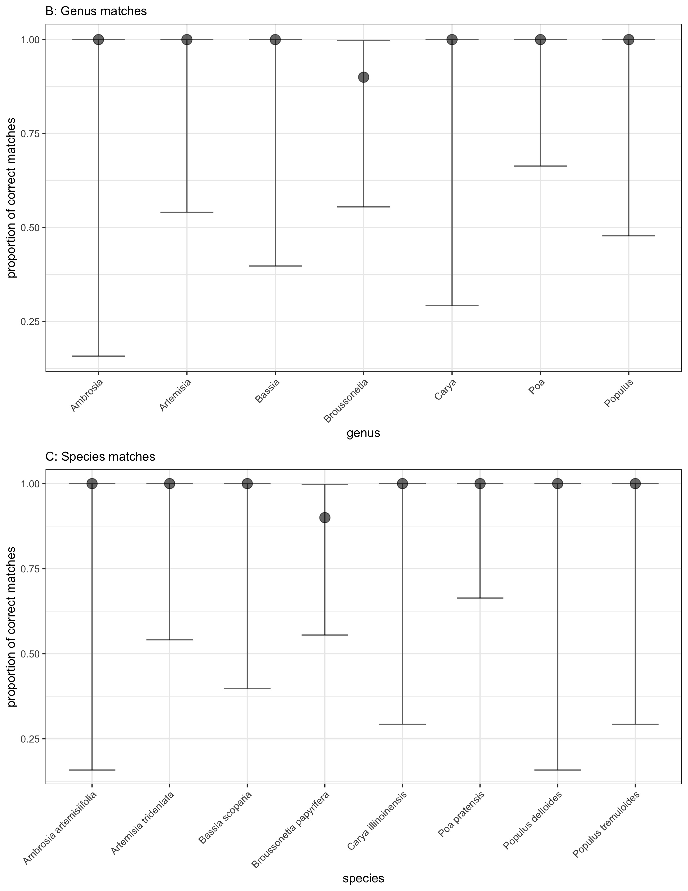
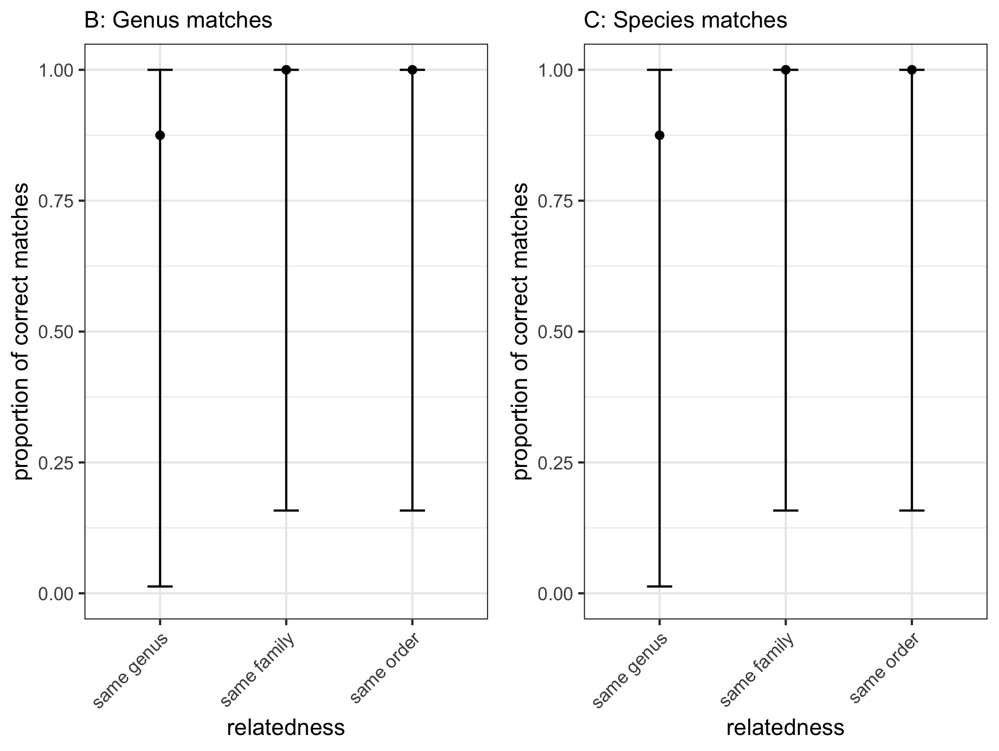
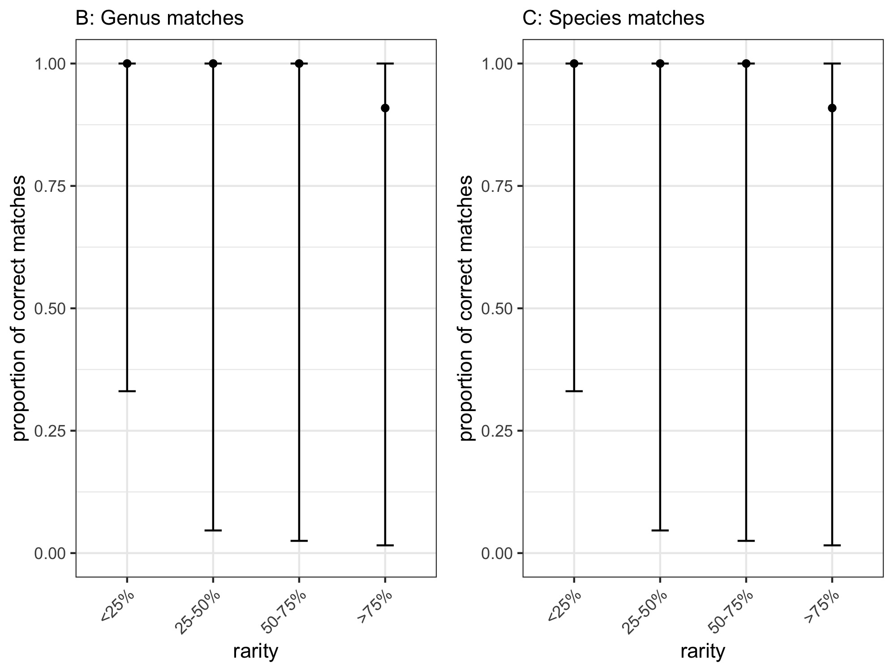
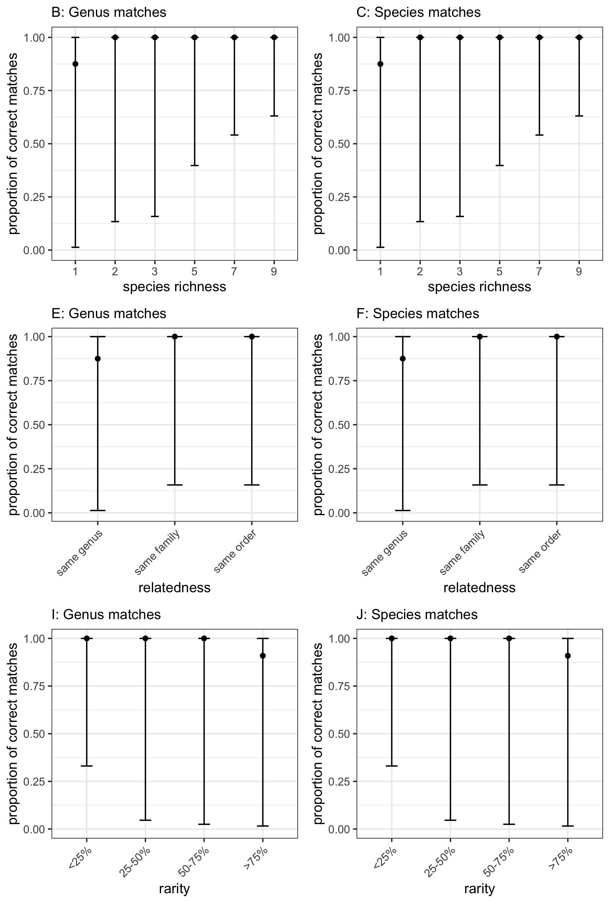
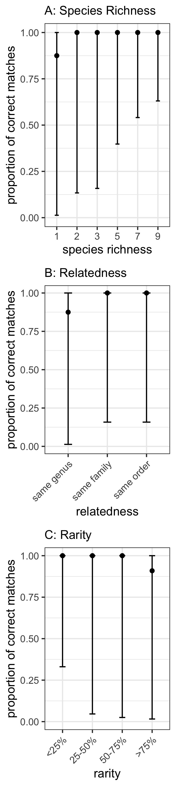
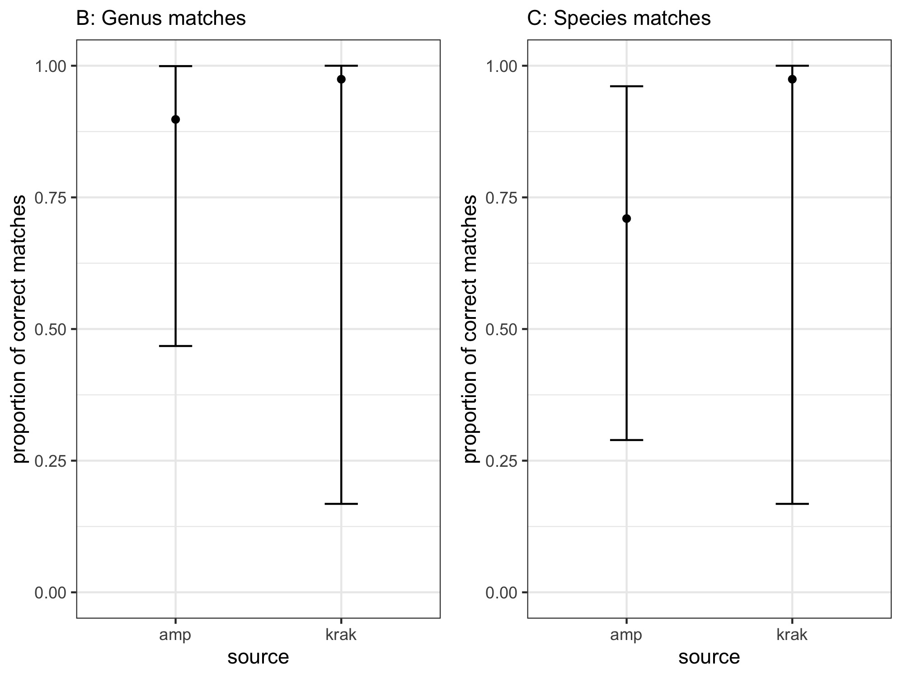
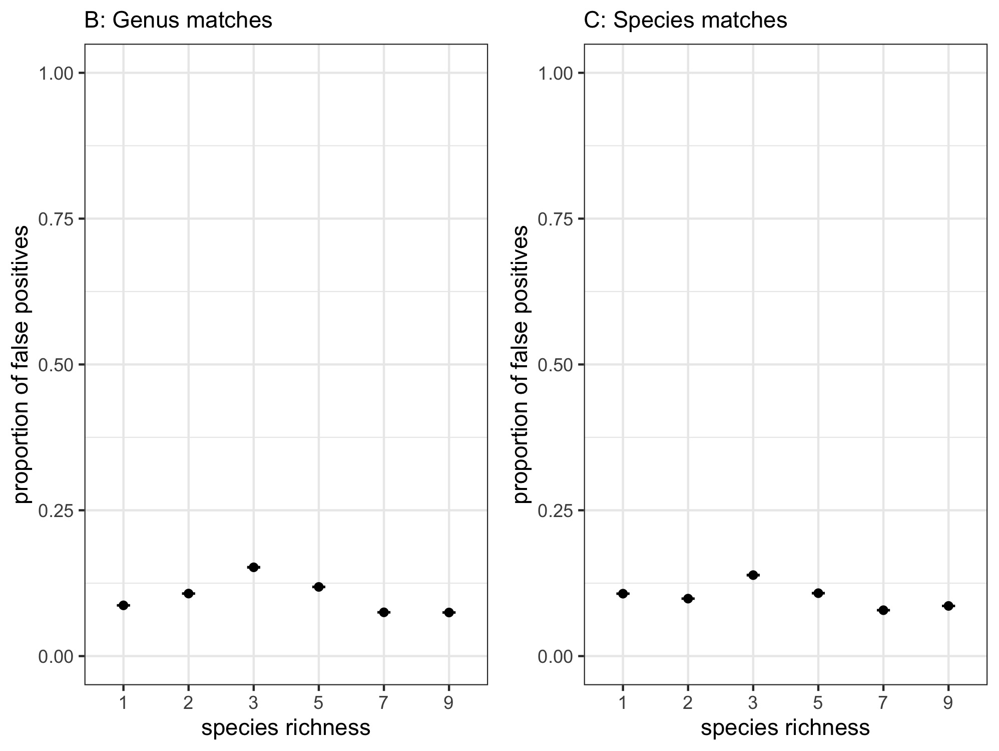
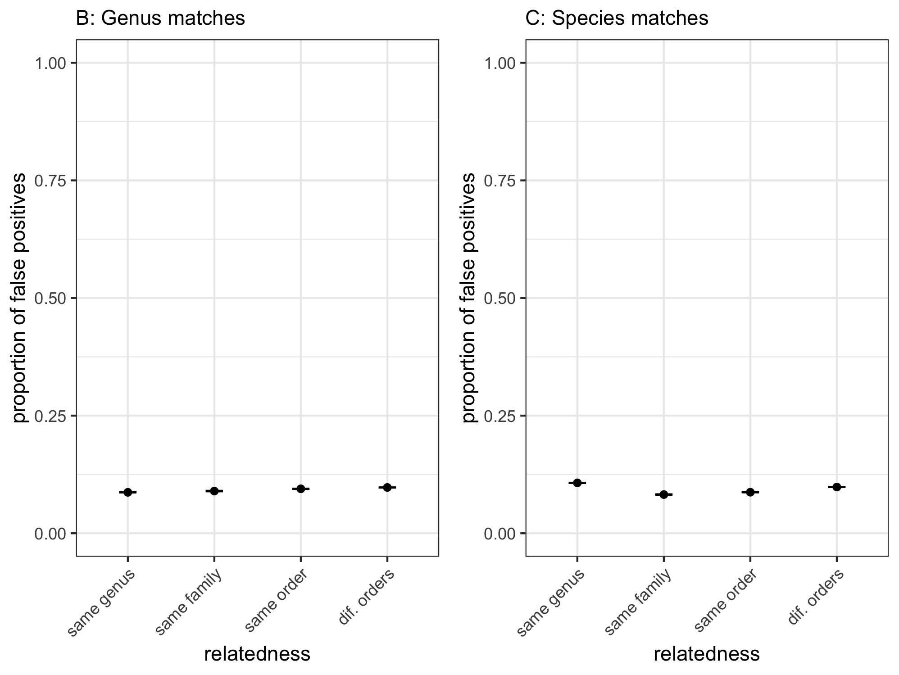
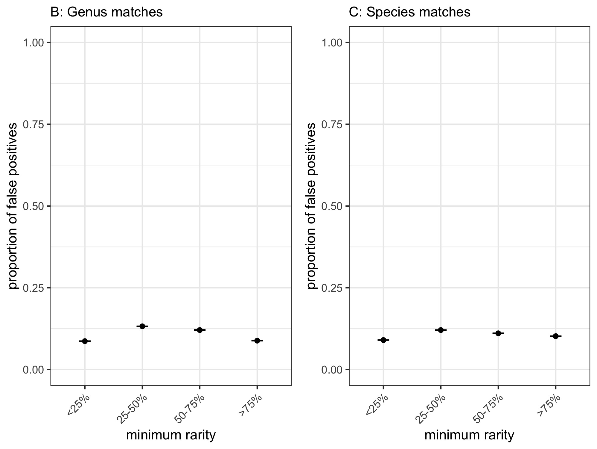
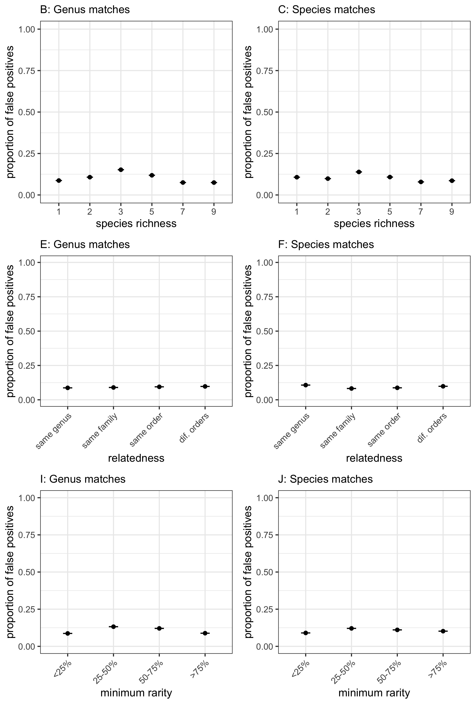

```{r setup, include=FALSE}
knitr::opts_chunk$set(echo = TRUE, error = TRUE)

suppressPackageStartupMessages(require(kableExtra))
suppressPackageStartupMessages(require(dplyr))
suppressPackageStartupMessages(require(stringr))
suppressPackageStartupMessages(require(reshape2))
suppressPackageStartupMessages(require(lme4))
suppressPackageStartupMessages(require(lmerTest))
suppressPackageStartupMessages(require(r2glmm))
suppressPackageStartupMessages(require(knitr))
suppressPackageStartupMessages(require(stringr))
suppressPackageStartupMessages(require(tidyr))
suppressPackageStartupMessages(require(tibble))
suppressPackageStartupMessages(require(data.table))
suppressPackageStartupMessages(require(binom))
suppressPackageStartupMessages(require(ggplot2))
suppressPackageStartupMessages(require(gridExtra))
suppressPackageStartupMessages(require(broom.mixed))
```

# Overview

This analysis is set up to assess how whole-genome shotgun (WGS) sequencing of known pollen samples performs, both on its own and relative to amplicon-based metabarcoding (with ITS2 and *rbcL*) in terms of:

1. **False negatives** (i.e. true positives)---if a species is present in a sample, is that species detected? 
1. **False positives**---how many species that are *not* present in a sample are erroneously detected?
1. **Quantitative matching**---what is the quantitative correspondence between the number of pollen grains going in to a sample and the number of sequence reads coming out?

These three questions form the basic structure of the analysis, which is paralleled by the structure of this file.

The samples that were sequenced with WGS were from constructed "mock community" pollen samples of known composition. We used the exact same DNA isolations as in Bell et al. 2019 *Molecular Ecology*. This analysis is largely (though not entirely) based on the analyses in that paper. 

The sequenced pollen samples were constructed to vary in complexity in three dimensions; we assessed how sample complexity affected the qualitative outcomes (false positive and false negative reads):

1. Question 1: **species richness** (1-9 species)
2. Question 2: **rarity** (actual proportion of grains this taxon has in a sample; from roughly half & half to < 1% of the rarer type)
3. Question 3: **taxonomic relatedness** (within genus to across broad clades in the seed plants)

# Analysis approach

## non-independence of data
Because all analyses included non-independent data (multiple replicates of the same pollen mixtures; pollen from the same plant species occurring in multiple mixtures), all of our analyses were conducted with mixed-effects modeling, using mixture identity and species identity as crossed random effects (modeled as random intercepts). For the analyses related to false positive matching, all species truly present in a mix were pooled together for the "true positives", so we did not use species identity (up to 9 different species) as a random effect in those analyses.

## comparing WGS to amplicon data
Across our outcomes, in comparing WGS and amplicon performance, we pooled WGS and amplicon results together into a single data table and conducted analyses with method (WGS vs. amplicon) as a fixed effect.

## structure of analyses: false negatives and false positives

The response variables for our first two outcomes are binomial (yes / no) in structure. We use binomial-errors mixed-effects models for these analyses.

For our first outcome of false negatives, we thus need to record---for each species present in a pollen mixture---whether or not that species was detected in that sample. To do this, we set up a datafile with each species truly present within each sample as its own row, which we subsequently scored as 0 / 1, with a zero for species that were present in the sample but *not* present in sequencing reads (above the contamination threshold), and a one for species that *were* present in the sequencing reads above the threshold. 

For our second outcome of false positives, we wished to assess the proportion of true vs. false positives. To do this, we aggregated the data to one row per sample replicate, and summed the read counts of true positives (combining all species truly present in a particular mix) and false positives in two separate columns.

## structure of analyses: quantitative matching

To assess the quantitative accuracy of WGS sequencing for our constructed mixtures, we tested the correlation between the known proportion of pollen grains in a sample (explanatory variable) and the proportion of WGS sequencing reads (response variable).

Ideally, we would like for there to be a perfect 1:1 fit between pollen grains going in and sequence reads coming out. This means a linear response between the two, with an intercept of 0 and a slope of 1. One could make an argument that instead of using a linear model, a binomial-errors model would be more appropriate given that the response variable is indeed proportional counts (of sequence reads). Moreover, even with a binomial-errors model, it is possible to get the equivalent of a line with slope = 1 and intercept = 0. 

We considered this issue in detail and decided that a linear model is better in this context. In particular, a binomial model could for example predict that for a given taxon, it will have a very very low detection probability until it reaches say ~80% of the pollen grains in the sample at which point the logistic curve could swing up sharply and after ~80% the detection probability could be very close to 1. If the data matched such a model, it would return both a very low $p$-value and a very high $R^2$, even though it would not be giving us what we want. Therefore, we decided to stick with a linear model.  

An alternative possibility is to specify the intercept (0) and slope (1) and see how well the data do at fitting that line. We also pursued this approach, by examining the *residuals* of WGS vs. amplicon data to that regression line. Smaller residuals are better. One thing to note about this approach is that it is probably dominated by the proportion of false positive reads---more false positives will mean that the proportion of true matches will be further from the 1:1 ratio. We thus used both of the approaches above to assess quantitative matching.

# Data import

Three groups of data sets to import: 

1. sample metadata 
1. WGS Kraken empirical data 
1. amplicon data 

The **metadata** are the same for the WGS and amplicon data, as both were run from the exact same DNA extractions.

For the **WGS Kraken data**, Jamieson Botsch formatted these (25-Apr-2018) from the raw Kraken output to combine the two data sources (we sequenced WGS data both at Emory and at UGA), and to have the family / genus / species separated out into columns; see `Shotgun_data_prep.Rmd`. Unlike the QIIME Illumina data, we do not need to do any aggregation of read counts as this was done automatically by Kraken (nice touch); i.e. all read counts at the species level are also included in genus-level matches and so on. We do just a couple of steps of very basic / simple formatting with the data import here (removal of superfluous numeric column a the beginning of the data; removal of duplicate rows).

The **amplicon data** are represented by 7 data files: The first (`amp_all`) is already merged with the sample metadata and already formatted for false-negative analyses (with a separate row for each species within each sample). There are separate columns for the presence or absence of that taxon at three different taxonomic levels (species, genus, and family) and for each marker (ITS2 and *rbcL*).

This `amp_all` dataset, however, does not include data on false positives. Thus, the remaining six datafiles are there to provide data on how many of the hits were to true positives (known to be present in the sample) vs. false positives (not included in the sample). In contrast to `amp_all`, these are formatted as six separate files, one each for the two markers (ITS2 and *rbcL*) and three levels of taxonomic matching (species, genus, and family). The format of these files matches basically what comes from QIIME: taxa are the rows, and samples are the columns. We re-format these to the tidy format of having samples as rows later. 

Across both the amplicon and the kraken data, one issue is that for different samples, matching the taxonomy at different levels leads to different numbers of rows. For example, we have two *Populus* species in some of the samples. For matching at the species level, that is two different rows. But for genus and family, it is just one row. There are some other samples that have two different genera in the same family (e.g., *Poa* and *Zea*, both in the Poaceae). Thus, these have to be either 1) stored as completely separate datafiles; or 2) stored in a single datafile (as in `amp_all`) but properly subset to not include duplicate rows for the same genus or family within samples. In this analysis we have split these out into separate files, which may not have been the best way to go (certainly not for memory management / speed; and also it makes the global environment rather messy). But given the aggregation that we had to do, it was probably the most straightforward way to go.


```{r data import}

mixes = read.csv("pollen-mixes-proportions.csv")
amp_its_family = read.csv("Amplicon_ITS_Family.csv")
amp_its_genus = read.csv("Amplicon_ITS_Genus.csv")
amp_its_species = read.csv("Amplicon_ITS_Species.csv")
amp_rbc_family = read.csv("Amplicon_rbcL_Family.csv")
amp_rbc_genus = read.csv("Amplicon_rbcL_Genus.csv")
amp_rbc_species = read.csv("Amplicon_rbcL_Species.csv")
amp_all = read.csv("Amplicon_all.csv")

# 'mixes' comes in with some rows duplicated (because in the spreadsheet, each was assessed with both ITS2 and with rbcL); fix this here:
mixes = unique(mixes)

#Create list of kraken2 report files
reports = list.files(path="./kraken2_results", full.names=T)

#Read in files as table
kraken2=lapply(reports, read.table, header=FALSE, sep="\t")

#Create column with file name to get sampleID and bind it to other columns
for (i in 1:length(kraken2)){kraken2[[i]]<-cbind(reports[i],kraken2[[i]])}
kraken2_rbind <- do.call("rbind", kraken2) 

#Rename column names
colnames(kraken2_rbind)[c(1,2,3,4,5,6,7)]<-c("sample.id", "perc.hit", "hits","misses","tax","tax.id","id")

```

# data formatting / setup

**Overview**

1. Basic Kraken data prep
    + filter to include only matches at family / genus / species taxonomic resolutions (not anything coarser, and no intermediate clades)
    + create new columns for `mix.ID` that matches the column in the sample (`pollen-mixes-proportions.csv`) data, and also `replicate.ID` for replicates within each mix
    + a couple of minor tweaks to make sure data are consistent etc.
1. Combine Kraken and sample metadata
1. Remove reads below contamination threshold
1. Format Kraken data for false negative and quantitative matching analyses
    + both of these analyses are about true positives (=false negatives) and straightforward to do the data formatting in the same step
1. Combine amplicon and empirical Kraken data: false negatives
1. Format Kraken data for false positive analysis
1. Combine amplicon and empirical Kraken data: false positives

## Basic Kraken data prep

1. create new column for `mix.ID` that matches the column in the sample metadata (`pollen-mixes-proportions.csv`)  
1. also create a new `replicate.ID` column (replicate samples of each `mix.ID`)
1. filter by `tax` column, including only species / genus / family levels

```{r Basic Kraken data prep}

#Create mixID column
kraken2_rbind$mix.ID = substr(kraken2_rbind$sample.id, 19, 24)

#replace dashes in 'mix.ID' with periods so that they match the 'mixes' data and remove underscores
kraken2_rbind$mix.ID = gsub("-", ".", kraken2_rbind$mix.ID)

#delete underscores either followed by nothing or an "S" (if mix number was single digit) 
kraken2_rbind$mix.ID = gsub("_S*", "", kraken2_rbind$mix.ID)

# move the new column to be second in order (not at the end where it's hard to see)
kraken2_rbind = kraken2_rbind[, c(1, ncol(kraken2_rbind), 3:ncol(kraken2_rbind)-1)]

#Create sample number column
kraken2_rbind$samp = substr(kraken2_rbind$sample.id, nchar(as.character(kraken2_rbind$sample.id))-17,nchar(as.character(kraken2_rbind$sample.id))-16)

#Remove S from sample number
kraken2_rbind$samp = gsub("S","", kraken2_rbind$samp)

#Create replicate number within mixID
kraken2_rbind = kraken2_rbind %>%
  group_by(mix.ID) %>%
  mutate(rep.ID= dense_rank((as.numeric(samp))))

#Move rep.ID to third row
kraken2_rbind = kraken2_rbind[, c(1,2, ncol(kraken2_rbind), 4:ncol(kraken2_rbind)-1)]

#Remove "undetermined"
kraken2_sub = kraken2_rbind[!(kraken2_rbind$mix.ID == "Undete"),]

#Replace isol.n and PCR.ne with "negat"
kraken2_sub$mix.ID = gsub("isol.n", "negat", kraken2_sub$mix.ID)
kraken2_sub$mix.ID = gsub("PCR.ne", "negat", kraken2_sub$mix.ID)

#Remove any rows that are identified to anything other than family, genus, or species (not higher tax or subgroups)
kraken2_sub = kraken2_sub[(kraken2_sub$tax == "F" | kraken2_sub$tax == "G" | kraken2_sub$tax == "S"),]

#Remove leading white space in tax names
kraken2_sub$id = trimws(kraken2_sub$id, "left")

#Rename dataframe so it can run through script
krak = kraken2_sub

#Create list of unique kraken IDs
krak_uniqueid = data.frame(krak$mix.ID, krak$rep.ID)
krak_uniqueid = unique.data.frame(krak_uniqueid)
```
## combine Kraken & sample metadata

Create a new aggregated datasheet, based on sample metadata, but which matches sample data back to the Kraken data so we can run analyses about probability of matching (both qualitative and quantitative). In particular this is taking account of sample "replicates" (including some that are not true replicates, but rather forward vs. reverse reads); also different Illumina lanes in the Emory Genome Center data.

1. Merge the unique krak IDs with mixes to subset the sample data to only the samples in the kraken dataset 
1. Create a dataset for analysis of false negatives by only including taxa that are present in sample data
    + for this one, do it separately at each taxonomic level that we are assessing, i.e. species, genus, family
1. Create a dataset for analysis of false positives by including all taxa in kraken data

use 'mix.ID' as the variable to combine by...

```{r merge kraken data and sample metadata}

## Merge sample and replicate IDs with mixes data
krak_mixes <- merge(mixes,krak_uniqueid, by="mix.ID", by.y="krak.mix.ID")

# create separate datasets for family, genus, and species level, both including and excluding false positives
# excluding false positives (focus on true positives / false negatives):
truepos.krak.family =  merge(krak_mixes, filter(krak, tax == "F"), by.x = c("mix.ID", "family"), by.y = c("mix.ID", "id"), all.x=T)
truepos.krak.genus =  merge(krak_mixes, filter(krak, tax == "G"), by.x = c("mix.ID", "genus"), by.y = c("mix.ID", "id"), all.x=T)
truepos.krak.species =  merge(krak_mixes, filter(krak, tax == "S"), by.x = c("mix.ID", "species"), by.y = c("mix.ID", "id"), all.x=T)

# including false positives:
all.krak.family =  merge(krak_mixes, filter(krak, tax == "F"), by.x = c("mix.ID", "family"), by.y = c("mix.ID", "id"), all.x = T, all.y = T)
all.krak.genus =  merge(krak_mixes, filter(krak, tax == "G"), by.x = c("mix.ID", "genus"), by.y = c("mix.ID", "id"), all.x = T, all.y = T)
all.krak.species =  merge(krak_mixes, filter(krak, tax == "S"), by.x = c("mix.ID", "species"), by.y = c("mix.ID", "id"), all.x = T, all.y = T)

# clean up:
rm(krak_uniqueid)

```

## remove Kraken reads below the contamination threshold

1. remove reads below the isolation / PCR negative control thresholds
      a) ideally, would base these on negative controls *for a given Illumina run* (two separate runs here, at UGA and Emory Genome center; we will need to keep those separate); but unfortunately there are not negative controls for the Emory Genome Center data; use the UGA thresholds for all the data (definitely not ideal, but working with what we have)
      a) this entails removing rows with $k$-mer counts below the threshold
      a) in the Illumina QIIME amplicon data, we did this separately for (entire) taxa below the threshold level, and for reads, because of the way that the data were formatted in a taxon-by-sample matrix; the Kraken output is already formatted in a way that is closer to `tidy` so we only need to do this step once here.
1. remove negative control rows (once the above is completed) so they don't interfere with the analysis


```{r remove kraken reads below contamination threshold}

# Establish threshold for maximum number of reads in the negative controls
maxy = max(krak$hits[krak$mix.ID=="negat"])

# Identify rows that fall below this threshold for false negative analysis
truepos.indexy_family = which(truepos.krak.family$hits <= maxy)
truepos.indexy_genus = which(truepos.krak.genus$hits <= maxy)
truepos.indexy_species = which(truepos.krak.species$hits <= maxy)

# No rows for false negative analysis with read level below threshold - can continue with analysis 

# Identify rows that fall below thresshold for false positive analysis
all.indexy_family = which(all.krak.family$hits <= maxy)
all.indexy_genus = which(all.krak.genus$hits <= maxy)
all.indexy_species = which(all.krak.species$hits <= maxy)

# Remove these rows
all.krak.family = all.krak.family[-all.indexy_family,]
all.krak.genus = all.krak.genus[-all.indexy_genus,]
all.krak.species = all.krak.species[-all.indexy_species,]

# Remove negative control rows
all.krak.family = filter(all.krak.family, mix.ID!="negat")
all.krak.genus = filter(all.krak.genus, mix.ID!="negat")
all.krak.species = filter(all.krak.species, mix.ID!="negat")

# Clean up
rm(maxy, all.indexy_family, all.indexy_genus, all.indexy_species, truepos.indexy_family, truepos.indexy_genus, truepos.indexy_species)

```

## Kraken data: format for false negative and quantitative analyses

(will do false positives in next step; the data formatting at this step is relatively straightforward; again both of these are focused on true positives so easy to do them in the same code chunk)

1. Convert NAs in true positives / false negatives to 0s
1. Convert the "percentage hits" to a proportion - which will be the response variable in the quantitative models
1. Create a qualitative variable that equals 1 if that taxon was detected in the analysis (i.e. if proportion is greater than 0), and 0 if not detected (i.e. if proportion = 0). 

```{r match kraken to sample data}

# create quantitative variable by simply dividing the percentage hits (perc.hit) by 100
truepos.krak.family$quant.family = truepos.krak.family$perc.hit/100
truepos.krak.genus$quant.genus = truepos.krak.genus$perc.hit/100
truepos.krak.species$quant.species = truepos.krak.species$perc.hit/100

# for taxa that were not detected, NAs are currently present. Need to change this to 0 for quantitative variable before running analysis.
truepos.krak.family$quant.family = ifelse(is.na(truepos.krak.family$quant.family), 0, truepos.krak.family$quant.family)
truepos.krak.genus$quant.genus = ifelse(is.na(truepos.krak.genus$quant.genus), 0, truepos.krak.genus$quant.genus)
truepos.krak.species$quant.species = ifelse(is.na(truepos.krak.species$quant.species), 0, truepos.krak.species$quant.species)

#Create qualitative variable based on quantitative variable
truepos.krak.family$qual.family = ifelse(truepos.krak.family$quant.family > 0, 1, 0)
truepos.krak.genus$qual.genus = ifelse(truepos.krak.genus$quant.genus > 0, 1, 0)
truepos.krak.species$qual.species = ifelse(truepos.krak.species$quant.species > 0, 1, 0)
```

## combine amplicon and Kraken data for false negative analysis

Using the kraken data formatted for true positive/false negative analysis ("truepos.krak"), rbind with amplicon data. 

```{r combine amplicon and kraken data for true positive/false negative}

#Add "K-" to beginning of sample number of kraken dataset and add variable "source" to indicate that data is from kraken dataset
truepos.krak.family$sample <- paste("K-", truepos.krak.family$krak.sample, sep="")
truepos.krak.genus$sample <- paste("K-", truepos.krak.genus$krak.sample, sep="")
truepos.krak.species$sample <- paste("K-", truepos.krak.species$krak.sample, sep="")

#Add "source" variable to indicate if data is WGS or amplicon
truepos.krak.family$source = "krak"
truepos.krak.genus$source = "krak"
truepos.krak.species$source = "krak"
amp_all$source = "amp"

#Concatenate WGS and amplicon data using mapply so that mismatching variable names of the amplicon data will be ignored
# 'fn' appended at the end of the variable names signifies "false negatives"

krakamp_rbc_family_fn <- as.data.frame(mapply(c, truepos.krak.family[,c("mix.ID", "family", "sample", "qual.family", "source")], amp_all[,c("mix.ID","family","sample", "qual.family.rbcL", "source")]))

krakamp_its_family_fn <- as.data.frame(mapply(c, truepos.krak.family[,c("mix.ID", "family", "sample", "qual.family", "source")], amp_all[,c("mix.ID","family","sample", "qual.family.ITS", "source")]))

krakamp_rbc_genus_fn <- as.data.frame(mapply(c, truepos.krak.genus[,c("mix.ID", "genus", "sample", "qual.genus", "source")], amp_all[,c("mix.ID","genus","sample", "qual.genus.rbcL", "source")]))

krakamp_its_genus_fn <- as.data.frame(mapply(c, truepos.krak.genus[,c("mix.ID", "genus", "sample", "qual.genus", "source")], amp_all[,c("mix.ID","genus","sample", "qual.genus.ITS", "source")]))

krakamp_rbc_species_fn <- as.data.frame(mapply(c, truepos.krak.species[,c("mix.ID", "species", "sample", "qual.species", "source")], amp_all[,c("mix.ID","species","sample", "qual.species.rbcL", "source")]))

krakamp_its_species_fn <- as.data.frame(mapply(c, truepos.krak.species[,c("mix.ID", "species", "sample", "qual.species", "source")], amp_all[,c("mix.ID","species","sample", "qual.species.ITS", "source")]))

```

## format kraken data for false positive analysis

To analyze false positives in kraken data, need to have aggregated counts of the "true positive" and "false positive" reads by sample. These will be our "success" and "failure" numbers in a binomial mixed model. 

1. If the merged sample data is N/A, this indicates the taxa is a false positive. Based on N/A values, create a variable indicating if taxa is true or false positive.
1. Remove taxa that are in sample data but not kraken data (false negatives) - not considered for this analysis
    + while perhaps counterintuitive, need to do this because in this analysis we are using counts of "true positive" reads vs. "false positive" reads, i.e. only using reads that exist, not reads that should have existed but do not. Those are dealt with in our false negative analysis.
1. Add "K" to the sample names to distinguish from the samples in the amplicon data
1. Aggregate the counts per sample ID by "true positive" and "false positive"

In addition :

1. removed *Zea mays* and mix5 samples (don't match with metadata; mix5 has *Zea* in it)
1. matched false positive data with metadata so that sample complexity analyses can be run down the line
1. one consideration is that since we are aggregating all of the reads for a particular sample into one row, we have to figure out how to deal with rarity / commonness of taxa within a sample.
    + to do that, we use the *minimum* % of any taxon within the sample as a measure of rarity

```{r Format kraken data for false positive analysis}

# For false positive analysis, create variable indicating if taxa if "false positive" or "true positive"
all.krak.family$type <- ifelse(is.na(all.krak.family$question.1), "false_pos", "true_pos")
all.krak.genus$type <- ifelse(is.na(all.krak.genus$question.1), "false_pos", "true_pos")
all.krak.species$type <- ifelse(is.na(all.krak.species$question.1), "false_pos", "true_pos")

# If hits = N/A, indicates a false negative (in sample data but not in Kraken data). Remove because we are not considering for this analysis
# (for the future, probably easier with `filter` in `dplyr` package)
all.krak.family <- all.krak.family[-which(is.na(all.krak.family$sample.id)),]
all.krak.genus <- all.krak.genus[-which(is.na(all.krak.genus$sample.id)),]
all.krak.species <- all.krak.species[-which(is.na(all.krak.species$sample.id)),]

# Add "K_" to sample name
all.krak.family$sample <- paste("K_",all.krak.family$sample, sep="")
all.krak.genus$sample <- paste("K_",all.krak.genus$sample, sep="")
all.krak.species$sample <- paste("K_",all.krak.species$sample, sep="")

# Aggregate counts by mix.ID, sample.ID, and type
agg.krak.family <- all.krak.family %>%
          select(mix.ID, family, rep.ID, sample, type, hits) %>%
          group_by(mix.ID, sample, rep.ID, type) %>%
          summarize(total_hits = sum(hits))
agg.krak.genus <- all.krak.genus %>%
          select(mix.ID, genus, rep.ID, sample, type, hits) %>%
          group_by(mix.ID, sample, rep.ID, type) %>%
          summarize(total_hits = sum(hits))
agg.krak.species <- all.krak.species %>%
          select(mix.ID, species, rep.ID, sample, type, hits) %>%
          group_by(mix.ID, sample, rep.ID, type) %>%
          summarize(total_hits = sum(hits))

# Convert to wide format with one column for true positive hits and one column for false positive hits
agg.krak.family <- spread(agg.krak.family, key=type, value=total_hits)
agg.krak.genus <- spread(agg.krak.genus, key=type, value=total_hits)
agg.krak.species <- spread(agg.krak.species, key=type, value=total_hits)

# If positives are N/A, set to equal 0
agg.krak.family$true_pos = ifelse(is.na(agg.krak.family$true_pos),0, agg.krak.family$true_pos)
agg.krak.genus$true_pos = ifelse(is.na(agg.krak.genus$true_pos),0, agg.krak.genus$true_pos)
agg.krak.species$true_pos = ifelse(is.na(agg.krak.species$true_pos),0, agg.krak.species$true_pos)
agg.krak.family$false_pos = ifelse(is.na(agg.krak.family$false_pos),0, agg.krak.family$false_pos)
agg.krak.genus$false_pos = ifelse(is.na(agg.krak.genus$false_pos),0, agg.krak.genus$false_pos)
agg.krak.species$false_pos = ifelse(is.na(agg.krak.species$false_pos),0, agg.krak.species$false_pos)

# as set up currently, the false positive datasets ('agg.krak.family', 'agg.krak.genus', 'agg.krak.species')
# do not have the needed components to replicate the analysis we used for false negatives
# specifically, we need to have data on the facets of samples complexity:
    # species richness, taxonomic relatedness, and rarity
# and we also need the data subset component ('sub' vs. 'all')

# first, remove Zea mays and mix5 (which had Zea in it):
#agg.krak.family = filter(agg.krak.family, mix.ID != "Z.may" & mix.ID != "mix5")
#agg.krak.genus = filter(agg.krak.genus, mix.ID != "Z.may" & mix.ID != "mix5")
#agg.krak.species = filter(agg.krak.species, mix.ID != "Z.may" & mix.ID != "mix5")

# now, add the needed metadata

# don't want the aggregated data to be repeated for each taxon in a mix
# and that is the way the 'mixes' dataframe is set up
# in addition, to assess rarity, different taxa have different proportions
# thus, summarize 'mixes' to have the *minimum* value of 'pollen.grain.proportion' for each mix

mixy = mixes 
mixy = mixy %>% select(-family, -genus, -species) %>% group_by(mix.ID) %>% summarize_all(min)

# now put them together
# via a merge of the false positive datasets with the 'mixes' (sample metadata)
# (didn't use 'left_join' because of conversion of factors to character)
agg.krak.family = merge(agg.krak.family, mixy, by = "mix.ID")
agg.krak.genus = merge(agg.krak.genus, mixy, by = "mix.ID")
agg.krak.species = merge(agg.krak.species, mixy, by = "mix.ID")

# clean up... or don't
# don't remove 'mixy' just yet as we'll employ it again below for the false-positive amplicon data

```


## false positives: format amplicon data

This part is one of the more challenging components of the formatting. It is based on the six amplicon data files (one for each marker and taxonomic level), formatted as QIIME matrices such that taxa comprise the rows and samples comprise the columns.

we need to:

* `melt` each matrix into a single row for each taxon / mix / sample combination, reporting the number of reads for each
    + remove combos for which there were zero reads (not strictly necessary since we will later just add up all the true and false positives, but makes everything more compact)
    + also a good time to remove mix #5 and also *Zea* samples from the amplicon data for consistencey
* merge each melted dataframe with with the sample metadata
* classify reads ("hits") into false positives and false negatives, on a replicate-by-replicate basis
* aggregate (sum) false positive and false negative reads for each sample and replicate
* merge sample metadata in with the amplicon data


```{r format amplicon false positive}

#Create list of amplicon data frames
amp_data <- list(amp_its_family, amp_its_genus, amp_its_species, amp_rbc_family, amp_rbc_genus, amp_rbc_species)

# create a function for *melting* the amplicon QIIME matrices, with a row for each...
# ...taxon / mix / sample combination, reporting the number of reads for each
amp_convert <- lapply(amp_data, function(x){
  #convert first column name to "taxa"
  names(x)[1] <- "taxa"
  #convert from wide to long format
  x <- melt(x, id.vars="taxa", value.name="hits")
  #separate mix ID and sample ID
  x[,4:5] <- colsplit(x$variable, "_", c("mix.ID", "sample"))
  #remove variable "id"
  x <- x[,-2]
  # remove any rows for which the "hits" count == 0
  # there were no reads, so we don't need to include them
  # also a good point to remove Zea mays single-species samples
  # and also mix #5 which includes Zea
  x <- filter(x, hits!=0 & mix.ID != "Z.mays" & mix.ID != "mix5")
})

# apply the melting function to each of the 6 datasets
# convert them into data frames at the same time
# (in the future, better to do this with `lapply` or similar)
amp_its_family <- as.data.frame(amp_convert[1])
amp_its_genus <- as.data.frame(amp_convert[2])
amp_its_species <- as.data.frame(amp_convert[3])
amp_rbc_family <- as.data.frame(amp_convert[4])
amp_rbc_genus <- as.data.frame(amp_convert[5])
amp_rbc_species <- as.data.frame(amp_convert[6])

# merge with sample metadata (`mixes`) by mixID and sampleID
amp_its_family_mix <- merge(amp_its_family, mixes, by.x=c("mix.ID", "taxa"), by.y=c("mix.ID", "family"), all.x=T)
amp_its_genus_mix <- merge(amp_its_genus, mixes, by.x=c("mix.ID", "taxa"), by.y=c("mix.ID", "genus"), all.x=T)
amp_its_species_mix <- merge(amp_its_species, mixes, by.x=c("mix.ID", "taxa"), by.y=c("mix.ID", "species"), all.x=T)
amp_rbc_family_mix <- merge(amp_rbc_family, mixes, by.x=c("mix.ID", "taxa"), by.y=c("mix.ID", "family"), all.x=T)
amp_rbc_genus_mix <- merge(amp_rbc_genus, mixes, by.x=c("mix.ID", "taxa"), by.y=c("mix.ID", "genus"), all.x=T)
amp_rbc_species_mix <- merge(amp_rbc_species, mixes, by.x=c("mix.ID", "taxa"), by.y=c("mix.ID", "species"), all.x=T)

#Rows with mixes variables that are "NA" are false positive taxa. Create a data frame that indicates if row is true positive or false positive
amp_its_family_mix$type <- ifelse(is.na(amp_its_family_mix$question.1), "false_pos", "true_pos")
amp_its_genus_mix$type <- ifelse(is.na(amp_its_genus_mix$question.1), "false_pos", "true_pos")
amp_its_species_mix$type <- ifelse(is.na(amp_its_species_mix$question.1), "false_pos", "true_pos")
amp_rbc_family_mix$type <- ifelse(is.na(amp_rbc_family_mix$question.1), "false_pos", "true_pos")
amp_rbc_genus_mix$type <- ifelse(is.na(amp_rbc_genus_mix$question.1), "false_pos", "true_pos")
amp_rbc_species_mix$type <- ifelse(is.na(amp_rbc_species_mix$question.1), "false_pos", "true_pos")

#New list of mixed datasets
amp_mixed <- list(amp_its_family_mix, amp_its_genus_mix, amp_its_species_mix, amp_rbc_family_mix, amp_rbc_genus_mix, amp_rbc_species_mix)


#Apply function to list
amp_summed <- lapply(amp_mixed, function(x){
  #summarize number of hits by mix.ID, sample, and type
  x <- x %>%
          select(mix.ID, taxa, hits, sample, type) %>%
          group_by(mix.ID, sample, type) %>%
          summarize(total_hits = sum(as.numeric(hits)))
  #Convert to wide format with one column for true positive hits and one column for false positive hits
  #x <- reshape(x, idvar="sample", timevar="type", direction="wide")
})

amp_its_family_summ <- as.data.frame(amp_summed[1])
amp_its_genus_summ <- as.data.frame(amp_summed[2])
amp_its_species_summ <- as.data.frame(amp_summed[3])
amp_rbc_family_summ <- as.data.frame(amp_summed[4])
amp_rbc_genus_summ <- as.data.frame(amp_summed[5])
amp_rbc_species_summ <- as.data.frame(amp_summed[6])

# Add "A" to beginning of sample ID - couldn't get this to work in the lapply function
amp_its_family_summ$sample <- paste("A_", amp_its_family_summ$sample, sep="")
amp_its_genus_summ$sample <- paste("A_", amp_its_genus_summ$sample, sep="")
amp_its_species_summ$sample <- paste("A_", amp_its_species_summ$sample, sep="")
amp_rbc_family_summ$sample <- paste("A_", amp_rbc_family_summ$sample, sep="")
amp_rbc_genus_summ$sample <- paste("A_", amp_rbc_genus_summ$sample, sep="")
amp_rbc_species_summ$sample <- paste("A_", amp_rbc_species_summ$sample, sep="")

# Convert to wide format with one column for true positive hits and one column for false positive hits - couldn't get this to work in the lapply function
amp_its_family_reshape <- spread(amp_its_family_summ, key=type, value=total_hits)
amp_its_genus_reshape <- spread(amp_its_genus_summ, key=type, value=total_hits)
amp_its_species_reshape <- spread(amp_its_species_summ, key=type, value=total_hits)
amp_rbc_family_reshape <- spread(amp_rbc_family_summ, key=type, value=total_hits)
amp_rbc_genus_reshape <- spread(amp_rbc_genus_summ, key=type, value=total_hits)
amp_rbc_species_reshape <- spread(amp_rbc_species_summ, key=type, value=total_hits)

#If positives are N/A, set to equal 0
amp_its_family_reshape$true_pos = ifelse(is.na(amp_its_family_reshape$true_pos),0, amp_its_family_reshape$true_pos)
amp_its_genus_reshape$true_pos = ifelse(is.na(amp_its_genus_reshape$true_pos),0, amp_its_genus_reshape$true_pos)
amp_its_species_reshape$true_pos = ifelse(is.na(amp_its_species_reshape$true_pos),0, amp_its_species_reshape$true_pos)
amp_rbc_family_reshape$true_pos = ifelse(is.na(amp_rbc_family_reshape$true_pos),0, amp_rbc_family_reshape$true_pos)
amp_rbc_genus_reshape$true_pos = ifelse(is.na(amp_rbc_genus_reshape$true_pos),0, amp_rbc_genus_reshape$true_pos)
amp_rbc_species_reshape$true_pos = ifelse(is.na(amp_rbc_species_reshape$true_pos),0, amp_rbc_species_reshape$true_pos)

amp_its_family_reshape$false_pos = ifelse(is.na(amp_its_family_reshape$false_pos),0, amp_its_family_reshape$false_pos)
amp_its_genus_reshape$false_pos = ifelse(is.na(amp_its_genus_reshape$false_pos),0, amp_its_genus_reshape$false_pos)
amp_its_species_reshape$false_pos = ifelse(is.na(amp_its_species_reshape$false_pos),0, amp_its_species_reshape$false_pos)
amp_rbc_family_reshape$false_pos = ifelse(is.na(amp_rbc_family_reshape$false_pos),0, amp_rbc_family_reshape$false_pos)
amp_rbc_genus_reshape$false_pos = ifelse(is.na(amp_rbc_genus_reshape$false_pos),0, amp_rbc_genus_reshape$false_pos)
amp_rbc_species_reshape$false_pos = ifelse(is.na(amp_rbc_species_reshape$false_pos),0, amp_rbc_species_reshape$false_pos)

# Add rep.ID = 1 for amplicon data to match kraken data
# (probably could have done this in the first function above)
amp_its_family_reshape$rep.ID = 1
amp_its_genus_reshape$rep.ID = 1
amp_its_species_reshape$rep.ID = 1
amp_rbc_family_reshape$rep.ID = 1
amp_rbc_genus_reshape$rep.ID = 1
amp_rbc_species_reshape$rep.ID = 1

# Move to third column to match Kraken data
# (better done with `dplyr` in the future)
amp_its_family_reshape = amp_its_family_reshape[,c(1:2,5,3:4)]
amp_its_genus_reshape = amp_its_genus_reshape[,c(1:2,5,3:4)]
amp_its_species_reshape = amp_its_species_reshape[,c(1:2,5,3:4)]
amp_rbc_family_reshape = amp_rbc_family_reshape[,c(1:2,5,3:4)]
amp_rbc_genus_reshape = amp_rbc_genus_reshape[,c(1:2,5,3:4)]
amp_rbc_species_reshape = amp_rbc_species_reshape[,c(1:2,5,3:4)]

# merge these data with the sample metadata
# use 'mixy' from above which is the sample metadata summarized by sample
# (not by taxon within sample, as for 'mixes')
amp_its_family_reshape = merge(amp_its_family_reshape, mixy, by = "mix.ID")
amp_its_genus_reshape = merge(amp_its_genus_reshape, mixy, by = "mix.ID")
amp_its_species_reshape = merge(amp_its_species_reshape, mixy, by = "mix.ID")
amp_rbc_family_reshape = merge(amp_rbc_family_reshape, mixy, by = "mix.ID")
amp_rbc_genus_reshape = merge(amp_rbc_genus_reshape, mixy, by = "mix.ID")
amp_rbc_species_reshape = merge(amp_rbc_species_reshape, mixy, by = "mix.ID")

# clean up
rm(mixy)

```

## combine amplicon and Kraken data for false positive analysis

Combine the WGS with amplicon data by creating a dataframe showing the number of true positive and the number of false positive reads by source, mix ID, and sample ID. Straightforward.


``` {r combine amplicon and kraken data for false positives}

# Add column "source" to amplicon and kraken data
amp_its_family_reshape$source = "amp"
amp_its_genus_reshape$source = "amp"
amp_its_species_reshape$source = "amp"
amp_rbc_family_reshape$source = "amp"
amp_rbc_genus_reshape$source = "amp"
amp_rbc_species_reshape$source = "amp"

agg.krak.family$source = "krak"
agg.krak.genus$source = "krak"
agg.krak.species$source = "krak"

# Merge kraken and amplicon data
krakamp_its_family = rbind(subset(amp_its_family_reshape, mix.ID %in% agg.krak.family$mix.ID), as.data.frame(agg.krak.family))
krakamp_its_genus = rbind(subset(amp_its_genus_reshape, mix.ID %in% agg.krak.genus$mix.ID), as.data.frame(agg.krak.genus))
krakamp_its_species = rbind(subset(amp_its_species_reshape, mix.ID %in% agg.krak.species$mix.ID), as.data.frame(agg.krak.species))
krakamp_rbc_family = rbind(subset(amp_rbc_family_reshape, mix.ID %in% agg.krak.family$mix.ID), as.data.frame(agg.krak.family))
krakamp_rbc_genus = rbind(subset(amp_rbc_genus_reshape, mix.ID %in% agg.krak.genus$mix.ID), as.data.frame(agg.krak.genus))
krakamp_rbc_species = rbind(subset(amp_rbc_species_reshape, mix.ID %in% agg.krak.species$mix.ID), as.data.frame(agg.krak.species))

```


# Analysis

1. false negatives
    + WGS data alone, as a function of sample complexity
    + WGS data compared to amplicon data
1. false positives
    + WGS data alone, as a function of sample complexity
    + WGS data compared to amplicon data
1. quantitative matching
    + WGS data alone (sample input compared to sample output)
    + WGS data compared to amplicon data

## false negatives 

To assess if species richness, relatedness, and pollen grain proportion have a significant effect on the ability of the empirical WGS to qualitatively detect the presence/absence of a species, use a binomial mixed effects model with species as a random effect and rep.ID nested in sample nested in mix.ID as a random effect. 

For consistency, take out *Zea mays* and format data tables to have the same name as those in the mixed amplicon analysis. 

### sample complexity: false negatives

* the analysis approach here is based on binomial-errors mixed-effects models
* the **fixed effects** are sample complexity; we are assessing one facet of sample complexity per model
    + Question 1: **species richness** (1-9 species)
    + Question 2: **rarity** (actual proportion of grains this taxon has in a sample; from roughly half & half to < 1% of the rarer type)
    + Question 3: **taxonomic relatedness** (within genus to across broad clades in the seed plants)
* we separately assessed models that considered different **subsets of the data**:
    + just the mixes specifically set up for each of the questions above (smaller subset of the data)
    + all of the mixes (thus more data)
* we also ran separate models for matching at each of the **taxonomic levels:**
    + family, genus, and species
* the **random effects** are nested, with the highest level as `mix.ID` (i.e. the identity of the pollen mixture); then `sample` replicate within each mix and finally `rep.ID` (forward / reverse read within a sample, or Illumina lane for samples split across lanes)
    + we modeled these as random intercepts
    + the random effects were consistent and equivalent for all models
* there are 3 facets of sample complexity times 2 data subsets times 3 taxonomic levels = **18 total models**
    + set this up with a nested `for` loop; there are almost certainly cleaner and more elegant ways to do this (e.g. probably better to use `formula` objects and to vectorize)


```{r false negative analysis setup}

# Take out Zea
truepos.krak.family = filter(truepos.krak.family, genus!= "Zea") 
truepos.krak.genus = filter(truepos.krak.genus, genus!="Zea")
truepos.krak.species = filter(truepos.krak.species, genus!="Zea")

# set up the three factors by which we are running the models
taxon = c("species", "genus", "family")
datasubset = c("sub", "all") # whether we are using the designated subset of data designed for the question, or all data
question = c("spp.rich", "relatedness", "pollen.grain.proportion")

# calculate total number of models
total = length(taxon)*length(datasubset)*length(question)

# first set up a table for the results with a number of entries equal to the 'total' variable above (18):
results.table = data.frame(question = rep(NA,total), taxon  = rep(NA,total), data.subset  = rep(NA,total), model.name = rep(NA,total), p.val  = rep(1.000001,total), n  = rep(9999,total), warning.msg = rep(NA,total))

# keep track of which row of the table to record in:
tracker = 1

# EXAMPLE FORMULA:
# Krak.Q1.species.all = glmer(qual.species.rbcL ~ spp.rich + (1|mix.ID//rep.ID) + (1|species), family = binomial, data = truepos.krak.species, control = glmerControl(optimizer="bobyqa"))

# 'for' loop:

for(q in 1:3) { # 'question': response variables for Q1 / Q2 / Q3
    for(k in 1:3){ # 'taxon': species, genus, family
      for(l in 1:2) { # 'datasubset': sub or all
        # first, name the analysis:
        namer = paste("Krak.Q", q, ".", taxon[k], ".", datasubset[l], sep = "")
        # second, set which taxonomic data to use:
        data.to.use = paste("truepos.krak.", taxon[k], sep = "")
        # third, set up the data subset
        subster = paste("data.sub = filter(", data.to.use, ", question.1 == ", q, " | question.2 == ", q, " | question.3 == ",q, ")", sep = "")
        eval(parse(text = subster)) # probably not the most efficient thing ever... 
        # fourth, set whether or not data subset is used (vs. all data)
        if(datasubset[l]=="sub") {data.to.use = "data.sub"} # i.e., doesn't change if all data are to be used
        # fifth, set up mixed-effects model: 
        mixed = paste(namer, " = suppressWarnings(glmer(qual.", taxon[k],
          " ~ ",  question[q], " + (1|mix.ID/krak.rep.ID) + (1|", taxon[k], "), family = binomial, 
          data = ", data.to.use, ", control = glmerControl(optimizer=\"bobyqa\")))", sep = "")
        # sixth, evaluate the mixed-effects model
        eval(parse(text = mixed))
            # # eighth, print summary of model [SKIP FOR NOW]
            # summarizer = paste("print(summary(", namer, "))", sep = "")
            # eval(parse(text = summarizer)) # print summary of the mixed-effects model
        
        ## extract p-value
        # (this would probably be easier using the 'broom.mixed' package?)
        # example: coef(summary(Q3.genus.ITS.all))[2,4]
        pvaller = paste("pval <- coef(summary(", namer, "))[2,4]", sep = "")
        eval(parse(text = pvaller))
        
        # extract convergence failures
        converger = paste(namer, "@optinfo$conv$lme4$code", sep = "")
        converg = eval(parse(text = converger))
        converg.return = ifelse(length(converg)==1, "ERROR!!", "")
        
        # record results in table
        results.table[tracker,1] = question[q]
        results.table[tracker,2] = taxon[k]
        results.table[tracker,3] = datasubset[l]
        results.table[tracker,4] = namer
        results.table[tracker,5] = pval
        results.table[tracker,6] = nrow(eval(parse(text = data.to.use)))
        results.table[tracker,7] = converg.return
        
        # advance tracker
        tracker = tracker + 1
      }
    }
  }


# display results table
# note that the 'kable' function is part of the 'knitr' package and `kable_styling` is from the `kableExtra` package 
kable(results.table) %>% 
  kable_styling(bootstrap_options = "striped", full_width = F)
```

We got back `boundary` (singular) fits for many of these models. Most of those were because the fine-scale random effects showed almost no variance. That is probably a good thing, we do not want to have any variability among (say) forward vs. reverse reads of the same sample or across sample replicates.

For the empirical data, species richness has a significant effect on qualitative detection at the species level (in both the subsetted data and full data set) and at the genus level in the subsetted data, but the model gives errors at the genus level using the full dataset and at the family level. 

Species relatedness has a significant effect on qualitative detection with the full dataset (highly significant - all p-values <0.0001), but not with the subsetted dataset ($p$ = 0.97 for species and genus level, $p$ = 0.06 for family level). Not sure if this makes sense...

Pollen grain proportion has a significant effect on qualitative detection at the species level with the full dataset and at the family level with the full dataset. The other tests gave errors. 

### Amplicon vs. Shotgun comparison: false negatives

This analysis uses binomial mixed models to assess if using amplicon vs. WGS has an effect on the ability to qualitatively detect true positives vs. false negatives. This analysis is similar to the qualitative mixed models to assess the effect of species richness, pollen grain proportion, etc. on the ability to qualitatively detect the correct taxa, but instead using "source" as the (sole) fixed effect.

#### by marker (*rbcL* vs ITS2)---Amplicon vs. Shotgun false negatives

```{r amplicon vs. shotgun false positive - separate markers}

taxon = c("species", "genus", "family")
marker = c("its", "rbc")


# first set up a table for the results:
rowz = length(taxon)*length(marker)

krakamp.fn.results.table = data.frame(taxon  = rep(NA,rowz), marker  = rep(NA,rowz), model.name = rep(NA,rowz), p.val  = rep(1.000001,rowz), n  = rep(9999,rowz), warning.msg = rep(NA,rowz))

# keep track of which row of the table to record in:
tracker = 1

# # EXAMPLE FORMULA
# its.family = glmer(qual.family ~ source + (1|mix.ID/sample) + (1|family), family = binomial, data = krakamp_its_family_fn, control = glmerControl(optimizer="bobyqa"))

# response variables relating to each of the three questions (column names in data)

for(q in 1:2) { # 'marker': its or rbc
    for(k in 1:3){ # 'taxon': species, genus, family
        # first, name the analysis (i.e. name the result object):
        namer = paste(marker[q], ".", taxon[k], sep = "")
        
        # second, set which taxonomic data to use:
        data.to.use = paste("krakamp_", marker[q], "_", taxon[k],"_fn", sep = "")
        
        # third, set up mixed-effects model: 
        mixed = paste(namer, " = suppressWarnings(glmer(qual.", taxon[k],
          " ~ source + (1|mix.ID/sample) + (1|", taxon[k], "), family = binomial, 
          data = ", data.to.use, ", control = glmerControl(optimizer=\"bobyqa\")))", sep = "")
        
        # fourth, evaluate the mixed-effects model
        eval(parse(text = mixed))
            #fifth, print summary of model [SKIP FOR NOW]
            #summarizer = paste("print(summary(", namer, "))", sep = "")
            #eval(parse(text = summarizer)) # print summary of the mixed-effects model
        
        # fifth, extract the results
        ## extract p-value
        # example: coef(summary(its.family))[2,4]
        pvaller = paste("pval <- coef(summary(", namer, "))[2,4]", sep = "")
        eval(parse(text = pvaller))
        
        # extract convergence failures
        converger = paste(namer, "@optinfo$conv$lme4$code", sep = "")
        converg = eval(parse(text = converger))
        converg.return = ifelse(length(converg)==1, "ERROR!!", "")
        
        # record results in table
        krakamp.fn.results.table[tracker,1] = taxon[k]
        krakamp.fn.results.table[tracker,2] = marker[q]
        krakamp.fn.results.table[tracker,3] = namer
        krakamp.fn.results.table[tracker,4] = pval
        krakamp.fn.results.table[tracker,5] = nrow(eval(parse(text = data.to.use)))
        krakamp.fn.results.table[tracker,6] = converg.return
        
        # advance tracker
        tracker = tracker + 1
      }
    }
  

# display results table
# note that the 'kable' function is part of the 'knitr' package and `kable_styling` is from the `kableExtra` package 
kable(krakamp.fn.results.table) %>% 
  kable_styling(bootstrap_options = "striped", full_width = F)
```

Again, we got back `boundary` (singular) fits for many of these models. Most of those were because the fine-scale random effects showed almost no variance. That is probably a good thing, we do not want to have any variability among (say) forward vs. reverse reads of the same sample or across sample replicates.

When ITS2 was used as a marker in the amplicon data, the amplicon data did not behave significantly better or worse than the WGS data at the species and family level. However, at the genus level (estimate = -1.15), the negative estimate and low $p$-value suggests that using ITS2 sequencing was more accurate for detecting true positives than WGS.

In contrast, when *rbcL* was used as a marker in the amplicon data, the amplicon data detected fewer true positives at the species (estimate = 1.19) and genus (estimate = 1.04) levels than the WGS data. However, the amplicon data detected more true positives at the family level (estimate = -26.774) than the WGS data.

#### markers combined---Amplicon vs. Shotgun false negatives

This is a repeat of the analysis above, but with ITS2 and *rbcL* combined 

```{r r amplicon vs. shotgun true positive vs false negative - markers combined}

#Create new qualitative variable in amplicon dataset that equals 1 if ITS and/or rbcL equals 1, 0 if else

amp_all$qual.family = ifelse(amp_all$qual.family.ITS == 1 | amp_all$qual.family.rbcL == 1, 1, 0)
amp_all$qual.genus = ifelse(amp_all$qual.genus.ITS == 1 | amp_all$qual.genus.rbcL == 1, 1, 0)
amp_all$qual.species = ifelse(amp_all$qual.species.ITS == 1 | amp_all$qual.species.rbcL == 1, 1, 0)

#Combine kraken and amplicon data
krakamp_family_fn <- rbind(truepos.krak.family[,c("mix.ID", "family", "sample", "qual.family", "source")], amp_all[,c("mix.ID","family","sample", "qual.family", "source")])

krakamp_genus_fn <- rbind(truepos.krak.genus[,c("mix.ID", "genus", "sample", "qual.genus", "source")], amp_all[,c("mix.ID","genus","sample", "qual.genus", "source")])

krakamp_species_fn <- rbind(truepos.krak.species[,c("mix.ID", "species", "sample", "qual.species", "source")], amp_all[,c("mix.ID","species","sample", "qual.species", "source")])


taxon = c("species", "genus", "family")

# first set up a table for the results:
# I will set this up with 18 entries
krakamp.fn.results.combined = data.frame(taxon  = rep(NA,3), model.name = rep(NA,3), p.val  = rep(1.000001,3), n  = rep(9999,3), warning.msg = rep(NA,3))

# keep track of which row of the table to record in:
tracker = 1

# # EXAMPLE FORMULA
# its.family = glmer(qual.family ~ source + (1|mix.ID/sample) + (1|family), family = binomial, data = krakamp_family_fn, control = glmerControl(optimizer="bobyqa"))

# response variables relating to each of the three questions (column names in data)

    for(k in 1:3){ # 'taxon': species, genus, family
        # first, name the analysis:
        namer = taxon[k]
        
        # second, set which taxonomic data to use:
        data.to.use = paste("krakamp_", taxon[k],"_fn", sep = "")
        
        # third, set up mixed-effects model: 
        mixed = paste(namer, " = suppressWarnings(glmer(qual.", taxon[k],
          " ~ source + (1|mix.ID/sample) + (1|", taxon[k], "), family = binomial, 
          data = ", data.to.use, ", control = glmerControl(optimizer=\"bobyqa\")))", sep = "")
        # fourth, evaluate the mixed-effects model
        eval(parse(text = mixed))

        # fifth, extract model information
        ## extract p-value
        # example: coef(summary(its.family))[2,4]
        pvaller = paste("pval <- coef(summary(", namer, "))[2,4]", sep = "")
        eval(parse(text = pvaller))
        
        # extract convergence failures
        converger = paste(namer, "@optinfo$conv$lme4$code", sep = "")
        converg = eval(parse(text = converger))
        converg.return = ifelse(length(converg)==1, "ERROR!!", "")
        
        # record results in table
        krakamp.fn.results.combined[tracker,1] = taxon[k]
        krakamp.fn.results.combined[tracker,2] = namer
        krakamp.fn.results.combined[tracker,3] = pval
        krakamp.fn.results.combined[tracker,4] = nrow(eval(parse(text = data.to.use)))
        krakamp.fn.results.combined[tracker,5] = converg.return
        
        # advance tracker
        tracker = tracker + 1
      }

# display results table
# note that the 'kable' function is part of the 'knitr' package and `kable_styling` is from the `kableExtra` package 
kable(krakamp.fn.results.combined) %>% 
  kable_styling(bootstrap_options = "striped", full_width = F)


```

After combining *rbcL* and ITS2, where taxa were determined as present if they were present in *rbcL* OR ITS2, an amplicon-based approach performed better than kraken at the species level (estimate = -0.948, $p$ = 0.034), genus level (estimate = -30.28, $p$ < 0.00001), and family level (estimate = -68.21, $p$ < 0.00001).

## false positives

### sample complexity: false positives

this analysis has the same structure as for the false negatives analysis of sample complexity, again examining 3 taxonomic levels (family / genus / species) for three dimensions of sample complexity (species richness / taxonomic relatedness / rarity), each with two datasets (the subsample specifically designed for the sample complexity component of interest and the entire dataset). 

Some difference from the false negatives analysis:

* the response variable needs to change
    + formerly (for false negatives) it was a 0/1 column which had info on whether or not each taxon within a mixture was present or not
    + in this analysis, the response variable is two columns, the count of true positive reads and the count of false positive reads, which are bound together with `cbind`
* the random effect for taxon is removed, since data are not aggregated taxonomically (instead they are aggregated by sample, i.e. replicate within each mix)
* since the data are aggregated, for pollen grain proportion the *minimum* proportion (i.e. the proportion of the smallest quantity of pollen in any given mix) was used as the explanatory variable

```{r false positives kraken analysis}

# set up the three factors by which we are running the models
taxon = c("species", "genus", "family")
datasubset = c("sub", "all") # whether we are using the designated subset of data designed for the question, or all data
question = c("spp.rich", "relatedness", "pollen.grain.proportion")

# calculate total number of models
total = length(taxon)*length(datasubset)*length(question)

# first set up a table for the results with a number of entries equal to the 'total' variable above (18):
results.table.falsepos = data.frame(question = rep(NA,total), taxon  = rep(NA,total), data.subset  = rep(NA,total), model.name = rep(NA,total), p.val  = rep(1.000001,total), n  = rep(9999,total), warning.msg = rep(NA,total))

# keep track of which row of the table to record in:
tracker = 1

# EXAMPLE FORMULA:
# Krak.Q1.species.all = glmer(qual.species.rbcL ~ spp.rich + (1|mix.ID/sample/rep.ID) + (1|species), family = binomial, data = agg.krak.species, control = glmerControl(optimizer="bobyqa"))

# 'for' loop:

for(q in 1:3) { # 'question': response variables for Q1 / Q2 / Q3
  for(k in 1:3){ # 'taxon': species, genus, family
    for(l in 1:2) { # 'datasubset': sub or all
      # first, name the analysis:
      namer = paste("Krak.falsepos.Q", q, ".", taxon[k], ".", datasubset[l], sep = "")
      # second, set which taxonomic data to use:
      data.to.use = paste("agg.krak.", taxon[k], sep = "")
      # third, set up the data subset
      subster = paste("data.sub = filter(", data.to.use, ", question.1 == ", q, " | question.2 == ", q, " | question.3 == ",q, ")", sep = "")
      eval(parse(text = subster)) # probably not the most efficient thing ever... 
      # fourth, set whether or not data subset is used (vs. all data)
      if(datasubset[l]=="sub") {data.to.use = "data.sub"} # i.e., doesn't change if all data are to be used
      # fifth, set up mixed-effects model: 
      mixed = paste(namer, " = suppressWarnings(glmer(cbind(false_pos, true_pos) ~ ",  question[q], " + (1|mix.ID/sample/rep.ID), family = binomial, 
                    data = ", data.to.use, ", control = glmerControl(optimizer=\"bobyqa\")))", sep = "")
      # sixth, evaluate the mixed-effects model
      eval(parse(text = mixed))
      # # eighth, print summary of model [SKIP FOR NOW]
      # summarizer = paste("print(summary(", namer, "))", sep = "")
      # eval(parse(text = summarizer)) # print summary of the mixed-effects model
      
      ## extract p-value
      # (this would probably be easier using the 'broom.mixed' package?)
      # example: coef(summary(Q3.genus.ITS.all))[2,4]
      pvaller = paste("pval <- coef(summary(", namer, "))[2,4]", sep = "")
      eval(parse(text = pvaller))
      
      # extract convergence failures
      converger = paste(namer, "@optinfo$conv$lme4$code", sep = "")
      converg = eval(parse(text = converger))
      converg.return = ifelse(length(converg)==1, "ERROR!!", "")
      
      # record results in table
      results.table.falsepos[tracker,1] = question[q]
      results.table.falsepos[tracker,2] = taxon[k]
      results.table.falsepos[tracker,3] = datasubset[l]
      results.table.falsepos[tracker,4] = namer
      results.table.falsepos[tracker,5] = pval
      results.table.falsepos[tracker,6] = nrow(eval(parse(text = data.to.use)))
      results.table.falsepos[tracker,7] = converg.return
      
      # advance tracker
      tracker = tracker + 1
    }
  }
}

# display results table
# note that the 'kable' function is part of the 'knitr' package and `kable_styling` is from the `kableExtra` package 
kable(results.table.falsepos) %>% 
  kable_styling(bootstrap_options = "striped", full_width = F)

```

Yet again, we got back `boundary` (singular) fits for many of these models. These were because the fine-scale random effects showed almost no variance. That is probably a good thing, we do not want to have any variability among (say) forward vs. reverse reads of the same sample or across sample replicates.

**Unfortunately**, most (8/12) of the false positive analyses had errors. Three of the four that did not have errors showed a statistically significant relationship between sample complexity and the proportion of false positive reads (i.e. compared to true positives). These were for relatedness (one result) and pollen grain proportion (three results). We did not see an effect for species richness. Specifically:

* for species richness, at the family level, and considering all samples, there was no statistically significant effect of richness on the proportion of false positive reads
* for relatedness, again at the family level, but this time considering only the subset we set up to compare relatedness, relatedness *was* significantly related to the proportion of false positive reads. We will have to go into the plots to see the directionality of this effect
* for pollen grain proportion, at the species, genus, and family levels---but only for the subset of samples we set up to examine relatedness in each of those cases---pollen grain proportion *was* significantly related to the proportion of false positive reads. Again, we will have to go into the plots to see the directionality of this effect

### Amplicon vs. Shotgun comparison, false positives

This analysis uses binomial mixed models to assess if using amplicon vs. WGS approaches return different proportions of false positive results (relative to true positives).  

#### Amplicon markers considered separately (*rbcL* and ITS2)

First we will split out the analysis by amplicon marker (*rbcL* vs. ITS2) and by taxonomic level of identification (family / genus / species); next we will combine both amplicons but continue to assess matches at all three taxonomic levels.


```{r amplicon vs. WGS - GLMM by marker}

taxon = c("species", "genus", "family")
marker = c("its", "rbc")

# set up a data frame for the results: 
# I will set this up with 6 rows (3 taxonomy levels x 2 markers)
rowz = length(taxon)*length(marker)
krakamp.results.table = data.frame(taxon  = rep(NA,rowz), marker  = rep(NA,rowz), p.val  = rep(1.000001,rowz), n  = rep(9999,rowz), warning.msg = rep(NA,rowz))

# keep track of which row of the table to record in:
tracker = 1

# # EXAMPLE FORMULA
# glmer(cbind(true_pos,false_pos) ~ source + (1|mix.ID/sample/rep.ID), family = binomial, data = krakamp_its_species, control = glmerControl(optimizer="bobyqa"))


for(k in 1:3) { # 'taxon': species, genus, family
    for(l in 1:2){ # 'marker': ITS2 or rbcL
        # first, name the analysis:
        namer = paste(taxon[k], ".", marker[l], sep = "")
        
        # second, set which taxonomic data to use:
        data.to.use = paste("krakamp_", marker[l], "_", taxon[k], sep = "")
        
        # third, set up mixed-effects model: 
        mixed = paste(namer, " = suppressWarnings(glmer(cbind(true_pos,false_pos) ~ source + (1|mix.ID/sample/rep.ID), family = binomial, data =", data.to.use, ", control = glmerControl(optimizer=\"bobyqa\")))", sep = "")
        
        # fourth, evaluate the mixed-effects model
        eval(parse(text = mixed))
        
        ## extract p-value
        pvaller = paste("pval <- coef(summary(", namer, "))[2,4]", sep = "")
        eval(parse(text = pvaller))
        
        # extract convergence failures
        converger = paste(namer, "@optinfo$conv$lme4$code", sep = "")
        converg = eval(parse(text = converger))
        converg.return = ifelse(length(converg)==1, "ERROR!!", "")
        
        # record results in table
        krakamp.results.table[tracker,1] = taxon[k]
        krakamp.results.table[tracker,2] = marker[l]
        krakamp.results.table[tracker,3] = pval
        krakamp.results.table[tracker,4] = nrow(eval(parse(text = data.to.use)))
        krakamp.results.table[tracker,5] = converg.return
        
        # advance tracker
        tracker = tracker + 1
      }
    }
  
# display results table
# note that the 'kable' function is part of the 'knitr' package, which I required at the very top of this document. 
kable(krakamp.results.table) %>% 
  kable_styling(bootstrap_options = "striped", full_width = F)
```

In each case, the amplicon-based approach produced significantly fewer false positive reads compared to the shotgun / kraken approach, irrespective of the marker used and the taxonomic level.

#### amplicon markers combined

for this analysis we need to format the data a little differently; the formatted amplicon data are in different data frames based on the marker (ITS2 vs. *rbcL*). Need to combine those two to generate a single amplicon data frame; this has to happen at each taxonomic level. While seemingly easy with `rbind`, we have to take the additional step of aggregating for each mix.id and sample.id the two amplicon markers (add the false positives and false negatives together). Still, this is very straightforward with `dplyr`.

```{r amplicon vs. WGS - GLMM markers combined}

# first combine the two amplicon datasets, aggregating counts for the same mix and sample IDs
# this has to happen at each taxonomic level
ampkrak.family = rbind(amp_its_family_reshape, amp_rbc_family_reshape) %>% group_by(mix.ID, sample, rep.ID, source) %>% summarize(false_pos = sum(false_pos), true_pos = sum(true_pos))

ampkrak.genus = rbind(amp_its_genus_reshape, amp_rbc_genus_reshape) %>% group_by(mix.ID, sample, rep.ID, source) %>% summarize(false_pos = sum(false_pos), true_pos = sum(true_pos))

ampkrak.species = rbind(amp_its_species_reshape, amp_rbc_species_reshape) %>% group_by(mix.ID, sample, rep.ID, source) %>% summarize(false_pos = sum(false_pos), true_pos = sum(true_pos))

# then combine amplicon data with kraken data
ampkrak.family = rbind(data.frame(ampkrak.family), data.frame(select(agg.krak.family, mix.ID, sample, rep.ID, source, false_pos, true_pos)))
ampkrak.genus = rbind(data.frame(ampkrak.genus), data.frame(select(agg.krak.genus, mix.ID, sample, rep.ID, source, false_pos, true_pos)))
ampkrak.species = rbind(data.frame(ampkrak.species), data.frame(select(agg.krak.species, mix.ID, sample, rep.ID, source, false_pos, true_pos)))

# set up a data frame for the results with 3 rows (by taxonomic level)
krakamp.results.table = data.frame(taxon  = rep(NA,3), p.val  = rep(1.000001,3), n  = rep(9999,3), warning.msg = rep(NA,3))

# keep track of which row of the table to record in:
tracker = 1

# # EXAMPLE FORMULA
# glmer(cbind(true_pos,false_pos) ~ source + (1|mix.ID/sample/rep.ID), family = binomial, data = krakamp_its_species, control = glmerControl(optimizer="bobyqa"))


for(k in 1:3) { # 'taxon': species, genus, family
        # first, name the analysis:
        namer = paste("krakamp.GLMM", taxon[k], sep = ".")
        
        # second, set which taxonomic data to use:
        data.to.use = paste("ampkrak", taxon[k], sep = ".")
        
        # third, set up mixed-effects model: 
        mixed = paste(namer, " = suppressWarnings(glmer(cbind(true_pos,false_pos) ~ source + (1|mix.ID/sample/rep.ID), family = binomial, data = ", data.to.use, ", control = glmerControl(optimizer=\"bobyqa\")))", sep = "")
        
        # fourth, evaluate the mixed-effects model
        eval(parse(text = mixed))
        
        ## extract p-value
        pvaller = paste("pval <- coef(summary(", namer, "))[2,4]", sep = "")
        eval(parse(text = pvaller))
        
        # extract convergence failures
        converger = paste(namer, "@optinfo$conv$lme4$code", sep = "")
        converg = eval(parse(text = converger))
        converg.return = ifelse(length(converg)==1, "ERROR!!", "")
        
        # record results in table
        krakamp.results.table[tracker,1] = taxon[k]
        # krakamp.results.table[tracker,2] = marker[l]
        krakamp.results.table[tracker,2] = pval
        krakamp.results.table[tracker,3] = nrow(eval(parse(text = data.to.use)))
        krakamp.results.table[tracker,4] = converg.return
        
        # advance tracker
        tracker = tracker + 1
    }

  
# display results table
# note that the 'kable' function is part of the 'knitr' package, which I required at the very top of this document. 
kable(krakamp.results.table) %>% 
  kable_styling(bootstrap_options = "striped", full_width = F)
```

Consistently with the previous analysis (in which results were split out by marker), the amplicon-based approach performs better than the shotgun / kraken based approach.

Here---with markers combined---we also found that all three taxonomic levels, we see statistically significant differences between the amplicon and the shotgun data. All three of the coefficients are negative (as we move from amplicon to kraken), indicating that the "successes" (true positives) were reduced as we moved in that direction, i.e. that amplicon performance was better than kraken performance in terms of signal-to-noise ratio. In other words, WGS kraken results had a higher proportion of false positives. 

## quantitative matching 

To assess if pollen grain proportion is correlated to read proportion in the empirical WGS data, use mixed-effects models with mix.ID and species as random effects. Using the same dataset as for the false negatives analysis, i.e. data are formatted to have each taxon (truly present) within each sample representing a row.

There are two analyses:

1. WGS data only: quantitative matching
1. amplicon + WGS data: comparison on which gives us better quantitative matching

### WGS data only: quantitative matching

Here the question is: do we see a statistical relationship between the proportion of pollen grains input into a sample and the proportion of read counts that are output? As described in the **Overview** section at the beginning, we do this with a linear mixed-effects model as we are looking for a linear relationship between the input pollen grain proportions, and the proportions of output sample reads. A logistic relationship, as would likely be predicted with a binomial-errors model, is not helpful to an end-user here even though the data are ultimately binomial in nature.

We tried specifying these models with intercept = 0. Unfortunately, we can't estimate an $R^2$ with a specification of zero intercept, at least with the `r2beta` function (not sure why). Either way, we ultimately didn't do this even though we could get the models to work.


```{R quantitative matching linear model}

# linear mixed-effects model

# ultimately want 3 analyses: {species, genus, and family}
# within each, we will do a separate analysis without the nested random effect of the 'replicate ID', and with a zero intercept. We will do these to make them more directly comparable to the amplicon analyses below. 

# species
quant.species = lmer(quant.species ~ pollen.grain.proportion + (1|mix.ID/krak.rep.ID) + (1|species), data = truepos.krak.species)
#quant.species.nonest = lmer(quant.species ~ pollen.grain.proportion + (1|mix.ID) + (1|species), data = truepos.krak.species)

# genus
quant.genus = lmer(quant.genus ~ pollen.grain.proportion + (1|mix.ID/krak.rep.ID) + (1|genus), data = truepos.krak.genus)
#quant.genus.nonest = lmer(quant.genus ~ pollen.grain.proportion + (1|mix.ID) + (1|genus), data = truepos.krak.genus)

#family
quant.family = lmer(quant.family ~ pollen.grain.proportion + (1|mix.ID/krak.rep.ID) + (1|family), data = truepos.krak.family)
#quant.family.nonest = lmer(quant.family ~ pollen.grain.proportion + (1|mix.ID) + (1|family), data = truepos.krak.family)

#=========================================
# r-squared calculation at the family level
r2.family = r2beta(quant.family)
#r2.family.nonest = r2beta(quant.family.nonest)

# r-squared calculation at the genus level
r2.genus = r2beta(quant.genus)
#r2.genus.nonest = r2beta(quant.genus.nonest)

# r-squared calculation at the species level
r2.species = r2beta(quant.species)
#r2.species.nonest = r2beta(quant.species.nonest)

#Merge the slope ("Estimate"), p-value ("Pr...t..") from the mixed models with the r-squared value for each test
coefs_quant.family <- cbind((data.frame(coef(summary(quant.family)))["pollen.grain.proportion",c("Estimate","Pr...t..")]), r2.family[2,6])
#coefs_quant.family.nonest <- cbind((data.frame(coef(summary(quant.family.nonest)))["pollen.grain.proportion",c("Estimate","Pr...t..")]), r2.family.nonest[2,6])

coefs_quant.genus <- cbind((data.frame(coef(summary(quant.genus)))["pollen.grain.proportion",c("Estimate","Pr...t..")]), r2.genus[2,6]) 
#coefs_quant.genus.nonest <- cbind((data.frame(coef(summary(quant.genus.nonest)))["pollen.grain.proportion",c("Estimate","Pr...t..")]), r2.genus.nonest[2,6]) 

coefs_quant.species <- cbind((data.frame(coef(summary(quant.species)))["pollen.grain.proportion",c("Estimate","Pr...t..")]), r2.species[2,6]) 
#coefs_quant.species.nonest <- cbind((data.frame(coef(summary(quant.species.nonest)))["pollen.grain.proportion",c("Estimate","Pr...t..")]), r2.species.nonest[2,6])

#Rename row names 
row.names(coefs_quant.family) = "Family"
row.names(coefs_quant.genus) = "Genus"
row.names(coefs_quant.species) = "Species"

# row.names(coefs_quant.family.nonest) = "Family"
# row.names(coefs_quant.genus.nonest) = "Genus"
# row.names(coefs_quant.species.nonest) = "Species"

# rename column names 
colnames(coefs_quant.family) = c("Slope", "p-value", "R2")
colnames(coefs_quant.genus) = c("Slope", "p-value", "R2")
colnames(coefs_quant.species) = c("Slope", "p-value", "R2")

# colnames(coefs_quant.family.nonest) = c("Slope", "p-value", "R2")
# colnames(coefs_quant.genus.nonest) = c("Slope", "p-value", "R2")
# colnames(coefs_quant.species.nonest) = c("Slope", "p-value", "R2")

#Merge summary of coefficients into one dataset
coefs_summ <- rbind(coefs_quant.family, coefs_quant.genus, coefs_quant.species)
# coefs_summ.nonest <- rbind(coefs_quant.family.nonest, coefs_quant.genus.nonest, coefs_quant.species.nonest)

#Display table of summarized coefficients
kable(coefs_summ) %>% 
  kable_styling(bootstrap_options = "striped", full_width = F)

# kable(coefs_summ.nonest) %>% 
#   kable_styling(bootstrap_options = "striped", full_width = F)

```

Pollen grain proportion was highly significantly related to read proportion across all taxonomic levels, with relatively strong $R^2$ values (except perhaps for genus).

### Amplicon vs. WGS: quantitative matching

The basic idea here is to assess if WGS vs. amplicon data has better quantitative matching. This is at first glance more challenging than for the qualitative metrics, in which the directionality of the data tells the story completely: more true positives = good, and more false positives = bad. But for the quantitative analyses, having a higher proportion of matches than there are input proportion of pollen grains is bad, and having a lower proportion of matches than the input proportion of pollen grains is also bad.

We used two complementary approaches. The first compares the residuals of WGS vs. amplicon to the "true" model (slope = 1, intercept = 0). The second compares the $R^2$ values of unconstrained linear models between WGS and amplicon approaches.

**FIRST**
A quantitative approach to this is to analyze the *residuals* of the input vs. output quantitative model, and see if there are differences in the *mean absolute values of the residuals* between WGS and amplicon approaches. Here, directionality has a meaning: smaller absolute residual values are better. There are at least two different approaches one could take: first is just to fit a linear model to the data (as we have done above); second is to fit a linear model with intercept = 0 and slope = 1, and use the residuals from that model.

The latter approach here seems better---ultimately we want the output proportion of sequence reads to match as closely to possible the input proportion of pollen grains (i.e. a linear relationship with intercept = 0 and slope = 1). To find the residuals of this relationship, we don't need to run a model at all; because the expected value of the output proportion is the input proportion, we can just calculate the absolute value of (`input - output`) in a new column. Then we can use that residual value as the response variable in a new linear mixed-effects model, with the sole fixed effect being the data `source` (i.e. amplicon vs. WGS), but allowing us to use the random intercepts we specified in previous models (mix identity and taxonomic identity).

One thing to note about this approach is that we already know that the WGS data have more false positives, and that is likely to pull them further away from the "true" line with slope = 1 and intercept = 0.

**SECOND**
Alternatively, another approach is to just directly compare the WGS and amplicon results in terms of $R^2$ values for the linear models. Higher $R^2$ values are better. This is somewhat qualitative, however: e.g. while $R^2 = 0.77$ is better than $R^2 = 0.70$, are those two values meaningfullly different? For example, it would be easy for a couple of values that were strongly off from the prediction to greatly alter the $R^2$ values. But if the results are strongly different between WGS and amplicon approaches, that will tell us something.


#### data prep for quant matching amplicon vs. WGS

We need to do is to get the amplicon data formatted in a similar way to the WGS data for this analysis (with a percentage of hits for each taxon truly present in a sample, as well as the proportion of pollen grains of that taxon in that sample). For this, we will combine our original `amp_all` data with e.g. `truepos.krak.species` (and the corresponding files for genus and species)

```{r data prep for quant matching amplicon vs. WGS}

# # first get a `rep.ID` variable into the `amp_all` dataset
# # so that there is a parallel with the kraken data
# amp_all$rep.ID = 1

# pull out only the relevant variables from the kraken data, for easier merging down the line:
quant.krak.family = select(truepos.krak.family, mix.ID, rep.ID = krak.rep.ID, family, pollen.grain.proportion, quant.family, source)
quant.krak.genus = select(truepos.krak.genus, mix.ID, rep.ID = krak.rep.ID, genus, pollen.grain.proportion, quant.genus, source)
quant.krak.species = select(truepos.krak.species, mix.ID, rep.ID = krak.rep.ID, species, pollen.grain.proportion, quant.species, source)

# amplicon: pull out relevant variables, for easier `rbind` down the line
# rename `sample` to `rep.ID` since both represent sub-samples within a `mix.ID`
# ...but `sample` only meaningful for amplicon and `rep.ID` only meaningful for WGS
quant.amp.family.its = select(amp_all, mix.ID, rep.ID = sample, family, pollen.grain.proportion, quant.family = quant.family.ITS, source)
quant.amp.family.rbcl = select(amp_all, mix.ID, rep.ID = sample, family, pollen.grain.proportion, quant.family = quant.family.rbcL, source)
quant.amp.genus.its = select(amp_all, mix.ID, rep.ID = sample, genus, pollen.grain.proportion, quant.genus = quant.genus.ITS, source)
quant.amp.genus.rbcl = select(amp_all, mix.ID, rep.ID = sample, genus, pollen.grain.proportion, quant.genus = quant.genus.rbcL, source)
quant.amp.species.its = select(amp_all, mix.ID, rep.ID = sample, species, pollen.grain.proportion, quant.species = quant.species.ITS, source)
quant.amp.species.rbcl = select(amp_all, mix.ID, rep.ID = sample, species, pollen.grain.proportion, quant.species = quant.species.rbcL, source)

# rbind 'em together: 
quant.krakamp.family.its = rbind(quant.amp.family.its, quant.krak.family)
quant.krakamp.family.rbcl = rbind(quant.amp.family.rbcl, quant.krak.family)
quant.krakamp.genus.its = rbind(quant.amp.genus.its, quant.krak.genus)
quant.krakamp.genus.rbcl = rbind(quant.amp.genus.rbcl, quant.krak.genus)
quant.krakamp.species.its = rbind(quant.amp.species.its, quant.krak.species)
quant.krakamp.species.rbcl = rbind(quant.amp.species.rbcl, quant.krak.species)

```

#### residual-based analysis for quant matching amplicon vs. WGS

* calculate residuals (absolute value of difference between input pollen grain proportion and output proportion of sequence reads), as a new column
* then run a linear mixed-effects model, with `source` as the sole fixed effect 

```{r quant matching amplicon vs. WGS}

# calculate residuals
quant.krakamp.family.its = quant.krakamp.family.its %>% mutate(resid = abs(pollen.grain.proportion - quant.family))
quant.krakamp.family.rbcl = quant.krakamp.family.rbcl %>% mutate(resid = abs(pollen.grain.proportion - quant.family))
quant.krakamp.genus.its = quant.krakamp.genus.its %>% mutate(resid = abs(pollen.grain.proportion - quant.genus))
quant.krakamp.genus.rbcl = quant.krakamp.genus.rbcl %>% mutate(resid = abs(pollen.grain.proportion - quant.genus))
quant.krakamp.species.its = quant.krakamp.species.its %>% mutate(resid = abs(pollen.grain.proportion - quant.species))
quant.krakamp.species.rbcl = quant.krakamp.species.rbcl %>% mutate(resid = abs(pollen.grain.proportion - quant.species))

# run models:
quant.krakamp.family.its.lmer = lmer(resid ~ source + (1|mix.ID/rep.ID) + (1|family), data = quant.krakamp.family.its)
quant.krakamp.family.rbcl.lmer = lmer(resid ~ source + (1|mix.ID/rep.ID) + (1|family), data = quant.krakamp.family.rbcl)
quant.krakamp.genus.its.lmer = lmer(resid ~ source + (1|mix.ID/rep.ID) + (1|genus), data = quant.krakamp.genus.its)
quant.krakamp.genus.rbcl.lmer = lmer(resid ~ source + (1|mix.ID/rep.ID) + (1|genus), data = quant.krakamp.genus.rbcl)
quant.krakamp.species.its.lmer = lmer(resid ~ source + (1|mix.ID/rep.ID) + (1|species), data = quant.krakamp.species.its)
quant.krakamp.species.rbcl.lmer = lmer(resid ~ source + (1|mix.ID/rep.ID) + (1|species), data = quant.krakamp.species.rbcl)

# build a table of results, using `broom.mixed`
quant.krakamp.table = tidy(quant.krakamp.family.its.lmer)[2,c(3,4,8)]
quant.krakamp.table = rbind(quant.krakamp.table, tidy(quant.krakamp.family.rbcl.lmer)[2,c(3,4,8)])
quant.krakamp.table = rbind(quant.krakamp.table, tidy(quant.krakamp.genus.its.lmer)[2,c(3,4,8)])
quant.krakamp.table = rbind(quant.krakamp.table, tidy(quant.krakamp.genus.rbcl.lmer)[2,c(3,4,8)])
quant.krakamp.table = rbind(quant.krakamp.table, tidy(quant.krakamp.species.its.lmer)[2,c(3,4,8)])
quant.krakamp.table = rbind(quant.krakamp.table, tidy(quant.krakamp.species.rbcl.lmer)[2,c(3,4,8)])

quant.krakamp.table$source = c("family.its", "family.rbcl", "genus.its", "genus.rbcl", "species.its", "species.rbcl")

kable(quant.krakamp.table) %>% kable_styling(bootstrap_options = "striped", full_width = F)

```

All models show statistically significant differences between amplicon and WGS in the mean value of the residuals, with the amplicon data coming out ahead, i.e. the WGS / kraken data have *larger* mean residuals (worse; we want smaller). 

This is interesting because from the WGS-only linear model above, the $R^2$ values are much higher than for the amplicon data. Then again, these are estimating a slope and an intercept different for each of these that are not slope = 1 and intercept = 0. Potentially because we know that the false positive rates are higher, the false positives could be throwing this off.

#### linear-model based analysis for quant matching amplicon vs. WGS

Run two separate linear mixed-effects models, one for WGS and one for amplicon. We already did the WGS ones above, so here we just have to do the ones for amplicon. Then we can ask two different things: 1) which has a better $R^2$, i.e. even if the slope is not 1 and the intercept is not zero, which one would give us a better relative estimate of pollen grain proportions; and 2) which one has a slope closer to one (which is really ultimately an analogue of the residuals analysis). While it would be sensible to constrain the intercept to be zero in both cases, again for the WGS I tried this and was not able to get $R^2$ estimates.

```{r linear-model based analysis for quant matching amplicon vs. WGS}

# run models:
quant.amp.family.its.lmer = lmer(quant.family ~ pollen.grain.proportion + (1|mix.ID/rep.ID) + (1|family), data = quant.amp.family.its)
quant.amp.family.rbcl.lmer = lmer(quant.family ~ pollen.grain.proportion + (1|mix.ID/rep.ID) + (1|family), data = quant.amp.family.rbcl)
quant.amp.genus.rbcl.lmer = lmer(quant.genus ~ pollen.grain.proportion + (1|mix.ID/rep.ID) + (1|genus), data = quant.amp.genus.rbcl)
quant.amp.genus.its.lmer = lmer(quant.genus ~ pollen.grain.proportion + (1|mix.ID/rep.ID) + (1|genus), data = quant.amp.genus.its)
quant.amp.species.rbcl.lmer = lmer(quant.species ~ pollen.grain.proportion + (1|mix.ID/rep.ID) + (1|species), data = quant.amp.species.rbcl)
quant.amp.species.its.lmer = lmer(quant.species ~ pollen.grain.proportion + (1|mix.ID) + (1|species), data = quant.amp.species.its)

# r-squared calculations
r2.family.its.amp = r2beta(quant.amp.family.its.lmer)
r2.genus.its.amp = r2beta(quant.amp.genus.its.lmer)
r2.species.its.amp = r2beta(quant.amp.species.its.lmer)
r2.family.rbcl.amp = r2beta(quant.amp.family.rbcl.lmer)
r2.genus.rbcl.amp = r2beta(quant.amp.genus.rbcl.lmer)
r2.species.rbcl.amp = r2beta(quant.amp.species.rbcl.lmer)

# build a table of results, using `broom.mixed`
quant.amp.table = tidy(quant.amp.family.its.lmer)[2,c(3,4,8)]
quant.amp.table = rbind(quant.amp.table, tidy(quant.amp.family.rbcl.lmer)[2,c(3,4,8)])
quant.amp.table = rbind(quant.amp.table, tidy(quant.amp.genus.its.lmer)[2,c(3,4,8)])
quant.amp.table = rbind(quant.amp.table, tidy(quant.amp.genus.rbcl.lmer)[2,c(3,4,8)])
quant.amp.table = rbind(quant.amp.table, tidy(quant.amp.species.its.lmer)[2,c(3,4,8)])
quant.amp.table = rbind(quant.amp.table, tidy(quant.amp.species.rbcl.lmer)[2,c(3,4,8)])

# add in source column
quant.amp.table$source = c("family.its", "family.rbcl", "genus.its", "genus.rbcl", "species.its", "species.rbcl")
quant.amp.table$rsquared = c(r2.family.its.amp[2,6], r2.family.rbcl.amp[2,6], r2.genus.its.amp[2,6], r2.genus.rbcl.amp[2,6], r2.species.its.amp[2,6], r2.species.rbcl.amp[2,6])

# show off the table!
kable(quant.amp.table) %>% kable_styling(bootstrap_options = "striped", full_width = F)

```

Comparing this table to the table from the WGS only quantitative matching, we can see that the $R^2$ values are are substantially higher for WGS / kraken as compared to the amplicon data. Consistently with the residual-based analysis, the slopes of the relationships for the amplicon data are much large / much closer to one than for the WGS data. 

This is consistent with:

1. WGS being more quantitative (higher $R^2$---better explanatory power in a linear relationship)
1. WGS having lower slopes, and thus higher residuals from a relationship where intercept = 0 and slope = 1, which could be driven in large part by the high rate of false positives in the WGS data (which greatly limit quantitative matching)

# Figures

The numbering of figures in this section is not ultimately parallel to their numbering in the manuscript; we left it in the order they were developed because the naming in the code would have to change, which would be a substantial amount of work for relatively cosmetic purposes. Figures added later in the process are denoted with alphabetic rather than numeric names; e.g., X, Y, and Z for false negatives and I, J, and K for false positives.

## Figure 1: true positives by taxon
This figure shows the mean proportion and binomial CI of correct (true positive) taxonomic matches by species and genus. Fig. 1a is by family, Fig. 1b is by genus, and Fig. 1c is by species.

The binomial CI is calculated using the binom.confint function, which requires a vector of the number of success ($x$) and a vector of the number of independent trials ($n$). 

```{r Figure 1, fig.show='hide'}

#Create variable "presence" to get total number of independent tests
truepos.krak.family$presence = 1
truepos.krak.genus$presence = 1
truepos.krak.species$presence = 1


#Total the number of taxa correctly identified (x) when grouped by taxa
family_x = truepos.krak.family %>%
  group_by(family) %>%
  summarise(x = sum(qual.family))

genus_x = truepos.krak.genus %>%
  group_by(genus) %>%
  summarise(x = sum(qual.genus))

species_x = truepos.krak.species %>%
  group_by(species) %>%
  summarise(x = sum(qual.species))

#Get the total number of independent tests (n) when grouped by taxa
family_n = truepos.krak.family %>% 
  group_by(family) %>%
  summarise(n = sum(presence))

genus_n = truepos.krak.genus %>% 
  group_by(genus) %>%
  summarise(n = sum(presence))

species_n = truepos.krak.species %>% 
  group_by(species) %>%
  summarise(n = sum(presence))

#Calculate binomial confidence interval using x and n
binomci_family = binom.confint(family_x$x, family_n$n, method="exact")
binomci_species = binom.confint(species_x$x, species_n$n, method="exact")
binomci_genus = binom.confint(genus_x$x, genus_n$n, method="exact")

#Add the taxa names, rename column
binomci_family = cbind(family_x$family, binomci_family)
binomci_genus = cbind(genus_x$genus, binomci_genus)
binomci_species = cbind(species_x$species, binomci_species)

colnames(binomci_family)[1] = "family"
colnames(binomci_genus)[1] = "genus"
colnames(binomci_species)[1] = "species"


#Figure 1A: Family level
fig1a=binomci_family%>%
  ggplot(aes(family,mean))+
  geom_point(position=position_dodge(width=0.3), size=4, alpha=0.6)+
  geom_errorbar(width=0.6, aes(family,ymin=lower, ymax=upper), alpha=0.6, position=position_dodge(width=0.3))+
  xlab("family")+
  ylab("proportion of correct matches")+
  labs(title = NULL, subtitle = "A: Family matches") +
  theme_bw()
fig1a = fig1a + theme(axis.text.x = element_text(angle = 45, hjust = 1))

#Figure 1B: Genus level
fig1b=binomci_genus%>%
  ggplot(aes(genus,mean))+
  geom_point(position=position_dodge(width=0.3), size=4, alpha=0.6)+
  geom_errorbar(width=0.6, aes(genus,ymin=lower, ymax=upper), alpha=0.6, position=position_dodge(width=0.3))+
  xlab("genus")+
  ylab("proportion of correct matches")+
  labs(title = NULL, subtitle = "B: Genus matches") +
  theme_bw()
fig1b = fig1b + theme(axis.text.x = element_text(angle = 45, hjust = 1))

#Figure 1C: Species level
fig1c=binomci_species%>%
  ggplot(aes(species,mean))+
  geom_point(position=position_dodge(width=0.3), size=4, alpha=0.6)+
  geom_errorbar(width=0.6, aes(species,ymin=lower, ymax=upper), alpha=0.6, position=position_dodge(width=0.3))+
  xlab("species")+
  ylab("proportion of correct matches")+
  labs(title = NULL, subtitle = "C: Species matches") +
  theme_bw()
fig1c = fig1c + theme(axis.text.x = element_text(angle = 45, hjust = 1))

  #Figure 1 panel

suppressMessages(ggsave("WGS_fig1a.pdf", plot=fig1a, device="pdf", height=5, width=7, units="in"))
suppressMessages(ggsave("WGS_fig1b.pdf", plot=fig1b, device="pdf", height=5, width = 7, units="in"))
suppressMessages(ggsave("WGS_fig1c.pdf", plot=fig1c, device="pdf", height=5, width = 7, units="in"))
panel.fig1 = grid.arrange(fig1a, fig1b,fig1c, ncol=1)
suppressMessages(ggsave("fig1_combined.jpg", plot=panel.fig1, device="jpeg", height=11, width = 8.5, units="in"))

```





## Figure 2: true positives vs. species richness

This figure shows the proportion of correct taxonomic matches by species richness for *rbcL* and ITS2 at the species, genus, and family levels of matching. To correctly format the data, the mean and binomial CI of correct taxonomic matches needs to be summarized 3 times: once for sample, once for mix, and once for level of species richness. Otherwise samples with multiple species will get over-represented in terms of the overall means. The integers are tracked at each step and summarized with `dplyr`. The data are summarized with `dplyr` twice, once per mix and then once per sample. Then within each level of the factor of interest, the mean and binomial confidence intervals are calculated using `binom.confint` from the `binom` package.

```{r Figure 2, fig.show='hide'}

#Summarize the agg dataset first by species richness, mix.ID, and sample. Also calculate pool size for each sample ('n()'), as well as sum # of positive identifications

CI.family.1 = truepos.krak.family %>% 
select(mix.ID, sample, spp.rich, qual.family, question.1, question.2, question.3) %>% group_by(spp.rich, mix.ID, sample) %>%
summarize(pool.size = n(),
  family = sum(qual.family),
# add question.1, question.2, question.3 because those equal to 1 are filtered out in Jamie's figure 3 code
  question.1 = mean(question.1),
  question.2 = mean(question.2),
  question.3 = mean(question.3))

CI.genus.1 = truepos.krak.genus %>% 
select(mix.ID, sample, spp.rich, qual.genus, question.1, question.2, question.3) %>% group_by(spp.rich, mix.ID, sample) %>%
summarize(pool.size = n(),
  genus = sum(qual.genus),
# add question.1, question.2, question.3 because those equal to 1 are filtered out in Jamie's figure 3 code
  question.1 = mean(question.1),
  question.2 = mean(question.2),
  question.3 = mean(question.3))

CI.species.1 = truepos.krak.species %>% 
select(mix.ID, sample, spp.rich, qual.species, question.1, question.2, question.3) %>% group_by(spp.rich, mix.ID, sample) %>%
summarize(pool.size = n(),
  species = sum(qual.species),
# add question.1, question.2, question.3 because those equal to 1 are filtered out in Jamie's figure 3 code
  question.1 = mean(question.1),
  question.2 = mean(question.2),
  question.3 = mean(question.3))

# second step: group_by(spp.rich, mix.ID, pool.size)

CI.family.2 = CI.family.1 %>% group_by(spp.rich, mix.ID, pool.size) %>% 
  summarize(pool.num = n(),
  family = sum(family), 
  question.1 = mean(question.1),
  question.2 = mean(question.2),
  question.3 = mean(question.3)) # %>% 
  # multiply pool size & number to get total number of possibilities of matches
  CI.family.2$n2 = CI.family.2$pool.size * CI.family.2$pool.num
  
CI.genus.2 = CI.genus.1 %>% group_by(spp.rich, mix.ID, pool.size) %>% 
  summarize(pool.num = n(),
  genus = sum(genus), 
  question.1 = mean(question.1),
  question.2 = mean(question.2),
  question.3 = mean(question.3)) # %>% 
  # multiply pool size & number to get total number of possibilities of matches
  CI.genus.2$n2 = CI.genus.2$pool.size * CI.genus.2$pool.num

CI.species.2 = CI.species.1 %>% group_by(spp.rich, mix.ID, pool.size) %>% 
  summarize(pool.num = n(),
  species = sum(species), 
  question.1 = mean(question.1),
  question.2 = mean(question.2),
  question.3 = mean(question.3)) # %>% 
  # multiply pool size & number to get total number of possibilities of matches
  CI.species.2$n2 = CI.species.2$pool.size * CI.species.2$pool.num
  
#Format variables to be factors.  Restrict to mixtures where questions are equal to 1. **Not sure why this is done?  
  
dat.family <- CI.family.2
dat.family$question.1=as.factor(dat.family$question.1)
dat.family$question.2=as.factor(dat.family$question.2)
dat.family$question.3=as.factor(dat.family$question.3)
dat.family$spp.rich=as.factor(dat.family$spp.rich)
#dat.family=filter(dat.family,question.1=="1"|question.2=="1"|question.3=="1")
fig2_family=dat.family%>%
  select(spp.rich, mix.ID, n2, family)

dat.genus <- CI.genus.2
dat.genus$question.1=as.factor(dat.genus$question.1)
dat.genus$question.2=as.factor(dat.genus$question.2)
dat.genus$question.3=as.factor(dat.genus$question.3)
dat.genus$spp.rich=as.factor(dat.genus$spp.rich)
#dat.genus=filter(dat.genus,question.1=="1"|question.2=="1"|question.3=="1")
fig2_genus=dat.genus%>%
  select(spp.rich, mix.ID, n2, genus)

dat.species <- CI.species.2
dat.species$question.1=as.factor(dat.species$question.1)
dat.species$question.2=as.factor(dat.species$question.2)
dat.species$question.3=as.factor(dat.species$question.3)
dat.species$spp.rich=as.factor(dat.species$spp.rich)
#dat.species=filter(dat.species,question.1=="1"|question.2=="1"|question.3=="1")
fig2_species=dat.species%>%
  select(spp.rich, mix.ID, n2, species)

#Convert from wide to long

fig2_long_family = melt(fig2_family, id.vars = c("spp.rich","mix.ID", "n2"))
fig2_long_genus = melt(fig2_genus, id.vars = c("spp.rich","mix.ID", "n2"))
fig2_long_species = melt(fig2_species, id.vars = c("spp.rich","mix.ID", "n2"))

#Subset to species richness

spp.rich_family = fig2_long_family%>%
  filter(substr(variable,1,7)=="family")%>%
  rename(x=value, n=n2)
spp.rich_genus = fig2_long_genus%>%
  filter(substr(variable,1,7)=="genus")%>%
  rename(x=value, n=n2)
spp.rich_species = fig2_long_species%>%
  filter(substr(variable,1,7)=="species")%>%
  rename(x=value, n=n2)

#group by species richness and marker so that all mixtures with richness = 2 are grouped together

spp.rich_family = spp.rich_family %>%
  group_by(spp.rich, variable) %>%
  summarize(n=mean(n),x=mean(x)) %>%
  ungroup()

spp.rich_genus = spp.rich_genus %>%
  group_by(spp.rich, variable) %>%
  summarize(n=mean(n),x=mean(x)) %>%
  ungroup()

spp.rich_species = spp.rich_species %>%
  group_by(spp.rich, variable) %>%
  summarize(n=mean(n),x=mean(x)) %>%
  ungroup()

#Calculate mean and binomial CI

bin.family = binom.confint(spp.rich_family$x, spp.rich_family$n,methods="exact") %>%
  select(-method)

bin.genus = binom.confint(spp.rich_genus$x, spp.rich_genus$n,methods="exact") %>%
  select(-method)

bin.species = binom.confint(spp.rich_species$x, spp.rich_species$n,methods="exact") %>%
  select(-method)

#Merge mean and binomial CI with mixture info

family.all = merge(bin.family, spp.rich_family, by = c("x", "n"))
family.all = unique(family.all)

genus.all = merge(bin.genus, spp.rich_genus, by = c("x", "n"))
genus.all = unique(genus.all)

species.all = merge(bin.species, spp.rich_species, by = c("x", "n"))
species.all = unique(species.all)

#Figure 2A: Family level
fig2a=family.all%>%
  filter(variable=="family")%>%
  ggplot()+
  geom_point(aes(spp.rich,mean))+
  geom_errorbar(aes(spp.rich,ymin=lower, ymax=upper), width=0.2)+
  xlab("species richness")+
  ylab("proportion of correct matches")+
  ylim(0,1)+
  labs(title = NULL, subtitle = "A: Family matches")+
   theme_bw()

#Figure 2B: Genus level
fig2b=genus.all%>%
  filter(variable=="genus")%>%
  ggplot()+
  geom_point(aes(spp.rich,mean))+
  geom_errorbar(aes(spp.rich,ymin=lower, ymax=upper), width=0.2)+
  xlab("species richness")+
  ylab("proportion of correct matches")+
  ylim(0,1)+
  labs(title = NULL, subtitle = "B: Genus matches")+
   theme_bw()

#Figure 2A: Species level
fig2c=species.all%>%
  filter(variable=="species")%>%
  ggplot()+
  geom_point(aes(spp.rich,mean))+
  geom_errorbar(aes(spp.rich,ymin=lower, ymax=upper), width=0.2)+
  xlab("species richness")+
  ylab("proportion of correct matches")+
  ylim(0,1)+
  labs(title = NULL, subtitle = "C: Species matches")+
   theme_bw()

#Create panel for Figure 2
fig2=grid.arrange(fig2a,fig2b,fig2c, nrow=1)
suppressMessages(ggsave("fig2_combined.jpg", plot=fig2, device="jpeg", width=169, units="mm"))
```


## Figure X: true positives vs. relatedness

```{r Figure X, fig.show='hide'}

#Summarize the agg dataset first by relatedness, mix.ID, and sample. Also calculate pool size for each sample ('n()'), as well as sum # of positive identifications

CI.family.1 = truepos.krak.family %>% 
  select(mix.ID, sample, relatedness, qual.family, question.1, question.2, question.3) %>% group_by(relatedness, mix.ID, sample) %>%
  summarize(pool.size = n(),
            family = sum(qual.family),
            # add question.1, question.2, question.3 because those equal to 1 are filtered out in Jamie's figure 3 code
            question.1 = mean(question.1),
            question.2 = mean(question.2),
            question.3 = mean(question.3))

CI.genus.1 = truepos.krak.genus %>% 
  select(mix.ID, sample, relatedness, qual.genus, question.1, question.2, question.3) %>% group_by(relatedness, mix.ID, sample) %>%
  summarize(pool.size = n(),
            genus = sum(qual.genus),
            # add question.1, question.2, question.3 because those equal to 1 are filtered out in Jamie's figure 3 code
            question.1 = mean(question.1),
            question.2 = mean(question.2),
            question.3 = mean(question.3))

CI.species.1 = truepos.krak.species %>% 
  select(mix.ID, sample, relatedness, qual.species, question.1, question.2, question.3) %>% group_by(relatedness, mix.ID, sample) %>%
  summarize(pool.size = n(),
            species = sum(qual.species),
            # add question.1, question.2, question.3 because those equal to 1 are filtered out in Jamie's figure 3 code
            question.1 = mean(question.1),
            question.2 = mean(question.2),
            question.3 = mean(question.3))

# second step: group_by(relatedness, mix.ID, pool.size)

CI.family.2 = CI.family.1 %>% group_by(relatedness, mix.ID, pool.size) %>% 
  summarize(pool.num = n(),
            family = sum(family), 
            question.1 = mean(question.1),
            question.2 = mean(question.2),
            question.3 = mean(question.3)) # %>% 

# multiply pool size & number to get total number of possibilities of matches
CI.family.2$n2 = CI.family.2$pool.size * CI.family.2$pool.num

CI.genus.2 = CI.genus.1 %>% group_by(relatedness, mix.ID, pool.size) %>% 
  summarize(pool.num = n(),
            genus = sum(genus), 
            question.1 = mean(question.1),
            question.2 = mean(question.2),
            question.3 = mean(question.3)) # %>% 

# multiply pool size & number to get total number of possibilities of matches
CI.genus.2$n2 = CI.genus.2$pool.size * CI.genus.2$pool.num

CI.species.2 = CI.species.1 %>% group_by(relatedness, mix.ID, pool.size) %>% 
  summarize(pool.num = n(),
            species = sum(species), 
            question.1 = mean(question.1),
            question.2 = mean(question.2),
            question.3 = mean(question.3)) # %>% 

# multiply pool size & number to get total number of possibilities of matches
CI.species.2$n2 = CI.species.2$pool.size * CI.species.2$pool.num

#Format variables to be factors.  Restrict to mixtures where questions are equal to 1. **Not sure why this is done?  

dat.family <- CI.family.2
dat.family$question.1=as.factor(dat.family$question.1)
dat.family$question.2=as.factor(dat.family$question.2)
dat.family$question.3=as.factor(dat.family$question.3)
dat.family$relatedness=as.factor(dat.family$relatedness)
#dat.family=filter(dat.family,question.1=="1"|question.2=="1"|question.3=="1")
figX_family=dat.family%>%
  select(relatedness, mix.ID, n2, family)

dat.genus <- CI.genus.2
dat.genus$question.1=as.factor(dat.genus$question.1)
dat.genus$question.2=as.factor(dat.genus$question.2)
dat.genus$question.3=as.factor(dat.genus$question.3)
dat.genus$relatedness=as.factor(dat.genus$relatedness)
#dat.genus=filter(dat.genus,question.1=="1"|question.2=="1"|question.3=="1")
figX_genus=dat.genus%>%
  select(relatedness, mix.ID, n2, genus)

dat.species <- CI.species.2
dat.species$question.1=as.factor(dat.species$question.1)
dat.species$question.2=as.factor(dat.species$question.2)
dat.species$question.3=as.factor(dat.species$question.3)
dat.species$relatedness=as.factor(dat.species$relatedness)
#dat.species=filter(dat.species,question.1=="1"|question.2=="1"|question.3=="1")
figX_species=dat.species%>%
  select(relatedness, mix.ID, n2, species)

#Convert from wide to long
figX_long_family = melt(figX_family, id.vars = c("relatedness","mix.ID", "n2"))
figX_long_genus = melt(figX_genus, id.vars = c("relatedness","mix.ID", "n2"))
figX_long_species = melt(figX_species, id.vars = c("relatedness","mix.ID", "n2"))

#Subset to relatedness
relatedness_family = figX_long_family%>%
  filter(substr(variable,1,7)=="family")%>%
  rename(x=value, n=n2)
relatedness_genus = figX_long_genus%>%
  filter(substr(variable,1,7)=="genus")%>%
  rename(x=value, n=n2)
relatedness_species = figX_long_species%>%
  filter(substr(variable,1,7)=="species")%>%
  rename(x=value, n=n2)

#group by relatedness and marker
relatedness_family = relatedness_family %>%
  group_by(relatedness, variable) %>%
  summarize(n=mean(n),x=mean(x)) %>%
  ungroup()

relatedness_genus = relatedness_genus %>%
  group_by(relatedness, variable) %>%
  summarize(n=mean(n),x=mean(x)) %>%
  ungroup()

relatedness_species = relatedness_species %>%
  group_by(relatedness, variable) %>%
  summarize(n=mean(n),x=mean(x)) %>%
  ungroup()

#Calculate mean and binomial CI
bin.family = binom.confint(relatedness_family$x, relatedness_family$n,methods="exact") %>%
  select(-method)

bin.genus = binom.confint(relatedness_genus$x, relatedness_genus$n,methods="exact") %>%
  select(-method)

bin.species = binom.confint(relatedness_species$x, relatedness_species$n,methods="exact") %>%
  select(-method)

#Merge mean and binomial CI with mixture info
family.all = merge(bin.family, relatedness_family, by = c("x", "n"))
family.all = unique(family.all)

genus.all = merge(bin.genus, relatedness_genus, by = c("x", "n"))
genus.all = unique(genus.all)

species.all = merge(bin.species, relatedness_species, by = c("x", "n"))
species.all = unique(species.all)

#Figure XA: Family level
figXa=family.all%>%
  filter(variable=="family")%>%
  ggplot()+
  geom_point(aes(relatedness,mean))+
  geom_errorbar(aes(relatedness,ymin=lower, ymax=upper), width=0.2)+
  xlab("relatedness")+
  ylab("proportion of correct matches")+
  ylim(0,1)+
  labs(title = NULL, subtitle = "A: Family matches") +
  scale_x_discrete(labels=c("same genus", "same family", "same order", "dif. orders")) +
  theme_bw()
figXa = figXa + theme(axis.text.x = element_text(angle = 45, hjust = 1))

#Figure XB: Genus level
figXb=genus.all%>%
  filter(variable=="genus")%>%
  ggplot()+
  geom_point(aes(relatedness,mean))+
  geom_errorbar(aes(relatedness,ymin=lower, ymax=upper), width=0.2)+
  xlab("relatedness")+
  ylab("proportion of correct matches")+
  ylim(0,1)+
  labs(title = NULL, subtitle = "B: Genus matches")+
  scale_x_discrete(labels=c("same genus", "same family", "same order", "dif. orders")) +
  theme_bw()
figXb = figXb + theme(axis.text.x = element_text(angle = 45, hjust = 1))

#Figure XA: Species level
figXc=species.all%>%
  filter(variable=="species")%>%
  ggplot()+
  geom_point(aes(relatedness,mean))+
  geom_errorbar(aes(relatedness,ymin=lower, ymax=upper), width=0.2)+
  xlab("relatedness")+
  ylab("proportion of correct matches")+
  ylim(0,1)+
  labs(title = NULL, subtitle = "C: Species matches") +
  scale_x_discrete(labels=c("same genus", "same family", "same order", "dif. orders")) +
  theme_bw()
figXc = figXc + theme(axis.text.x = element_text(angle = 45, hjust = 1))

#Create panel for Figure X
figX=grid.arrange(figXa,figXb,figXc, nrow=1)
suppressMessages(ggsave("figX_combined.jpg", plot=figX, device="jpeg", width=169, units="mm"))
```



## Figure Y: true positives vs. rarity (binned)

The first step here is to create a categorical `rarity` variable based on binning `pollen.grain.proportion` into four equal bins (1-25%; 26-50%; 51-75%; 76-100%). We do that using the `cut` function. By creating a categorical variable, we can produce a figure that is highly parallel to those for the other two facets of sample complexity (species richness and relatedness)

```{r Figure Y, fig.show='hide'}

# this figure mirrors the other two questions (species richness and rarity) but
# rarity (input pollen grain proportion). Since rarity is continuous and the others are
# categorical we will 'bin' the rarity metrics into 4 bins:
# 1-25%; 26-50%; 51-75%; 76-100%

# use the `cut` function to create the `rarity` variable by binning `pollen.grain.proportion`:
truepos.krak.family$rarity = cut(truepos.krak.family$pollen.grain.proportion, breaks = c(0, 0.25, 0.5, 0.75, 1), 
      labels = c("<25%", "25-50%", "50-75%", ">75%"))
truepos.krak.genus$rarity = cut(truepos.krak.genus$pollen.grain.proportion, breaks = c(0, 0.25, 0.5, 0.75, 1), 
      labels = c("<25%", "25-50%", "50-75%", ">75%"))
truepos.krak.species$rarity = cut(truepos.krak.species$pollen.grain.proportion, breaks = c(0, 0.25, 0.5, 0.75, 1), 
      labels = c("<25%", "25-50%", "50-75%", ">75%"))

#Summarize the agg dataset first by rarity, mix.ID, and sample. Also calculate pool size for each sample ('n()'), as well as sum # of positive identifications

CI.family.1 = truepos.krak.family %>% 
  select(mix.ID, sample, rarity, qual.family, question.1, question.2, question.3) %>% group_by(rarity, mix.ID, sample) %>%
  summarize(pool.size = n(),
            family = sum(qual.family),
            # add question.1, question.2, question.3 because those equal to 1 are filtered out in Jamie's figure 3 code
            question.1 = mean(question.1),
            question.2 = mean(question.2),
            question.3 = mean(question.3))

CI.genus.1 = truepos.krak.genus %>% 
  select(mix.ID, sample, rarity, qual.genus, question.1, question.2, question.3) %>% group_by(rarity, mix.ID, sample) %>%
  summarize(pool.size = n(),
            genus = sum(qual.genus),
            # add question.1, question.2, question.3 because those equal to 1 are filtered out in Jamie's figure 3 code
            question.1 = mean(question.1),
            question.2 = mean(question.2),
            question.3 = mean(question.3))

CI.species.1 = truepos.krak.species %>% 
  select(mix.ID, sample, rarity, qual.species, question.1, question.2, question.3) %>% group_by(rarity, mix.ID, sample) %>%
  summarize(pool.size = n(),
            species = sum(qual.species),
            # add question.1, question.2, question.3 because those equal to 1 are filtered out in Jamie's figure 3 code
            question.1 = mean(question.1),
            question.2 = mean(question.2),
            question.3 = mean(question.3))

# second step: group_by(rarity, mix.ID, pool.size)

CI.family.2 = CI.family.1 %>% group_by(rarity, mix.ID, pool.size) %>% 
  summarize(pool.num = n(),
            family = sum(family), 
            question.1 = mean(question.1),
            question.2 = mean(question.2),
            question.3 = mean(question.3)) # %>% 

# multiply pool size & number to get total number of possibilities of matches
CI.family.2$n2 = CI.family.2$pool.size * CI.family.2$pool.num

CI.genus.2 = CI.genus.1 %>% group_by(rarity, mix.ID, pool.size) %>% 
  summarize(pool.num = n(),
            genus = sum(genus), 
            question.1 = mean(question.1),
            question.2 = mean(question.2),
            question.3 = mean(question.3)) # %>% 

# multiply pool size & number to get total number of possibilities of matches
CI.genus.2$n2 = CI.genus.2$pool.size * CI.genus.2$pool.num

CI.species.2 = CI.species.1 %>% group_by(rarity, mix.ID, pool.size) %>% 
  summarize(pool.num = n(),
            species = sum(species), 
            question.1 = mean(question.1),
            question.2 = mean(question.2),
            question.3 = mean(question.3)) # %>% 

# multiply pool size & number to get total number of possibilities of matches
CI.species.2$n2 = CI.species.2$pool.size * CI.species.2$pool.num

#Format variables to be factors.  Restrict to mixtures where questions are equal to 1. **Not sure why this is done?  

dat.family <- CI.family.2
dat.family$question.1=as.factor(dat.family$question.1)
dat.family$question.2=as.factor(dat.family$question.2)
dat.family$question.3=as.factor(dat.family$question.3)
dat.family$rarity=as.factor(dat.family$rarity)
#dat.family=filter(dat.family,question.1=="1"|question.2=="1"|question.3=="1")
figY_family=dat.family%>%
  select(rarity, mix.ID, n2, family)

dat.genus <- CI.genus.2
dat.genus$question.1=as.factor(dat.genus$question.1)
dat.genus$question.2=as.factor(dat.genus$question.2)
dat.genus$question.3=as.factor(dat.genus$question.3)
dat.genus$rarity=as.factor(dat.genus$rarity)
#dat.genus=filter(dat.genus,question.1=="1"|question.2=="1"|question.3=="1")
figY_genus=dat.genus%>%
  select(rarity, mix.ID, n2, genus)

dat.species <- CI.species.2
dat.species$question.1=as.factor(dat.species$question.1)
dat.species$question.2=as.factor(dat.species$question.2)
dat.species$question.3=as.factor(dat.species$question.3)
dat.species$rarity=as.factor(dat.species$rarity)
#dat.species=filter(dat.species,question.1=="1"|question.2=="1"|question.3=="1")
figY_species=dat.species%>%
  select(rarity, mix.ID, n2, species)

#Convert from wide to long

figY_long_family = melt(figY_family, id.vars = c("rarity","mix.ID", "n2"))
figY_long_genus = melt(figY_genus, id.vars = c("rarity","mix.ID", "n2"))
figY_long_species = melt(figY_species, id.vars = c("rarity","mix.ID", "n2"))

#Subset to rarity

rarity_family = figY_long_family%>%
  filter(substr(variable,1,7)=="family")%>%
  rename(x=value, n=n2)
rarity_genus = figY_long_genus%>%
  filter(substr(variable,1,7)=="genus")%>%
  rename(x=value, n=n2)
rarity_species = figY_long_species%>%
  filter(substr(variable,1,7)=="species")%>%
  rename(x=value, n=n2)

#group by rarity and marker so that all mixtures with richness = 2 are grouped together

rarity_family = rarity_family %>%
  group_by(rarity, variable) %>%
  summarize(n=mean(n),x=mean(x)) %>%
  ungroup()

rarity_genus = rarity_genus %>%
  group_by(rarity, variable) %>%
  summarize(n=mean(n),x=mean(x)) %>%
  ungroup()

rarity_species = rarity_species %>%
  group_by(rarity, variable) %>%
  summarize(n=mean(n),x=mean(x)) %>%
  ungroup()

#Calculate mean and binomial CI

bin.family = binom.confint(rarity_family$x, rarity_family$n,methods="exact") %>%
  select(-method)

bin.genus = binom.confint(rarity_genus$x, rarity_genus$n,methods="exact") %>%
  select(-method)

bin.species = binom.confint(rarity_species$x, rarity_species$n,methods="exact") %>%
  select(-method)

#Merge mean and binomial CI with mixture info

family.all = merge(bin.family, rarity_family, by = c("x", "n"))
family.all = unique(family.all)

genus.all = merge(bin.genus, rarity_genus, by = c("x", "n"))
genus.all = unique(genus.all)

species.all = merge(bin.species, rarity_species, by = c("x", "n"))
species.all = unique(species.all)

#Figure YA: Family level
figYa=family.all%>%
  filter(variable=="family")%>%
  ggplot()+
  geom_point(aes(rarity,mean))+
  geom_errorbar(aes(rarity,ymin=lower, ymax=upper), width=0.2) +
  xlab("rarity") +
  ylab("proportion of correct matches") +
  ylim(0,1) +
  labs(title = NULL, subtitle = "A: Family matches") +
  theme_bw()
figYa = figYa + theme(axis.text.x = element_text(angle = 45, hjust = 1))

#Figure YB: Genus level
figYb=genus.all%>%
  filter(variable=="genus")%>%
  ggplot()+
  geom_point(aes(rarity,mean))+
  geom_errorbar(aes(rarity,ymin=lower, ymax=upper), width=0.2)+
  xlab("rarity")+
  ylab("proportion of correct matches")+
  ylim(0,1)+
  labs(title = NULL, subtitle = "B: Genus matches")+
  theme_bw()
figYb = figYb + theme(axis.text.x = element_text(angle = 45, hjust = 1))

#Figure YC: Species level
figYc=species.all%>%
  filter(variable=="species")%>%
  ggplot()+
  geom_point(aes(rarity,mean))+
  geom_errorbar(aes(rarity,ymin=lower, ymax=upper), width=0.2)+
  xlab("rarity")+
  ylab("proportion of correct matches") +
  ylim(0,1)+
  labs(title = NULL, subtitle = "C: Species matches")+
  theme_bw()
figYc = figYc + theme(axis.text.x = element_text(angle = 45, hjust = 1))

#Create panel for Figure Y
figY=grid.arrange(figYa,figYb,figYc, nrow=1)
suppressMessages(ggsave("figY_combined.jpg", plot=figY, device="jpeg", width=169, units="mm"))
```



## Figure S1: true positives combined

Here we are putting together a figure comprised of panels we have already built in the sections for Figs 2, X, and Y. This figure has 9 panels, with a row for each of the 3 facets of sample complexity and a column for each of the 3 levels of taxonomic matching. Very straightforward.

```{r Figure S1: true positives combined, fig.show = 'hide'}

# re-label panels: 
figXa = figXa + labs(title = NULL, subtitle = "D: Family matches")
figXb = figXb + labs(title = NULL, subtitle = "E: Genus matches")
figXc = figXc + labs(title = NULL, subtitle = "F: Species matches")
figYa = figYa + labs(title = NULL, subtitle = "H: Family matches")
figYb = figYb + labs(title = NULL, subtitle = "I: Genus matches")
figYc = figYc + labs(title = NULL, subtitle = "J: Species matches")

#Create panel for Figure S1
figS1 = grid.arrange(fig2a, fig2b, fig2c, figXa, figXb, figXc, figYa, figYb, figYc, nrow=3)
suppressMessages(ggsave("figS1_combined.jpg", plot=figS1, device="jpeg", width=169, height = 250, units="mm"))
```



## Figure Z: true positives by all 3 complexity variables; species level only

Here we are putting together a figure comprised of panels we have already built in the sections for Figs 2, X, and Y. One relatively minor tweak is altering the figure header for each panel. Currently they all say "species" because they were pooled into figures with varying levels of taxonomic matching. We need to instead change the headers to reflect the explanatory variable (element of sample complexity) that each panel is focused on.

This code chunk comes *after* the Supplemental Figure so that we change those headers only after the previous headers are used as they are supposed to be (in the figure where each panel needs to be identified by its level of taxonomic matching).

A second minor change is that because the $x$-axis labels are different for each panel, with some of them being longer, the panels themselves end up being different heights. To get around this, setting the orientation of this plot as vertical rather than horizontal. This may also work better in a journal format with the figure being easier to compare to the text to the left of it.

```{r Figure Z: true positives, species, by all 3 complexity vars, fig.show = 'hide'}

# change panel headers
fig2c = fig2c + labs(title = NULL, subtitle = "A: Species Richness")
figXc = figXc + labs(title = NULL, subtitle = "B: Relatedness")
figYc = figYc + labs(title = NULL, subtitle = "C: Rarity")

#Create panel for Figure Z
figZ = grid.arrange(fig2c,figXc,figYc, nrow=3)
suppressMessages(ggsave("figZ_combined.jpg", plot=figZ, device="jpeg", width=(169/3), height = 250, units="mm"))
```




## Figure 3: true positives vs. rarity by taxon

**don't use this figure---instead use fig Y**

This figure shows the relationship between the proportion of pollen grains belonging to a particular taxon with the probability of detection (presence/absence) of that taxon in the sequencing reads. Each color belongs to a particular taxon, and each taxon has its own trendline as determined by logistic regression.


```{r Figure 3, fig.show='hide'}

fig3_sub_family=truepos.krak.family%>%
  select(mix.ID, family, spp.rich, pollen.grain.proportion, qual.family)

fig3_sub_family$spp.rich=as.factor(fig3_sub_family$spp.rich)

fig3_sub_genus=truepos.krak.genus%>%
  select(mix.ID, genus, spp.rich, pollen.grain.proportion, qual.genus)

fig3_sub_genus$spp.rich=as.factor(fig3_sub_genus$spp.rich)

fig3_sub_species=truepos.krak.species%>%
  select(mix.ID, species, spp.rich, pollen.grain.proportion, qual.species)

fig3_sub_genus$spp.rich=as.factor(fig3_sub_genus$spp.rich)

#Figure 3a: Family level
fig3a=fig3_sub_family%>%
  group_by(family)%>%
  ggplot(aes(pollen.grain.proportion, qual.family, color = family, shape = family))+
  geom_jitter( size=4, alpha=0.4, height=0.05 )+
    geom_smooth(method = "glm", method.args = list(family = "binomial"), se = FALSE, alpha=0.2) +
  ggtitle("A")+
  xlab("proportion of pollen grains in the sample") +
  ylab("probability of detection") +
  labs(title = NULL, subtitle = "A: Family matches") +
  theme_bw() +
  theme(legend.key = element_rect(size = 5),
        legend.key.size = unit(1.5, 'lines'))

#Figure 3b: Genus level
fig3b=fig3_sub_genus%>%
  group_by(genus)%>%
  ggplot(aes(pollen.grain.proportion, qual.genus, color = genus, shape = genus))+
  geom_jitter( size=4, alpha=0.4, height=0.05 )+
    geom_smooth(method = "glm", method.args = list(family = "binomial"), se = FALSE, alpha=0.2) +
  ggtitle("B")+
  xlab("proportion of pollen grains in the sample") +
  ylab("probability of detection") +
  labs(title = NULL, subtitle = "B: Genus matches") +
  theme_bw() +
  theme(legend.key = element_rect(size = 5),
        legend.key.size = unit(1.5, 'lines'))

#Figure 3c: Species level
fig3c=fig3_sub_species%>%
  group_by(species)%>%
  ggplot(aes(pollen.grain.proportion, qual.species, color = species, shape = species))+
  geom_jitter( size=4, alpha=0.4, height=0.05 )+
    geom_smooth(method = "glm", method.args = list(family = "binomial"), se = FALSE, alpha=0.2) +
  ggtitle("C")+
  xlab("proportion of pollen grains  in the sample") +
  ylab("probability of detection") +
  labs(title = NULL, subtitle = "C: Species matches")+
  theme_bw() +
  theme(legend.key = element_rect(size = 5),
        legend.key.size = unit(1.5, 'lines'))

#Create panel for figure 3
fig3=grid.arrange(fig3a,fig3b,fig3c, nrow=1)
suppressMessages(ggsave("WGS_fig3a.pdf", plot=fig3a, device="pdf", width=7, height=5, units="in"))
suppressMessages(ggsave("WGS_fig3b.pdf", plot=fig3b, device="pdf", width=7, height=5, units="in"))
suppressMessages(ggsave("WGS_fig3c.pdf", plot=fig3c, device="pdf", width=7, height=5, units="in"))
panel.fig3 = grid.arrange(fig3a, fig3b, fig3c, ncol=1) #  heights = rep(50,3)
suppressMessages(ggsave("fig3_combined.jpg", plot=panel.fig3, device="jpeg", height=8.5, width = 11, units="in"))
```


**AGAIN, DO NOT USE THIS FIGURE**

## Figure 4: quantitative matching by taxon

This figure shows the quantitative relationship between the proportion of pollen grains and the proportion of reads matching to a particular taxa. There are plots for the species, genus, and family level. 

Fortunately, these figures do not require formatting of the dataset beyond what has already been done. The code is fairly self-explanatory.

While it may seem non-sensical that all or nearly all of the points are falling out below the "true" line with slope = 1 and intercept = 0, that is because there are many false positive reads.

```{r Figure 4, fig.show='hide'}

#Figure 4A: Family level
fig4a=truepos.krak.family%>%
  ggplot()+
  geom_point(aes(pollen.grain.proportion, quant.family, color=family, shape=family), size=4, alpha=0.4, position = "jitter")+
  xlab("proportion of pollen grains in sample")+
  ylab("proportion of reads")+
  geom_abline(size=0.2, alpha=1) + #line w/ slope 1
  labs(title = NULL, subtitle = "A: Family matches") +
  scale_shape_manual(values=c(15,16,17,18,0,1,2,5,6)) + 
  theme_bw()

#Figure 4B: Genus level
fig4b=truepos.krak.genus%>%
  ggplot()+
  geom_point(aes(pollen.grain.proportion, quant.genus, color=genus, shape=genus), size=4, alpha=0.4, position = "jitter") +
  xlab("proportion of pollen grains in sample") +
  ylab("proportion of reads") +
  geom_abline(size=0.2, alpha=1) + #line w/ slope 1
  labs(title = NULL, subtitle = "B: Genus matches") +
  scale_shape_manual(values=c(15,16,17,18,0,1,2,5,6)) +
  theme_bw()

#Figure 4C: Species level
fig4c=truepos.krak.species%>%
  ggplot() +
  geom_point(aes(pollen.grain.proportion, quant.species, color=species, shape=species), size=4, alpha=0.4, position = "jitter") +
  xlab("proportion of pollen grains in sample")+
  ylab("proportion of reads") +
  geom_abline(size=0.2, alpha=1) + #line w/ slope 1
  labs(title = NULL, subtitle = "C: Species matches") +
  scale_shape_manual(values=c(15,16,17,18,0,1,2,5,6)) +
  theme_bw()

#Figure 4 Panel
ggsave("WGS_fig4a.pdf", fig4a, device="pdf", width=7, height=5, units="in")
ggsave("WGS_fig4b.pdf", fig4b, device="pdf", width=7, height=5, units="in")
ggsave("WGS_fig4c.pdf", fig4c, device="pdf", width=7, height=5, units="in")

# save panel
panel.fig4 = grid.arrange(fig4a, fig4b, fig4c,ncol=1) #  heights = rep(50,3)
suppressMessages(ggsave("fig4_combined.jpg", plot=panel.fig4, device="jpeg", height=11, width = 11, units="in"))
```


##figure 5: true positives by source

This figure shows the proportion of correct taxonomic matchess by source (amplicon vs. WGS) at the species, genus, and family level. To correctly format the data, the mean and binomial CI of correct taxonomic matches needs to be summarized 3 times: once for sample, once for mix, and once for source. Otherwise samples with multiple species will get over-represented in terms of the overall means. The integers are tracked at each step and summarized with `dplyr`. The data is summarized with `dplyr` twice, once per mix and then once per sample. Then within each level of the factor of interest, the mean and binomial confidence intervals are calculated using `binom.confint`.

```{r Figure 5, fig.show='hide'}

#Summarize the agg dataset first by source, mix.ID, and sample. Also calculate pool size for each sample ('n()'), as well as sum # of positive identifications

CI.krakamp.family.fn.1 = krakamp_family_fn %>% 
select(mix.ID, sample, qual.family, source) %>% group_by(source, mix.ID, sample) %>%
summarize(pool.size = n(),
  family = sum(as.numeric(qual.family)))

CI.krakamp.genus.fn.1 = krakamp_genus_fn %>% 
select(mix.ID, sample, qual.genus, source) %>% group_by(source, mix.ID, sample) %>%
summarize(pool.size = n(),
  genus = sum(as.numeric(qual.genus)))

CI.krakamp.species.fn.1 = krakamp_species_fn %>% 
select(mix.ID, sample, qual.species, source) %>% group_by(source, mix.ID, sample) %>%
summarize(pool.size = n(),
  species = sum(as.numeric(qual.species)))

# second step: group_by(source, mix.ID, pool.size)

CI.krakamp.family.fn.2 = CI.krakamp.family.fn.1 %>% group_by(source, mix.ID, pool.size) %>% 
  summarize(pool.num = n(),
  family = sum(family))
  # multiply pool size & number to get total number of possibilities of matches
  CI.krakamp.family.fn.2$n2 = CI.krakamp.family.fn.2$pool.size * CI.krakamp.family.fn.2$pool.num
  #format source to be factor
  CI.krakamp.family.fn.2$source=as.factor(CI.krakamp.family.fn.2$source)
  
  fig5_family=CI.krakamp.family.fn.2%>%
    select(source, mix.ID, n2, family)
  
CI.krakamp.genus.fn.2 = CI.krakamp.genus.fn.1 %>% group_by(source, mix.ID, pool.size) %>% 
  summarize(pool.num = n(),
  genus = sum(genus))
  # multiply pool size & number to get total number of possibilities of matches
  CI.krakamp.genus.fn.2$n2 = CI.krakamp.genus.fn.2$pool.size * CI.krakamp.genus.fn.2$pool.num
  #format source to be factor
  CI.krakamp.genus.fn.2$source=as.factor(CI.krakamp.genus.fn.2$source)
  
  fig5_genus=CI.krakamp.genus.fn.2%>%
    select(source, mix.ID, n2, genus)

CI.krakamp.species.fn.2 = CI.krakamp.species.fn.1 %>% group_by(source, mix.ID, pool.size) %>% 
  summarize(pool.num = n(),
  species = sum(species))
  # multiply pool size & number to get total number of possibilities of matches
  CI.krakamp.species.fn.2$n2 = CI.krakamp.species.fn.2$pool.size * CI.krakamp.species.fn.2$pool.num
  #format source to be factor
  CI.krakamp.species.fn.2$source=as.factor(CI.krakamp.species.fn.2$source)
  
  fig5_species=CI.krakamp.species.fn.2%>%
    select(source, mix.ID, n2, species)
  
  #Convert from wide to long
  fig5_long_family = melt(fig5_family, id.vars = c("source","mix.ID", "n2"))
  fig5_long_family = fig5_long_family%>%
  rename(x=value, n=n2)
  
  fig5_long_genus = melt(fig5_genus, id.vars = c("source","mix.ID", "n2"))
  fig5_long_genus = fig5_long_genus%>%
  rename(x=value, n=n2)
  
  fig5_long_species = melt(fig5_species, id.vars = c("source","mix.ID", "n2"))
  fig5_long_species = fig5_long_species%>%
  rename(x=value, n=n2)
  
  #group by source
  fig5_long_family = fig5_long_family %>%
    group_by(source) %>%
    summarize(n=mean(n),x=mean(x)) %>%
    ungroup()
  
  fig5_long_genus = fig5_long_genus %>%
    group_by(source) %>%
    summarize(n=mean(n),x=mean(x)) %>%
    ungroup()
  
  fig5_long_species = fig5_long_species %>%
    group_by(source) %>%
    summarize(n=mean(n),x=mean(x)) %>%
    ungroup()
  
  #Calculate mean and binomial CI

  fig5_bin.family = binom.confint(fig5_long_family$x, fig5_long_family$n,methods="exact") %>%
    select(-method)
  
  fig5_bin.genus = binom.confint(fig5_long_genus$x, fig5_long_genus$n,methods="exact") %>%
    select(-method)
  
  fig5_bin.species = binom.confint(fig5_long_species$x, fig5_long_species$n,methods="exact") %>%
    select(-method)
  
  #merge datasets
  
  fig5_family.all = merge(fig5_bin.family, fig5_long_family, by = c("x", "n"))
  fig5_family.all = unique(fig5_family.all)
  
  fig5_genus.all = merge(fig5_bin.genus, fig5_long_genus, by = c("x", "n"))
  fig5_genus.all = unique(fig5_genus.all)
  
  fig5_species.all = merge(fig5_bin.species, fig5_long_species, by = c("x", "n"))
  fig5_species.all = unique(fig5_species.all)
  
#Figure 5A: Family level
fig5a=fig5_family.all%>%
  ggplot()+
  geom_point(aes(source,mean))+
  geom_errorbar(aes(source,ymin=lower, ymax=upper), width=0.2)+
  xlab("source")+
  ylab("proportion of correct matches")+
  ylim(0,1)+
  labs(title = NULL, subtitle = "A: Family matches") +
  theme_bw()

#Figure 5B: Genus level
fig5b=fig5_genus.all%>%
  ggplot()+
  geom_point(aes(source,mean))+
  geom_errorbar(aes(source,ymin=lower, ymax=upper), width=0.2)+
  xlab("source")+
  ylab("proportion of correct matches")+
  ylim(0,1)+
  labs(title = NULL, subtitle = "B: Genus matches") +
  theme_bw()

#Figure 5C: Species level
fig5c=fig5_species.all%>%
  ggplot()+
  geom_point(aes(source,mean))+
  geom_errorbar(aes(source,ymin=lower, ymax=upper), width=0.2)+
  xlab("source")+
  ylab("proportion of correct matches")+
  ylim(0,1)+
  labs(title = NULL, subtitle = "C: Species matches") +
  theme_bw()


#Create panel for Figure 5
fig5=grid.arrange(fig5a,fig5b,fig5c, nrow=1)
suppressMessages(ggsave("fig5_combined.jpg", plot=fig5, device="jpeg", width=169, units="mm"))
```



## Figure 6: false negatives by source

This figure shows the proportion of hits that were false positives. The "false positive" vs. "false negative" variables created previously are converted to proportion of correct matches. The mean and binomial CI of false positive counts are aggregated once by sample, once by mix, and once by source. Data summary and confidence intervals are calculated as in figure 5. 

```{r figure 6, fig.show='hide'}

#Create variable called "falsepos" that is equivalent to "type"

all.krak.family$falsepos = all.krak.family$type
all.krak.genus$falsepos = all.krak.genus$type
all.krak.species$falsepos = all.krak.species$type

#Merge ITS and rbcL data
amp_family_allmix = merge(amp_its_family_mix, amp_rbc_family_mix, by=c("mix.ID","taxa","sample"), all.x=T, all.y=T)
amp_genus_allmix = merge(amp_its_genus_mix, amp_rbc_genus_mix, by=c("mix.ID","taxa","sample"), all.x=T, all.y=T)
amp_species_allmix = merge(amp_its_species_mix, amp_rbc_species_mix, by=c("mix.ID","taxa","sample"), all.x=T, all.y=T)

#Create hits variable that sums the hits for rbcL and ITS
amp_family_allmix$hits = rowSums(amp_family_allmix[,c("hits.x","hits.y")], na.rm=T)
amp_genus_allmix$hits = rowSums(amp_genus_allmix[,c("hits.x","hits.y")], na.rm=T)
amp_species_allmix$hits = rowSums(amp_species_allmix[,c("hits.x","hits.y")], na.rm=T)

#Create false positive variable
amp_family_allmix$falsepos = ifelse(!is.na(amp_family_allmix$type.x),amp_family_allmix$type.x,amp_family_allmix$type.y)
amp_genus_allmix$falsepos = ifelse(!is.na(amp_genus_allmix$type.x),amp_genus_allmix$type.x,amp_genus_allmix$type.y)
amp_species_allmix$falsepos = ifelse(!is.na(amp_species_allmix$type.x),amp_species_allmix$type.x,amp_species_allmix$type.y)

#Rename variable "taxa"
setnames(amp_family_allmix, "taxa", "family")
setnames(amp_genus_allmix, "taxa","genus")
setnames(amp_species_allmix, "taxa", "species")

all.krak.family$source = "K"
amp_family_allmix$source = "A"
all.krak.genus$source = "K"
amp_genus_allmix$source = "A"
all.krak.species$source = "K"
amp_species_allmix$source = "A"

#Merge amplicon and kraken data 
krakamp_family_fp <- rbind(all.krak.family[,c("mix.ID", "family", "sample", "falsepos", "source", "hits")], amp_family_allmix[,c("mix.ID","family","sample", "falsepos", "source", "hits")])
krakamp_genus_fp <- rbind(all.krak.genus[,c("mix.ID", "genus", "sample", "falsepos", "source", "hits")], amp_genus_allmix[,c("mix.ID","genus","sample", "falsepos", "source", "hits")])
krakamp_species_fp <- rbind(all.krak.species[,c("mix.ID", "species", "sample", "falsepos", "source", "hits")], amp_species_allmix[,c("mix.ID","species","sample", "falsepos", "source", "hits")])

#Summarize the agg dataset first by source and mix ID

CI.krakamp.family.fp = krakamp_family_fp %>% 
select(mix.ID, falsepos, source, hits) %>% group_by(source, mix.ID) %>%
summarize(total.hits = sum(hits),
          fp.hits = sum(hits[falsepos=="false_pos"]))

CI.krakamp.genus.fp = krakamp_genus_fp %>% 
select(mix.ID, falsepos, source, hits) %>% group_by(source, mix.ID) %>%
summarize(total.hits = sum(hits),
          fp.hits = sum(hits[falsepos=="false_pos"]))

CI.krakamp.species.fp = krakamp_species_fp %>% 
select(mix.ID, falsepos, source, hits) %>% group_by(source, mix.ID) %>%
summarize(total.hits = sum(hits),
          fp.hits = sum(hits[falsepos=="false_pos"]))

#Convert from wide to long
fig6_long_family = melt(CI.krakamp.family.fp, id.vars = c("source","mix.ID", "total.hits"))
  fig6_long_family = fig6_long_family%>%
  rename(x=value, n=total.hits)
  
fig6_long_genus = melt(CI.krakamp.genus.fp, id.vars = c("source","mix.ID", "total.hits"))
  fig6_long_genus = fig6_long_genus%>%
  rename(x=value, n=total.hits)
  
fig6_long_species = melt(CI.krakamp.species.fp, id.vars = c("source","mix.ID", "total.hits"))
  fig6_long_species = fig6_long_species%>%
  rename(x=value, n=total.hits)

#group by source
 fig6_long_family = fig6_long_family %>%
    group_by(source) %>%
    summarize(n=mean(n),x=mean(x)) %>%
    ungroup()
  
fig6_long_genus = fig6_long_genus %>%
    group_by(source) %>%
    summarize(n=mean(n),x=mean(x)) %>%
    ungroup()
  
fig6_long_species = fig6_long_species %>%
    group_by(source) %>%
    summarize(n=mean(n),x=mean(x)) %>%
    ungroup()

 #Calculate mean and binomial CI

fig6_bin.family = binom.confint(fig6_long_family$x, fig6_long_family$n,methods="exact") %>%
    select(-method)
  
fig6_bin.genus = binom.confint(fig6_long_genus$x, fig6_long_genus$n,methods="exact") %>%
    select(-method)
  
fig6_bin.species = binom.confint(fig6_long_species$x, fig6_long_species$n,methods="exact") %>%
    select(-method)
  
  #merge datasets
  
  fig6_family.all = merge(fig6_bin.family, fig6_long_family, by = c("x", "n"))
  fig6_family.all = unique(fig6_family.all)
  
  fig6_genus.all = merge(fig6_bin.genus, fig6_long_genus, by = c("x", "n"))
  fig6_genus.all = unique(fig6_genus.all)
  
  fig6_species.all = merge(fig6_bin.species, fig6_long_species, by = c("x", "n"))
  fig6_species.all = unique(fig6_species.all)
  
#Figure 6A: Family level
fig6a=fig6_family.all%>%
  ggplot()+
  geom_point(aes(source,mean))+
  geom_errorbar(aes(source,ymin=lower, ymax=upper), width=0.2)+
  xlab("source")+
  ylab("proportion of false positives")+
  ylim(0,1)+
  labs(title = NULL, subtitle = "A: Family matches") +
  theme_bw()

#Figure 6B: Genus level
fig6b=fig6_genus.all%>%
  ggplot()+
  geom_point(aes(source,mean))+
  geom_errorbar(aes(source,ymin=lower, ymax=upper), width=0.2)+
  xlab("source")+
  ylab("proportion of false positives")+
  ylim(0,1)+
  labs(title = NULL, subtitle = "B: Genus matches") +
  theme_bw()

#Figure 6C: Species level
fig6c=fig6_species.all%>%
  ggplot()+
  geom_point(aes(source,mean))+
  geom_errorbar(aes(source,ymin=lower, ymax=upper), width=0.2)+
  xlab("source")+
  ylab("proportion of false positives")+
  ylim(0,1)+
  labs(title = NULL, subtitle = "C: Species matches") +
  theme_bw()


#Create panel for Figure 6
fig6=grid.arrange(fig6a,fig6b,fig6c, nrow=1)
suppressMessages(ggsave("fig6_combined.jpg", plot=fig6, device="jpeg", width=169, units="mm"))
```


Note that the confidence intervals here are tiny, relative to the false negatives. That is because of the large counts of true and false positive reads in these data, as compared with a single count (1) per sample if a taxon was found that was truly present in that sample, in the false negatives analysis. In binomial data, it is very intuitive that as counts increase confidence intervals go down.

## data prep for false positives by sample complexity

approach:

* use the data we put together for fig 6 (`CI.krakamp.family.fp`)
* subset to include only the kraken data (i.e. not the amplicon data)
* merge these data with the `mixes` metadata
* for rarity, create new `rarity` column based on binning `pollen.grain.proportion`

then follow the basic approach for e.g. Fig 2:

* will need to alter how the `x` and `n` are calculated relative to the true positive / false negative analysis
* here we have basically already calculated them, but need to **add** up hits of false positives and false negatives to summarize within each level (e.g. for a given level of species richness)---there are already steps to do the summarizing, just need to make sure it happens via addition
* then run `binom.confint` (from the `binomial` package) to get a mean and CI for each level
* then plot

```{r False pos complexity data prep, fig.show='hide'}

# data prep
# family
falsepos.plot.fam = CI.krakamp.family.fp %>% filter(source == "K")
falsepos.plot.fam = merge(falsepos.plot.fam, mixes, by = "mix.ID", all.y = F)
falsepos.plot.fam$rarity = cut(falsepos.plot.fam$pollen.grain.proportion, breaks = c(0, 0.25, 0.5, 0.75, 1), labels = c("<25%", "25-50%", "50-75%", ">75%"))

# genus
falsepos.plot.gen = CI.krakamp.genus.fp %>% filter(source == "K")
falsepos.plot.gen = merge(falsepos.plot.gen, mixes, by = "mix.ID", all.y = F)
falsepos.plot.gen$rarity = cut(falsepos.plot.gen$pollen.grain.proportion, breaks = c(0, 0.25, 0.5, 0.75, 1), labels = c("<25%", "25-50%", "50-75%", ">75%"))

# species
falsepos.plot.spp = CI.krakamp.species.fp %>% filter(source == "K")
falsepos.plot.spp = merge(falsepos.plot.spp, mixes, by = "mix.ID", all.y = F)
falsepos.plot.spp$rarity = cut(falsepos.plot.spp$pollen.grain.proportion, breaks = c(0, 0.25, 0.5, 0.75, 1), labels = c("<25%", "25-50%", "50-75%", ">75%"))
```


## Figure I: false positives vs. species richness 

```{r fig I, fig.show='hide'}
# summarize for each level of species richness:
# family:
falsepos.rich.plot.fam = falsepos.plot.fam %>% group_by(spp.rich) %>% summarize(total.hits = sum(total.hits), fp.hits = sum(fp.hits))
# genus
falsepos.rich.plot.gen = falsepos.plot.gen %>% group_by(spp.rich) %>% summarize(total.hits = sum(total.hits), fp.hits = sum(fp.hits))
# species
falsepos.rich.plot.spp = falsepos.plot.spp %>% group_by(spp.rich) %>% summarize(total.hits = sum(total.hits), fp.hits = sum(fp.hits))

# convert species richness to factor for better plotting:
falsepos.rich.plot.fam$spp.rich = factor(falsepos.rich.plot.fam$spp.rich)
falsepos.rich.plot.gen$spp.rich = factor(falsepos.rich.plot.gen$spp.rich)
falsepos.rich.plot.spp$spp.rich = factor(falsepos.rich.plot.spp$spp.rich)

# binomial confidence intervals (and mean)
# family:
falsepos.rich.plot.fam = data.frame(falsepos.rich.plot.fam, binom.confint(falsepos.rich.plot.fam$fp.hits, falsepos.rich.plot.fam$total.hits, methods = "exact"))
# genus:
falsepos.rich.plot.gen = data.frame(falsepos.rich.plot.gen, binom.confint(falsepos.rich.plot.gen$fp.hits, falsepos.rich.plot.gen$total.hits, methods = "exact"))
# species:
falsepos.rich.plot.spp = data.frame(falsepos.rich.plot.spp, binom.confint(falsepos.rich.plot.spp$fp.hits, falsepos.rich.plot.spp$total.hits, methods = "exact"))

#Figure IA: Family level
figIa = falsepos.rich.plot.fam %>%
  ggplot()+
  geom_point(aes(spp.rich,mean))+
  geom_errorbar(aes(spp.rich,ymin=lower, ymax=upper), width=0.2)+
  xlab("species richness") +
  ylab("proportion of false positives") +
  ylim(0,1)+
  labs(title = NULL, subtitle = "A: Family matches") +
  theme_bw()

#Figure IB: Genus level
figIb = falsepos.rich.plot.gen %>%
  ggplot()+
  geom_point(aes(spp.rich,mean))+
  geom_errorbar(aes(spp.rich,ymin=lower, ymax=upper), width=0.2)+
  xlab("species richness") +
  ylab("proportion of false positives") +
  ylim(0,1)+
  labs(title = NULL, subtitle = "B: Genus matches")+
  theme_bw()

#Figure Ic: Species level
figIc = falsepos.rich.plot.spp %>%
  ggplot()+
  geom_point(aes(spp.rich,mean))+
  geom_errorbar(aes(spp.rich,ymin=lower, ymax=upper), width=0.2)+
  xlab("species richness") +
  ylab("proportion of false positives") +
  ylim(0,1)+
  labs(title = NULL, subtitle = "C: Species matches") +
  theme_bw()

#Create panel for Figure I
figI = grid.arrange(figIa,figIb,figIc, nrow=1)
suppressMessages(ggsave("figI_combined.jpg", plot=figI, device="jpeg", width=169, units="mm"))

```



## Figure J: false positives vs. relatedness

```{r fig J, fig.show='hide'}
# summarize for each level of relatedness:
# family:
falsepos.relat.plot.fam = falsepos.plot.fam %>% group_by(relatedness) %>% summarize(total.hits = sum(total.hits), fp.hits = sum(fp.hits))
# genus
falsepos.relat.plot.gen = falsepos.plot.gen %>% group_by(relatedness) %>% summarize(total.hits = sum(total.hits), fp.hits = sum(fp.hits))
# species
falsepos.relat.plot.spp = falsepos.plot.spp %>% group_by(relatedness) %>% summarize(total.hits = sum(total.hits), fp.hits = sum(fp.hits))

# convert relatedness to factor for better plotting:
falsepos.relat.plot.fam$relatedness = factor(falsepos.relat.plot.fam$relatedness)
falsepos.relat.plot.gen$relatedness = factor(falsepos.relat.plot.gen$relatedness)
falsepos.relat.plot.spp$relatedness = factor(falsepos.relat.plot.spp$relatedness)

# binomial confidence intervals (and mean)
# family:
falsepos.relat.plot.fam = data.frame(falsepos.relat.plot.fam, binom.confint(falsepos.relat.plot.fam$fp.hits, falsepos.relat.plot.fam$total.hits, methods = "exact"))
# genus:
falsepos.relat.plot.gen = data.frame(falsepos.relat.plot.gen, binom.confint(falsepos.relat.plot.gen$fp.hits, falsepos.relat.plot.gen$total.hits, methods = "exact"))
# species:
falsepos.relat.plot.spp = data.frame(falsepos.relat.plot.spp, binom.confint(falsepos.relat.plot.spp$fp.hits, falsepos.relat.plot.spp$total.hits, methods = "exact"))


#Figure JA: Family level
figJa = falsepos.relat.plot.fam %>%
  ggplot()+
  geom_point(aes(relatedness,mean))+
  geom_errorbar(aes(relatedness,ymin=lower, ymax=upper), width=0.2)+
  xlab("relatedness") +
  ylab("proportion of false positives") +
  ylim(0,1)+
  # scale_x_discrete(labels=paste(unique(falsepos.relat.plot.fam$relatedness))) +
  labs(title = NULL, subtitle = "A: Family matches")+
  scale_x_discrete(labels=c("same genus", "same family", "same order", "dif. orders")) +
  theme_bw()
figJa = figJa + theme(axis.text.x = element_text(angle = 45, hjust = 1))

#Figure JB: Genus level
figJb = falsepos.relat.plot.gen %>%
  ggplot()+
  geom_point(aes(relatedness,mean))+
  geom_errorbar(aes(relatedness,ymin=lower, ymax=upper), width=0.2)+
  xlab("relatedness") +
  ylab("proportion of false positives") +
  ylim(0,1)+
  labs(title = NULL, subtitle = "B: Genus matches") +
  scale_x_discrete(labels=c("same genus", "same family", "same order", "dif. orders")) +
  theme_bw()
figJb = figJb + theme(axis.text.x = element_text(angle = 45, hjust = 1))


#Figure Jc: Species level
figJc = falsepos.relat.plot.spp %>%
  ggplot()+
  geom_point(aes(relatedness,mean))+
  geom_errorbar(aes(relatedness,ymin=lower, ymax=upper), width=0.2)+
  xlab("relatedness") +
  ylab("proportion of false positives") +
  ylim(0,1)+
  labs(title = NULL, subtitle = "C: Species matches")+
  scale_x_discrete(labels=c("same genus", "same family", "same order", "dif. orders")) +
  theme_bw()
figJc = figJc + theme(axis.text.x = element_text(angle = 45, hjust = 1))

#Create panel for Figure J
figJ = grid.arrange(figJa,figJb,figJc, nrow=1)
suppressMessages(ggsave("figJ_combined.jpg", plot=figJ, device="jpeg", width=169, units="mm"))

```



Again, the confidence intervals are tiny as explained in the previous figure. We do not remark upon these more in subsequent figures.

## Figure K: false positives vs. rarity (binned)

```{r fig K, fig.show='hide'}
# summarize for each level of rarity:
# family:
falsepos.rarity.plot.fam = falsepos.plot.fam %>% group_by(rarity) %>% summarize(total.hits = sum(total.hits), fp.hits = sum(fp.hits))
# genus
falsepos.rarity.plot.gen = falsepos.plot.gen %>% group_by(rarity) %>% summarize(total.hits = sum(total.hits), fp.hits = sum(fp.hits))
# species
falsepos.rarity.plot.spp = falsepos.plot.spp %>% group_by(rarity) %>% summarize(total.hits = sum(total.hits), fp.hits = sum(fp.hits))

# convert rarity to factor for better plotting:
falsepos.rarity.plot.fam$rarity = factor(falsepos.rarity.plot.fam$rarity)
falsepos.rarity.plot.gen$rarity = factor(falsepos.rarity.plot.gen$rarity)
falsepos.rarity.plot.spp$rarity = factor(falsepos.rarity.plot.spp$rarity)

# binomial confidence intervals (and mean)
# family:
falsepos.rarity.plot.fam = data.frame(falsepos.rarity.plot.fam, binom.confint(falsepos.rarity.plot.fam$fp.hits, falsepos.rarity.plot.fam$total.hits, methods = "exact"))
# genus:
falsepos.rarity.plot.gen = data.frame(falsepos.rarity.plot.gen, binom.confint(falsepos.rarity.plot.gen$fp.hits, falsepos.rarity.plot.gen$total.hits, methods = "exact"))
# species:
falsepos.rarity.plot.spp = data.frame(falsepos.rarity.plot.spp, binom.confint(falsepos.rarity.plot.spp$fp.hits, falsepos.rarity.plot.spp$total.hits, methods = "exact"))


#Figure KA: Family level
figKa = falsepos.rarity.plot.fam %>%
  ggplot()+
  geom_point(aes(rarity,mean))+
  geom_errorbar(aes(rarity,ymin=lower, ymax=upper), width=0.2)+
  xlab("minimum rarity") +
  ylab("proportion of false positives") +
  ylim(0,1)+
  labs(title = NULL, subtitle = "A: Family matches")+
  theme_bw()
figKa = figKa + theme(axis.text.x = element_text(angle = 45, hjust = 1))

#Figure KB: Genus level
figKb = falsepos.rarity.plot.gen %>%
  ggplot()+
  geom_point(aes(rarity,mean))+
  geom_errorbar(aes(rarity,ymin=lower, ymax=upper), width=0.2)+
  xlab("minimum rarity") +
  ylab("proportion of false positives") +
  ylim(0,1)+
  labs(title = NULL, subtitle = "B: Genus matches")+
  theme_bw()
figKb = figKb + theme(axis.text.x = element_text(angle = 45, hjust = 1))

#Figure Kc: Species level
figKc = falsepos.rarity.plot.spp %>%
  ggplot()+
  geom_point(aes(rarity,mean))+
  geom_errorbar(aes(rarity,ymin=lower, ymax=upper), width=0.2)+
  xlab("minimum rarity") +
  ylab("proportion of false positives") +
  ylim(0,1)+
  labs(title = NULL, subtitle = "C: Species matches")+
  theme_bw()
figKc = figKc + theme(axis.text.x = element_text(angle = 45, hjust = 1))

#Create panel for Figure K
figK = grid.arrange(figKa,figKb,figKc, nrow=1)
suppressMessages(ggsave("figK_combined.jpg", plot=figK, device="jpeg", width=169, units="mm"))

```



## Figure S2: false positives combined

Here we are putting together a figure comprised of panels we have already built in the sections for Figs I, J, and K. This figure has 9 panels, with a row for each of the 3 facets of sample complexity and a column for each of the 3 levels of taxonomic matching. Very straightforward.

```{r Figure S2: true positives combined, fig.show = 'hide'}

# re-label panels: 
figJa = figJa + labs(title = NULL, subtitle = "D: Family matches")
figJb = figJb + labs(title = NULL, subtitle = "E: Genus matches")
figJc = figJc + labs(title = NULL, subtitle = "F: Species matches")
figKa = figKa + labs(title = NULL, subtitle = "H: Family matches")
figKb = figKb + labs(title = NULL, subtitle = "I: Genus matches")
figKc = figKc + labs(title = NULL, subtitle = "J: Species matches")

#Create panel for Figure S2
figS2 = grid.arrange(figIa, figIb, figIc, figJa, figJb, figJc, figKa, figKb, figKc, nrow=3)
suppressMessages(ggsave("figS2_combined.jpg", plot=figS2, device="jpeg", width=169, height = 250, units="mm"))
```



# Session Information

```{r}
sessionInfo()
```


